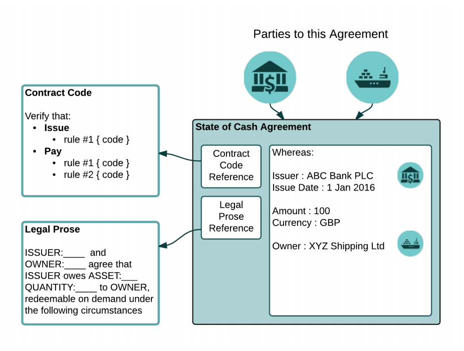
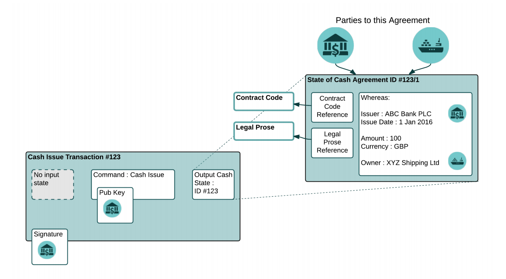
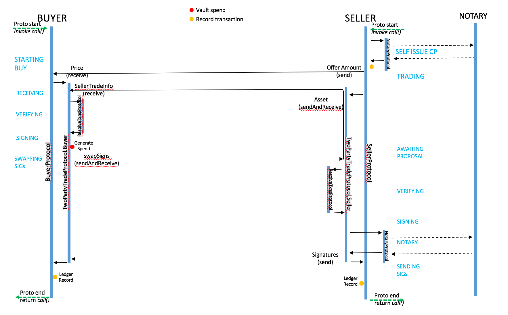

Key Concepts
============

States
------
    What is a state?
A State Object represents an agreement between two or more parties, governed by machine-readable Contract Code.
This code references, and is intended to implement, portions of human-readable Legal Prose.
A state object is a digital document which records the existence, content and current state of an agreement between
two or more parties. It is intended to be shared only with those who have a legitimate reason to see it.
The ledger is defined as a set of immutable state objects.
An objective of Corda is to ensure that all parties to the agreement remain in consensus as to this state as it evolves.

The following diagram illustrates a State object:

    What can we represent in a state?

Contracts
---------
    What's a contract?
Corda enforces business logic through smart contract code, which is constructed as a pure function that either accepts
or rejects a transaction, and which can be composed from simpler, reusable functions. The functions interpret transactions
as taking states as inputs and producing output states through the application of (smart contract) commands, and accept
 the transaction if the proposed actions are valid.

    What does a contract contain?
    Relationship to states

    Verify()
A contract is pure function; contracts do not have storage or the ability to interact with anything.
Given the same transaction, a contract’s “verify” function always yields exactly the same result.

    Clauses

    Contracts sandbox / Deterministic JVM?
Contracts define part of the business logic of the ledger, and they are mobile: nodes will download and run contracts
inside a sandbox without any review in some deployments, although we envisage the use of signed code for Corda deployments in the regulated sphere.
Corda uses an augmented JVM custom sandbox that is radically more restrictive than the ordinary JVM sandbox, and it enforces
not only security requirements but also deterministic execution.

    <diags>

Ledger construct model
----------------------
The Corda model focused on states of agreements is in contrast to systems where the data over which participants much
reach consensus is the state of an entire ledger or the state of an entire virtual machine.

Corda provides three main tools to achieve global distributed consensus:
• Smart contract logic to ensure state transitions are valid according to the pre-agreed rules.
• Uniqueness and timestamping services to order transactions temporally and eliminate conflicts.
• An orchestration framework which simplifies the process of writing com- plex multi-step protocols between multiple different parties.

    Why we chose the UTXO model
There are two competing computational models used in distributed ledger technology: the virtual computer model (as used
by Ethereum) and the UTXO model (as popularised by Bitcoin). In this model the database is a set of immutable rows keyed
by (hash:output index). Transactions define outputs that append new rows and inputs which consume existing rows.

Corda follows the UTXO (unspent transaction output set) model:
• Immutable states are consumed and created by transactions
• Transactions have multiple inputs and outputs
• A contract is pure function; contracts do not have storage or the ability to interact with anything.
Given the same transaction, a contract’s “verify” function always yields exactly the same result.
with additional features:
• Corda states can include arbitrary typed data.
• Transactions invoke not only input contracts but also the contracts of the outputs.
• Corda uses the term “contract” to refer to a bundle of business logic that may handle various different tasks,
beyond transaction verification.
• Corda contracts are Turing-complete and can be written in any ordinary programming language that targets the JVM.
• Corda allows arbitrarily-precise time-bounds to be specified in transactions (which must be attested to by a trusted timestamper)
• Corda's primary consensus implementations use block-free conflict resolution algorithms.
• Corda does not order transactions using a block chain and by implication does not use miners or proof-of-work. Instead
each state points to a notary, which is a service that guarantees it will sign a transaction only if all the input states are un-consumed.

    <diags>

Transactions
------------
    What is a transaction in Corda?
Transactions transition state objects through a lifecycle.
Transaction are used to update the ledger by consuming existing state objects and producing new state objects.
A transaction update is accepted according to the following two aspects of consensus:
1. Transaction validity: parties can reach certainty that a proposed update transaction defining output states is valid
by checking that the associated contract code runs successfully and has all the required signatures; and that any
transactions to which this transaction refers are also valid.
2. Transaction uniqueness: parties can reach certainty that the transaction in question is the unique consumer of all its
input states. That is: there exists no other transaction, over which we have previously reached consensus (validity and uniqueness), that consumes any of the same states.

The following diagram illustrates a simple Issuance Transaction:

    <diags>

    Elements of a transaction

    When is a transaction valid? / invalid?
Parties can agree on transaction validity by independently running the same contract code and validation logic.
Consensus over transaction validity is performed only by parties to the transaction in question. Therefore, data is only
shared with those parties which are required to see it. Other platforms generally reach consensus at the ledger level.
Thus, any given actor in a Corda system sees only a subset of the overall data managed by the system as a whole.

    Transaction Tear-Off

Data sharing model
------------------
The Shared Ledger Vision is based on a progression from a world where parties to shared facts record and manage their own
records, with associated discrepancies and duplications (“Bilateral - Reconciliation”) or one where parties delegate control
 and responsibility over critical processing to centralised utilities (“Third Party / Market Infrastructure”), to one where
 they collaborate to maintain a shared record, assured to be consistent between them, consuming the services of existing
 and new service providers and market infrastructure providers on an open and competitive basis.

This transitional model is illustrated in the following diagram:

.. image:: whitepaper/images/shared-logic.png

Consensus / Notaries
--------------------
Consensus over transaction validity is performed only by parties to the transaction in question. Therefore, data is only
 shared with those parties which are required to see it. Other platforms generally reach consensus at the ledger level.
 Thus, any given actor in a Corda system sees only a subset of the overall data managed by the system as a whole.
 We say a piece of data is “on- ledger” if at least two actors on the system are in consensus as to its existence and
 details and we allow arbitrary combinations of actors to participate in the consensus process for any given piece of data.
 Data held by only one actor is “off-ledger”.

Corda has “pluggable” uniqueness services. This is to improve privacy, scalability, legal-system compatibility and
algorithmic agility. A single service may be composed of many mutually untrusting nodes coordinating via a byzantine
fault tolerant algorithm, or could be very simple, like a single machine. In some cases, like when evolving a state
requires the signatures of all relevant parties, there may be no need for a uniqueness service at all.

It is important to note that these uniqueness services are required only to attest as to whether the states consumed by
a given transaction have previously been consumed; they are not required to attest as to the validity of the transaction
itself, which is a matter for the parties to the transaction. This means that the uniqueness services are not required to
(and, in the general case, will not) see the full contents of any transactions, significantly improving privacy and scalability
of the system compared with alternative distributed ledger and blockchain designs.

Flows
-----
Flows enable complex multi-party business interactions without a central controller.
in Corda all communication takes the form of small multi-party sub-protocols called flows.
The flow framework presents a programming model that looks to the developer as if they have the ability to run millions
of long lived threads which can survive node restarts, and even node upgrades. APIs are provided to send and receive
object graphs to and from other identities on the network, embed sub-flows, and report progress to observers.
The flow framework provide the following:
* **Just-in-time** state machine compiler. Code that is written in a blocking manner typically cannot be stopped and transparently
restarted later. The first time a flow’s call method is invoked a bytecode-to-bytecode transformation occurs that
rewrites the classes into a form that implements a resumable state machine. These state machines are sometimes called fibers
or coroutines, and the transformation engine Corda uses (Quasar) is capable of rewriting code arbitrarily deep in the stack on the fly.
* Transparent checkpointing.
* Identity to IP address mapping.
* A library of subflows
* Progress reporting
* Flow hospital

Section 4 of the Corda Technical WhitePaper provides a comprehensive description of the above features.

The following diagram illustrates a sample Multi-party Business Flow:

Oracles
-------
Oracles represent gateways to proprietary (or other) business logic executors (e.g., Central Counterparties or valuation agents)
that can be verified on-ledger by participants.

Attachments
-----------

Vault
-----

CorDapp
-------
Corda is a platform for the writing of “CorDapps”: applications that extend the global database with new capabilities.
Such apps define new data types, new inter-node protocol flows and the “smart contracts” that determine allowed changes.

The combination of state objects (data), Contract Code (allowable opera- tions), Transaction Protocols (business logic
choreography), any necessary APIs, Vault plugins, and UI components can be thought of a Shared Ledger application,
or Corda Distributed Application (“CorDapp”). This is the core set of components a contract developer on the platform
should expect to build.

Please see our published White Papers for in depth explanations of these concepts:
":doc:`https://docs.corda.net/_static/corda-introductory-whitepaper.pdf`
":doc:`https://docs.corda.net/_static/corda-technical-whitepaper.pdf`
