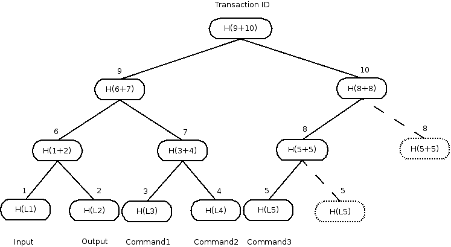
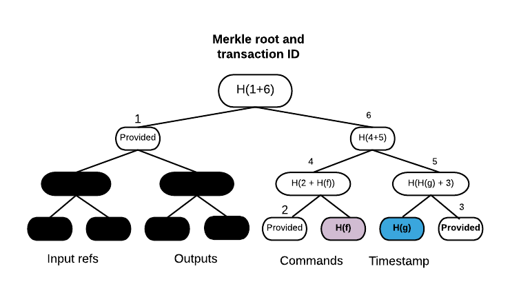

Transaction tear-offs
=====================

One of the basic data structures in our platform is a transaction. It can be passed around to be signed and verified,
also by third parties. The construction of transactions assumes that they form a whole entity with input and output states,
commands and attachments inside. However all sensitive data shouldn’t be revealed to other nodes that take part in
the creation of transaction on validation level (a good example of this situation is the Oracle which validates only
embedded commands). How to achieve it in a way that convinces the other party the data they got for signing really did form
a part of the transaction?

We decided to use well known and described cryptographic scheme to provide proofs of inclusion and data integrity.
Merkle trees are widely used in peer-to-peer networks, blockchain systems and git.
You can read more on the concept `here <https://en.wikipedia.org/wiki/Merkle_tree>`_.

Merkle trees in Corda
---------------------

Transactions are split into leaves, each of them contains either input, output, command or attachment. Other fields like
timestamp or signers are not used in the calculation.
Next, the Merkle tree is built in the normal way by hashing the concatenation
of nodes’ hashes below the current one together. It’s visible on the example image below, where ``H`` denotes sha256 function,
"+" - concatenation.

The transaction has one input state, one output and three commands. If a tree is not a full binary tree, the rightmost nodes are
duplicated in hash calculation (dotted lines).

Finally, the hash of the root is the identifier of the transaction, it's also used for signing and verification of data integrity.
Every change in transaction on a leaf level will change its identifier.

Hiding data
-----------

Hiding data and providing the proof that it formed a part of a transaction is done by constructing Partial Merkle Trees
(or Merkle branches). A Merkle branch is a set of hashes, that given the leaves’ data, is used to calculate the root’s hash.
Then that hash is compared with the hash of a whole transaction and if they match it means that data we obtained belongs
to that particular transaction.

In the example above, the red node is the one holding data for signing Oracle service. Blue nodes' hashes form the Partial Merkle
Tree, dotted ones are not included. Having the command that should be in a red node place and branch we are able to calculate
root of this tree and compare it with original transaction identifier - we have a proof that this command belongs to this transaction.

Example of usage
----------------

Let’s focus on a code example. We want to construct a transaction with commands containing interest rate fix data as in:
:doc:`oracles`.
After construction of a partial transaction, with included ``Fix`` commands in it, we want to send it to the Oracle for checking
and signing. To do so we need to specify which parts of the transaction are going to be revealed. That can be done by constructing
filtering functions for inputs, outputs, attachments and commands separately. If a function is not provided by default none
of the elements from this group will be included in a Partial Merkle Tree.

.. container:: codeset

   .. sourcecode:: kotlin

        val partialTx  = ...
        val oracle: Party.Full = ...
        fun filterCommands(c: Command) = oracle.owningKey in c.signers && c.value is Fix
        val filterFuns = FilterFuns(filterCommands = ::filterCommands)

Assuming that we already assembled partialTx with some commands and know the identity of Oracle service,
we pass filtering function over commands - ``filterCommands`` to ``FilterFuns``. It filters only
commands of type ``Fix`` as in IRSDemo example. Then we can construct ``FilteredTransaction``:

.. container:: codeset

   .. sourcecode:: kotlin

        val wtx: WireTransaction = partialTx.toWireTransaction()
        val ftx = FilteredTransaction.buildMerkleTransaction(wtx, filterFuns)

In the Oracle example this step takes place in ``RatesFixFlow``:

.. container:: codeset

   .. sourcecode:: kotlin

        val flow = RatesFixFlow(partialTx, filterFuns, oracle, fixOf, "0.675".bd, "0.1".bd)

``FilteredTransaction`` holds ``filteredLeaves`` (data that we wanted to reveal) and Merkle branch for them.

.. container:: codeset

   .. sourcecode:: kotlin

        // Getting included commands, inputs, outputs, attachments.
        val cmds: List<Command> = ftx.filteredLeaves.commands
        val ins: List<StateRef> = ftx.filteredLeaves.inputs
        val outs: List<TransactionState<ContractState>> = ftx.filteredLeaves.outputs
        val attchs: List<SecureHash> = ftx.filteredLeaves.attachments

If you want to verify obtained ``FilteredTransaction`` all you need is the root hash of the full transaction:

.. container:: codeset

   .. sourcecode:: kotlin

        if (!ftx.verify(merkleRoot)){
                throw MerkleTreeException("Rate Fix Oracle: Couldn't verify partial Merkle tree.")
        }

.. note:: The way the ``FilteredTransaction`` is constructed ensures that after signing of the root hash it's impossible to add or remove
    leaves. However, it can happen that having transaction with multiple commands one party reveals only subset of them to the Oracle.
    As signing is done now over the Merkle root hash, the service signs all commands of given type, even though it didn't see
    all of them. This issue will be handled after implementing partial signatures.
