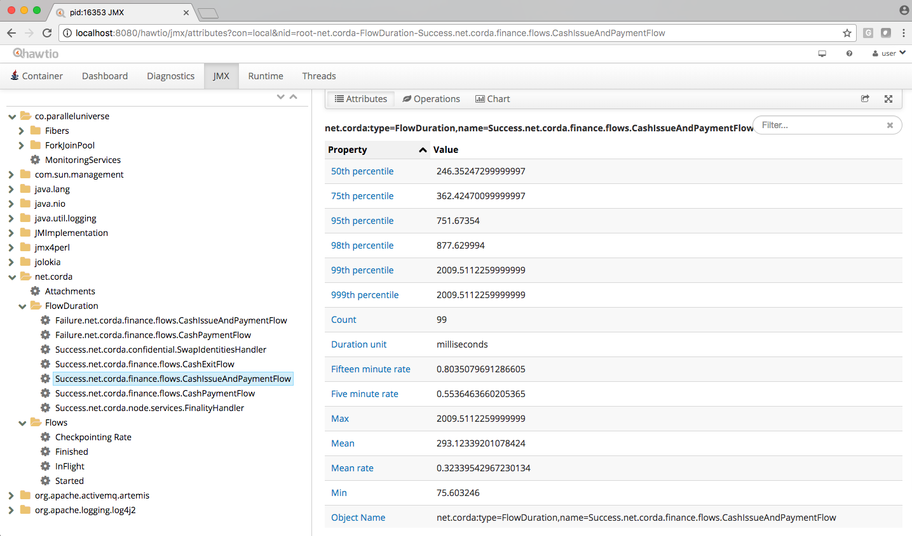

Node administration
===================

When a node is running, it exposes an RPC interface that lets you monitor it, upload and download attachments, and so
on.

Logging
-------

By default the node log files are stored to the ``logs`` subdirectory of the working directory and are rotated from time
to time. You can have logging printed to the console as well by passing the ``--log-to-console`` command line flag.
The default logging level is ``INFO`` which can be adjusted by the ``--logging-level`` command line argument. This configuration
option will affect all modules.

It may be the case that you require to amend the log level of a particular subset of modules (e.g. if you'd like to take a
closer look at hibernate activity). So, for more bespoke logging configuration, the logger settings can be completely overridden
with a `Log4j 2 <https://logging.apache.org/log4j/2.x>`_ configuration file assigned to the ``log4j.configurationFile`` system property.

Example
+++++++

Create a file ``sql.xml`` in the current working directory. Add the following text :

.. code-block:: xml

    <?xml version="1.0" encoding="UTF-8"?>
        <Configuration status="WARN">
            <Appenders>
                <Console name="Console" target="SYSTEM_OUT">
                    <PatternLayout pattern="%d{HH:mm:ss.SSS} [%t] %-5level %logger{36} - %msg%n"/>
                </Console>
            </Appenders>
            <Loggers>
                <Logger name="org.hibernate" level="debug" additivity="false">
                    <AppenderRef ref="Console"/>
                </Logger>
                <Root level="error">
                    <AppenderRef ref="Console"/>
                </Root>
            </Loggers>
        </Configuration>

Note the addition of a logger named ``org.hibernate`` that has set this particular logger level to ``debug``.

Now start the node as usual but with the additional parameter ``log4j.configurationFile`` set to the filename as above, e.g.

``java <Your existing startup options here> -Dlog4j.configurationFile=sql.xml -jar corda.jar``

To determine the name of the logger, for Corda objects, use the fully qualified name (e.g. to look at node output
in more detail, use ``net.corda.node.internal.Node`` although be aware that as we have marked this class ``internal`` we
reserve the right to move and rename it as it's not part of the public API as yet). For other libraries, refer to their
logging name construction. If you can't find what you need to refer to, use the ``--logging-level`` option as above and
then determine the logging module name from the console output.

SSH access
----------

Node can be configured to run SSH server. See :doc:`shell` for details.

Database access
---------------

The node exposes its internal database over a socket which can be browsed using any tool that can use JDBC drivers.
The JDBC URL is printed during node startup to the log and will typically look like this:

     ``jdbc:h2:tcp://192.168.0.31:31339/node``

The username and password can be altered in the :doc:`corda-configuration-file` but default to username "sa" and a blank
password.

Any database browsing tool that supports JDBC can be used, but if you have IntelliJ Ultimate edition then there is
a tool integrated with your IDE. Just open the database window and add an H2 data source with the above details.
You will now be able to browse the tables and row data within them.

Monitoring your node
--------------------

Like most Java servers, the node can be configured to export various useful metrics and management operations via the industry-standard
`JMX infrastructure <https://en.wikipedia.org/wiki/Java_Management_Extensions>`_. JMX is a standard API
for registering so-called *MBeans* ... objects whose properties and methods are intended for server management. It does
not require any particular network protocol for export. So this data can be exported from the node in various ways:
some monitoring systems provide a "Java Agent", which is essentially a JVM plugin that finds all the MBeans and sends
them out to a statistics collector over the network. For those systems, follow the instructions provided by the vendor.

.. warning:: As of Corda M11, Java serialisation in the Corda node has been restricted, meaning MBeans access via the JMX
             port will no longer work. Please use java agents instead, you can find details on how to use Jolokia JVM
             agent `here <https://jolokia.org/agent/jvm.html>`_.

`Jolokia <https://jolokia.org/>`_ allows you to access the raw data and operations without connecting to the JMX port
directly. Nodes can be configured to export the data over HTTP on the ``/jolokia`` HTTP endpoint, Jolokia defines the JSON and REST
formats for accessing MBeans, and provides client libraries to work with that protocol as well.

Here are a few ways to build dashboards and extract monitoring data for a node:

* `hawtio <https://hawt.io>`_ is a web based console that connects directly to JVM's that have been instrumented with a
  jolokia agent. This tool provides a nice JMX dashboard very similar to the traditional JVisualVM / JConsole MBbeans original.
* `JMX2Graphite <https://github.com/logzio/jmx2graphite>`_ is a tool that can be pointed to /monitoring/json and will
  scrape the statistics found there, then insert them into the Graphite monitoring tool on a regular basis. It runs
  in Docker and can be started with a single command.
* `JMXTrans <https://github.com/jmxtrans/jmxtrans>`_ is another tool for Graphite, this time, it's got its own agent
  (JVM plugin) which reads a custom config file and exports only the named data. It's more configurable than
  JMX2Graphite and doesn't require a separate process, as the JVM will write directly to Graphite.
* Cloud metrics services like New Relic also understand JMX, typically, by providing their own agent that uploads the
  data to their service on a regular schedule.
* `Telegraf <https://github.com/influxdata/telegraf>`_ is a tool to collect, process, aggregate, and write metrics.
  It can bridge any data input to any output using their plugin system, for example, Telegraf can
  be configured to collect data from Jolokia and write to DataDog web api.

The Node configuration parameter `jmxMonitoringHttpPort` has to be present in order to ensure a Jolokia agent is instrumented with
the JVM run-time.

The following JMX statistics are exported:

* Corda specific metrics: flow information (total started, finished, in-flight; flow duration by flow type), attachments (count)
* Apache Artemis metrics: queue information for P2P and RPC services
* JVM statistics: classloading, garbage collection, memory, runtime, threading, operating system
* Hibernate statistics (only when node is started-up in `devMode` due to to expensive run-time costs)

When starting Corda nodes using Cordformation runner (see :doc:`running-a-node`), you should see a startup message similar to the following:
**Jolokia: Agent started with URL http://127.0.0.1:7005/jolokia/**

When starting Corda nodes using the `DriverDSL`, you should see a startup message in the logs similar to the following:
**Starting out-of-process Node USA Bank Corp, debug port is not enabled, jolokia monitoring port is 7005 {}**

Several Jolokia policy based security configuration files (``jolokia-access.xml``) are available for dev, test, and prod
environments under ``/config/<env>``.

The following diagram illustrates Corda flow metrics visualized using `hawtio <https://hawt.io>`_ :

Memory usage and tuning
-----------------------

All garbage collected programs can run faster if you give them more memory, as they need to collect less
frequently. As a default JVM will happily consume all the memory on your system if you let it, Corda is
configured with a 512mb Java heap by default. When other overheads are added, this yields
a total memory usage of about 800mb for a node (the overheads come from things like compiled code, metadata,
off-heap buffers, thread stacks, etc).

If you want to make your node go faster and profiling suggests excessive GC overhead is the cause, or if your
node is running out of memory, you can give it more by running the node like this:

``java -Dcapsule.jvm.args="-Xmx1024m" -jar corda.jar``

The example command above would give a 1 gigabyte Java heap.

.. note:: Unfortunately the JVM does not let you limit the total memory usage of Java program, just the heap size.

Backup strategy recommendations
-------------------------------

Various components of the Corda platform read their configuration from the file system, and persist data to a database or into some files.
Given that hardware can fail operators of IT infrastructure must have a sound backup strategy in place. Whilst blockchain platforms can sometimes recover some lost data from peers, it is rarely the case that a node can recover its full state in this way because real-world blockchain applications invariably contain private information (eg customer account information). Moreover, this private information must remain in sync with the ledger state. As such, we strongly recommend implementing a comprehensive backup strategy.

The following elements of a backup strategy are recommended, with no requirements about their intervals with regards to each other:

Database replication
++++++++++++++++++++

When properly configured, database replication prevents data loss from occurring in case the database host fails.
In general, the higher the number of replicas, and the further away they are deployed in terms of regions and availability zones, the more a setup is resilient to disasters.
The trade-off is that, ideally, replication should happen synchronously, meaning that a high number of replicas and a considerable network latency will impact the performance of the Corda nodes connecting to the cluster.
Synchronous replication is strongly advised to prevent data loss.

Database snapshots
++++++++++++++++++

Database replication is a powerful technique, but it is very sensitive to destructive SQL updates. Whether malicious or unintentional, a SQL statement might compromise data by getting propagated to all replicas.
Without a rolling snapshots strategy, data loss due to a SQL statement will be irreversible.
Using snapshots always implies some data loss in case of a disaster, and the trade-off is between highly frequent backups minimising such a loss, and less frequent backups consuming less resources.
At present, Corda does not offer online updates with regards to transactions.
Should states in the vault ever be lost, partial or total recovery might be achieved by asking third-party companies and/or notaries to provide all data relevant to the affected legal identity.

File backups
++++++++++++

Corda components read and write information from and to the file-system. The advice is to backup the entire root directory of the component, plus any external directories and files optionally specified in the configuration.
If a resilient, synchronously replicated file-system abstraction like Azure Storage Disk or Elastic Block Storage is used, Corda components will benefit from the following:

* Guaranteed eventual processing of acknowledged client messages, provided that the backlog of persistent queues is not lost irremediably.
* A timely recovery from deletion or corruption of configuration files (e.g., ``node.conf``, ``node-info`` files, etc.), database drivers, CorDapps binaries and configuration, and certificates directories, provided backups are available to restore from.

.. warning:: Private keys used to sign transactions should be preserved with the utmost care. The recommendation is at least two separate copies on a storage not connected to the Internet.