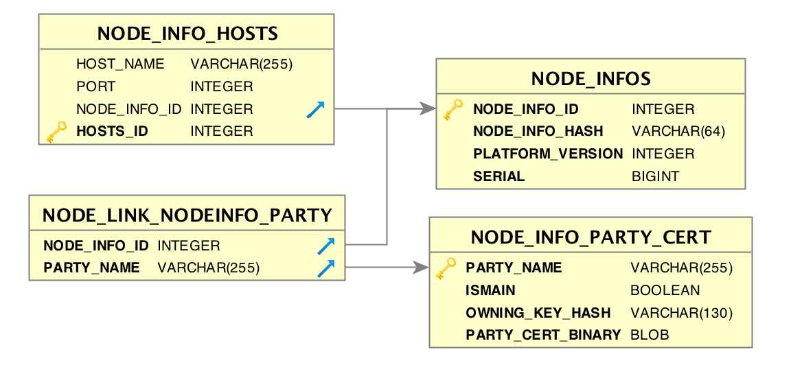
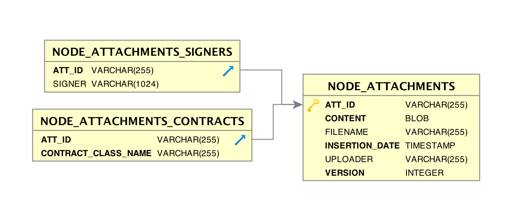
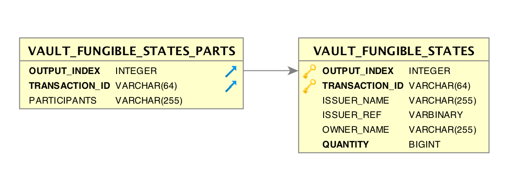
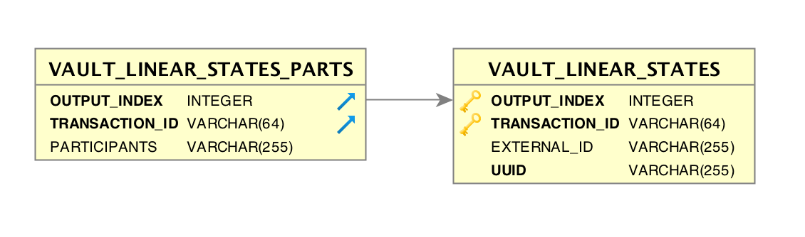

Database tables
===============

A Corda node database contains tables corresponding to the various services that the node provides.
It also contains custom tables defined by the CorDapps that are installed on the node.
Currently all these tables share the same database schema, but in a future release they will be isolated from each other.

.. note:: Unless specified otherwise the node tables are for internal use and can change between versions.

Some tables, especially the ones where the ``Ledger`` is maintained are append-only and the data will never change.

.. warning:: Manually adding, removing or updating any data should only be done with great care. Corda is a distributed ledger and modifying
             data could lead to unexpected behaviour and inconsistent views of the ledger.

Network map
-----------

Node Infos
^^^^^^^^^^

These are tables that store the NodeInfo of other network participants.
They are just a local cache that is kept in sync with the network map server.
By calling ``rpc.clearNetworkMapCache()`` all these tables will be cleared and recreated from the network map server.

Read more here: :doc:`network-map`

==============================   ==========================================================================================
NODE_INFOS                          Stores ``NodeInfo`` objects. The principal table.
==============================   ==========================================================================================
NODE_INFO_ID                        Primary key
NODE_INFO_HASH                      Hash of the binary nodeInfo file
PLATFORM_VERSION                    Declared version of the participant node.
SERIAL                              Version of the NodeInfo
==============================   ==========================================================================================

==============================   ==========================================================================================
NODE_INFO_HOSTS                     Many-to-one addresses to node
==============================   ==========================================================================================
HOSTS_ID                            Primary key
HOST_NAME                           Host name of the participant's node
PORT                                Port
NODE_INFO_ID                        FK to NODE_INFOS
==============================   ==========================================================================================

==============================   ==========================================================================================
NODE_INFO_PARTY_CERT                Legal identity for a network participant
==============================   ==========================================================================================
PARTY_NAME                          The X500 name
OWNING_KEY_HASH                     The public key
ISMAIN                              If this is a main identity
PARTY_CERT_BINARY                   The certificate chain
==============================   ==========================================================================================

==============================   ==========================================================================================
NODE_LINK_NODEINFO_PARTY            Many-to-Many link between the hosts and the legal identities
==============================   ==========================================================================================
NODE_INFO_ID                        FK to Node_info
PARTY_NAME                          FK to NODE_INFO_PARTY_CERT
==============================   ==========================================================================================

Node identities
^^^^^^^^^^^^^^^

The following two tables are used by the ``IdentityService`` and are created from the NodeInfos.
They are append only tables used for persistent caching.
They will also be cleared on ``rpc.clearNetworkMapCache()``.
Read more in :doc:`api-identity` and :doc:`node-services`

==============================   ==========================================================================================
NODE_IDENTITIES                     Maps public keys to identities
==============================   ==========================================================================================
PK_HASH                             The public key.
IDENTITY_VALUE                      The certificate chain.
==============================   ==========================================================================================

==============================   ==========================================================================================
NODE_NAMED_IDENTITIES               Maps the X500 name of a participant to a public key.
==============================   ==========================================================================================
NAME                                The x500 name
PK_HASH                             The public key
==============================   ==========================================================================================

Network parameters
^^^^^^^^^^^^^^^^^^

Read more here: :doc:`network-map`.
Each downloaded network parameters file will create an entry in this table.
The historical network parameters are used when validating transactions, which makes this table logically part of the ``Ledger``.
It is an append only table and the size will be fairly small.

==============================   ==========================================================================================
NODE_NETWORK_PARAMETERS             Stores the downloaded network parameters.
==============================   ==========================================================================================
HASH                                The hash of the downloaded file. Used as a primary key.
EPOCH                               The version of the parameters
PARAMETERS_BYTES                    The serialized bytes
SIGNATURE_BYTES                     The signature
CERT                                First signer certificate in the certificate chain.
PARENT_CERT_PATH                    Parent certificate path of signer.
==============================   ==========================================================================================

Ledger
------

The ledger data is formed of transactions and attachments.
In future versions this data will be encrypted using SGX.
Read more in :doc:`key-concepts-ledger`

Attachments
^^^^^^^^^^^

Read more in :doc:`tutorial-attachments` and :doc:`node-services`

==============================   ==========================================================================================
NODE_ATTACHMENTS                    Stores attachments
==============================   ==========================================================================================
ATT_ID                              The hash of the content of the file.
CONTENT                             The binary content
FILENAME                            Not used at the moment.
INSERTION_DATE                      Date.
UPLOADER                            One of: ``p2p``, ``app``, ``rpc``, ``unknown``. Currently used for for determining if this attachment is safe to execute during transaction verification.
VERSION                             The version of the JAR file.
==============================   ==========================================================================================

==============================   ==========================================================================================
NODE_ATTACHMENTS_CONTRACTS           Many-to-one contracts per attachment. Empty for non-contract attachments.
==============================   ==========================================================================================
ATT_ID                              Foreign key
CONTRACT_CLASS_NAME                 The fully qualified contract class name. E.g.: ``net.corda.finance.contracts.asset.Cash``
==============================   ==========================================================================================

==============================   ==========================================================================================
NODE_ATTACHMENTS_SIGNERS             Many-to-one JAR signers of an attachment. Empty if not signed.
==============================   ==========================================================================================
ATT_ID                             Foreign key
SIGNER                             Hex encoded public key of the JAR signer.
==============================   ==========================================================================================

Transactions
^^^^^^^^^^^^

These are all the transactions that the node has created or has ever downloaded as part of transaction resolution. This table can grow very large.
It is an append-only table, and the data will never change.
Read more in :doc:`node-services` - ``DBTransactionStorage``
This is the key ledger table used as a source of truth. In the future the content will be encrypted to preserve confidentiality.

==============================   ==========================================================================================
NODE_TRANSACTIONS                   Corda transactions in a binary format
==============================   ==========================================================================================
TX_ID                             The hash of the transaction. Primary key.
TRANSACTION_VALUE                 The binary representation of the transaction.
STATE_MACHINE_RUN_ID              The flow id associated with this transaction.
==============================   ==========================================================================================

                                                                                     |

Contract upgrades
^^^^^^^^^^^^^^^^^

Read more in :doc:`contract-upgrade`

==============================   ==========================================================================================
NODE_CONTRACT_UPGRADES              Represents an authorisation to upgrade a state_ref to a contract.
==============================   ==========================================================================================
STATE_REF                           The authorised state.
CONTRACT_CLASS_NAME                 The contract.
==============================   ==========================================================================================

This table should be empty when no states are authorised for upgrade or after authorised states have been upgraded.

Scheduling
^^^^^^^^^^

Read more in :doc:`event-scheduling`

==============================   ==========================================================================================
NODE_SCHEDULED_STATES               Contains scheduled states
==============================   ==========================================================================================
OUTPUT_INDEX                        Reference to a state - index in transaction
TRANSACTION_ID                      Reference to a state - transaction id
SCHEDULED_AT                        Timestamp when this state will execute.
==============================   ==========================================================================================

This table should be empty when no events are scheduled.

Storage of private keys
^^^^^^^^^^^^^^^^^^^^^^^

==============================   ==========================================================================================
NODE_OUR_KEY_PAIRS                  Stores the anonymous identities
==============================   ==========================================================================================
PUBLIC_KEY_HASH                     Primary key
PRIVATE_KEY                         Binary private key
PUBLIC_KEY                          Binary public key
==============================   ==========================================================================================

==============================   ==========================================================================================
PK_HASH_TO_EXT_ID_MAP               Maps public keys to external ids. Mainly used by CorDapps that need to simulate accounts.
==============================   ==========================================================================================
ID                                  Primary key
EXTERNAL_ID                         External id
PUBLIC_KEY_HASH                     Public key hash
==============================   ==========================================================================================

These tables should be append only.

Node state machine
^^^^^^^^^^^^^^^^^^

Read more in :doc:`node-services`

==============================   ==========================================================================================
NODE_CHECKPOINTS                    Stores the flow checkpoints.
==============================   ==========================================================================================
CHECKPOINT_ID                       Primary key
CHECKPOINT_VALUE                    Serialized application stack.
==============================   ==========================================================================================

This table will see the most intense read-write activity. Depending on the installed flows and the traffic on the node the I/O operations on this
table will be the main bottleneck of the node performance.
There will be an entry for every running flow.
Draining the node means waiting for this table to become emtpy. Read more in: :doc:`node-operations-upgrade-cordapps`.

==============================   ==========================================================================================
NODE_MESSAGE_IDS                    Used for de-duplication of messages received by peers.
==============================   ==========================================================================================
MESSAGE_ID                          Message id
INSERTION_TIME                      Insertion time
SENDER                              P2p sender
SEQUENCE_NUMBER                     Sequence number
==============================   ==========================================================================================

Key value store
^^^^^^^^^^^^^^^

==============================   ==========================================================================================
NODE_PROPERTIES                     General key value store. Currently only used for the flow draining mode.
==============================   ==========================================================================================
PROPERTY_KEY                        The key
PROPERTY_VALUE                      The value
==============================   ==========================================================================================

Vault tables
------------

Read more about the vault here :doc:`key-concepts-vault`.

Note that the vault tables are guaranteed to remain backwards compatible and are safe to be used directly by third party applications.

==============================   ==========================================================================================
VAULT_STATES                        Principal vault table.
==============================   ==========================================================================================
OUTPUT_INDEX                        Reference to a state - index in transaction
TRANSACTION_ID                      Reference to a state - transaction id
CONSUMED_TIMESTAMP                  When the state was consumed.
CONTRACT_STATE_CLASS_NAME           Contract class
LOCK_ID                             The soft lock id
LOCK_TIMESTAMP                      The soft lock timestamp
NOTARY_NAME                         The notary
RECORDED_TIMESTAMP                  Recorded timestamp
STATE_STATUS                        ``CONSUMED`` or ``UNCONSUMED``
RELEVANCY_STATUS                    ``RELEVANT`` or ``NOT_RELEVANT``
CONSTRAINT_TYPE                     The contract constraint.
CONSTRAINT_DATA                     The hash or the composite key depending on the ``CONSTRAINT_TYPE``
==============================   ==========================================================================================

The ``VAULT_STATES`` table contains an entry for every relevant state.
This table records the status of states and allows CorDapps to soft lock states it intends to consume.
Depending on the installed CorDapps this table can grow. For example when fungible states are used.

In case this table grows too large, the DBA can choose to archive old consumed states.
The actual content of the states can be retrieved from the ``NODE_TRANSACTIONS`` table by deserializing the binary representation.

==============================   ==========================================================================================
VAULT_TRANSACTION_NOTES             Allows additional notes per transaction
==============================   ==========================================================================================
SEQ_NO                              Primary key
TRANSACTION_ID                      The transaction
NOTE                                The note
==============================   ==========================================================================================

==============================   ==========================================================================================
STATE_PARTY                         Maps participants to states
==============================   ==========================================================================================
OUTPUT_INDEX                        Reference to a state - index in transaction
TRANSACTION_ID                      Reference to a state - transaction id
PUBLIC_KEY_HASH                     The pk of the participant
X500_NAME                           The name of the participant or null if unknown.
==============================   ==========================================================================================

==============================   ==========================================================================================
V_PKEY_HASH_EX_ID_MAP               This is a database view used to map states to external ids.
==============================   ==========================================================================================
OUTPUT_INDEX                        Reference to a state - index in transaction
TRANSACTION_ID                      Reference to a state - transaction id
PUBLIC_KEY_HASH                     The public key of the participant.
EXTERNAL_ID                         The external id.
==============================   ==========================================================================================

Fungible states
^^^^^^^^^^^^^^^

==============================   ==========================================================================================
VAULT_FUNGIBLE_STATES               Properties specific to fungible states
==============================   ==========================================================================================
OUTPUT_INDEX                        Reference to a state - index in transaction
TRANSACTION_ID                      Reference to a state - transaction id
ISSUER_NAME                         Issuer
ISSUER_REF                          Reference number used by the issuer
OWNER_NAME                          X500 name of the owner, or null if unknown
QUANTITY                            The amount.
==============================   ==========================================================================================

==============================   ==========================================================================================
VAULT_FUNGIBLE_STATES_PARTS         Many-to-one participants to a fungible state
==============================   ==========================================================================================
OUTPUT_INDEX                        Reference to a state - index in transaction
TRANSACTION_ID                      Reference to a state - transaction id
PARTICIPANTS                        X500 name of participant.
==============================   ==========================================================================================

Linear states
^^^^^^^^^^^^^

==============================   ==========================================================================================
VAULT_LINEAR_STATES                 Properties specific to linear states
==============================   ==========================================================================================
OUTPUT_INDEX                        Reference to a state - index in transaction
TRANSACTION_ID                      Reference to a state - transaction id
EXTERNAL_ID                         The external id of this linear state.
UUID                                The internal id of this linear state.
==============================   ==========================================================================================

==============================   ==========================================================================================
VAULT_LINEAR_STATES_PARTS           Many-to-one participants to a linear state
==============================   ==========================================================================================
OUTPUT_INDEX                        Reference to a state - index in transaction
TRANSACTION_ID                      Reference to a state - transaction id
PARTICIPANTS                        X500 name of participant.
==============================   ==========================================================================================

Liquibase database migration
----------------------------

These are `Liquibase <https://www.liquibase.org>`_ proprietary tables used by Corda internally to manage schema change and evolution.

==============================   ==========================================================================================
DATABASECHANGELOG                Read more: `DATABASECHANGELOG <https://www.liquibase.org/documentation/databasechangelog_table.html>`_
==============================   ==========================================================================================
ID
AUTHOR
FILENAME
DATEEXECUTED
ORDEREXECUTED
EXECTYPE
MD5SUM
DESCRIPTTION
COMMENTS
TAG
LIQUIBASE
CONTEXTS
LABELS
DEPLOYMENT_ID
==============================   ==========================================================================================

==============================   ==========================================================================================
DATABASECHANGELOGLOCK            Read more: `DATABASECHANGELOGLOCK <https://www.liquibase.org/documentation/databasechangeloglock_table.html>`_
==============================   ==========================================================================================
ID
LOCKED
LOCKGRANTED
LOCKEDBY
==============================   ==========================================================================================

