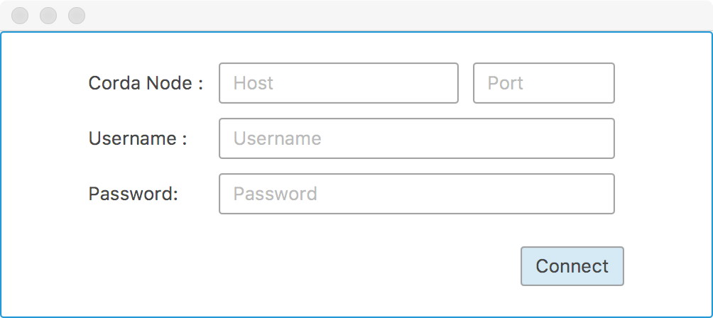
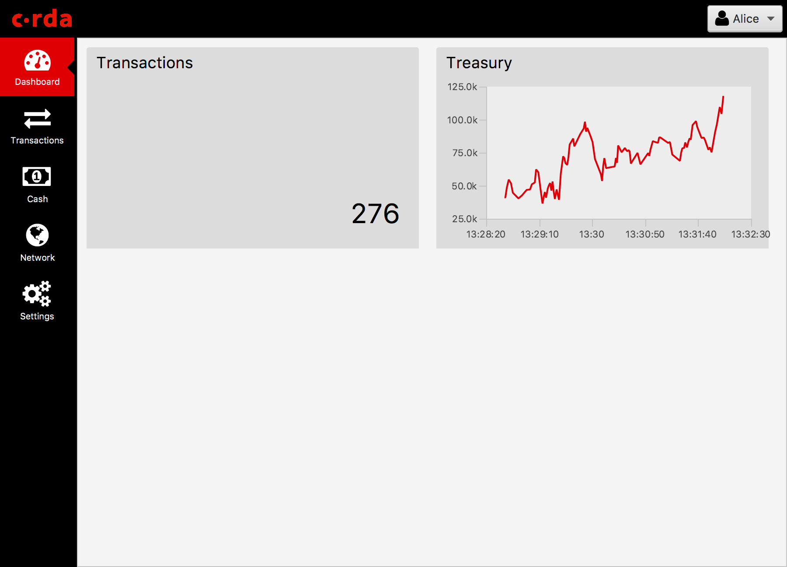
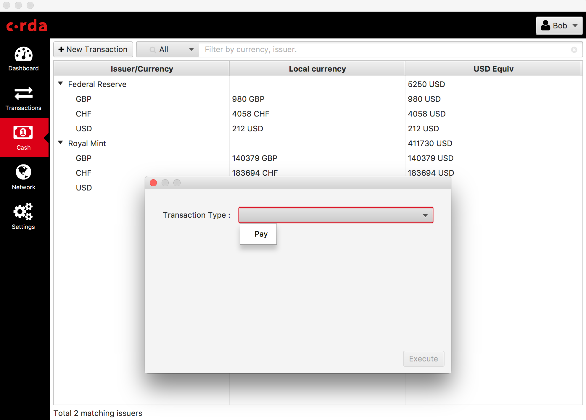
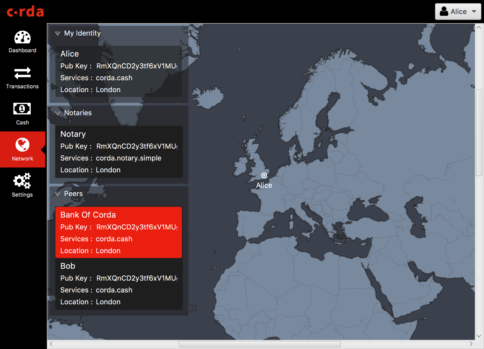
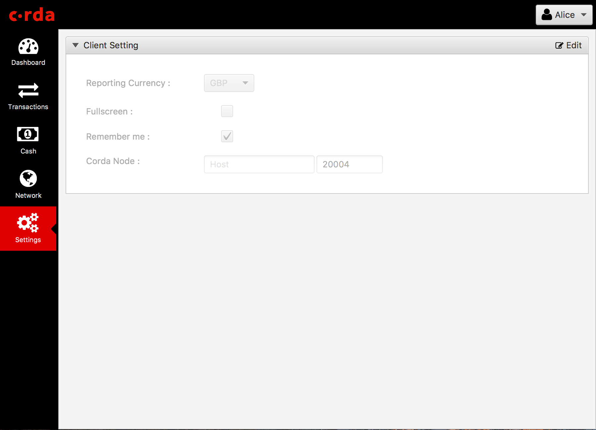

Node Explorer
=============

The node explorer provides views into a node's vault and transaction data using Corda's RPC framework.
The user can execute cash transaction commands to issue and move cash to other parties on the network or exit cash (eg. remove from the ledger)

Running the UI
--------------
**Windows**::

    gradlew.bat tools:explorer:run

**Other**::

    ./gradlew tools:explorer:run
    

Running demo nodes
------------------

A demonstration Corda network topology is configured with 5 nodes playing the following roles:

1. Notary
2. Issuer nodes, representing two fictional central banks (UK Bank Plc issuer of GBP and USA Bank Corp issuer of USD)
3. Participant nodes, representing two users (Alice and Bob)

When connected to an *Issuer* node, a user can execute cash transaction commands to issue and move cash to itself or other
parties on the network or to exit cash (for itself only).

When connected to a *Participant* node a user can only execute cash transaction commands to move cash to other parties on the network.

The Demo Nodes can be started in one of two modes:

1. Normal

   Fresh clean environment empty of transactions.
   Firstly, launch an Explorer instance to login to one of the Issuer nodes and issue some cash to the other participants (Bob and Alice).
   Then launch another Explorer instance to login to a participant node and start making payments (eg. move cash).
   You will only be able to exit (eg. redeem from the ledger) cash as an issuer node.

**Windows**::

    gradlew.bat tools:explorer:runDemoNodes

**Other**::

    ./gradlew tools:explorer:runDemoNodes

2. Simulation

   In this mode Nodes will automatically commence executing commands as part of a random generation process.
   The simulation start with pre-allocating chunks of cash to each of the party in 2 currencies (USD, GBP), then it enter a loop to generate random events.
   In each iteration, the issuers will execute a Cash Issue or Cash Exit command (at a 9:1 ratio) and a random party will execute a move of cash to another random party.

**Windows**::

    gradlew.bat tools:explorer:runSimulationNodes

**Other**::

    ./gradlew tools:explorer:runSimulationNodes

.. note:: 5 Corda nodes will be created on the following port on localhost by default.

   * Notary -> 20005            (Does not accept logins)
   * UK Bank Plc -> 20011       (*Issuer node*)
   * USA Bank Corp -> 20008     (*Issuer node*)
   * Alice -> 20017
   * Bob -> 20014

Explorer login credentials to the Issuer nodes are defaulted to ``manager`` and ``test``.
Explorer login credentials to the Participants nodes are defaulted to ``user1`` and ``test``.
Please note you are not allowed to login to the notary.

.. note:: When you start the nodes in Windows using the command prompt, they might not be killed when you close the
          window or terminate the task. If that happens you need to manually terminate the Java processes running the nodes.

.. note:: Alternatively, you may start the demo nodes from within IntelliJ using either of the run configurations
          ``Explorer - demo nodes`` or ``Explorer - demo nodes (simulation)``

.. note:: It is also possible to start the Explorer GUI from IntelliJ via ``Explorer - GUI`` run configuration, provided that the optional TornadoFX plugin has been installed first.

.. note:: Use the Explorer in conjunction with the Trader Demo and Bank of Corda samples to use other *Issuer* nodes.

Interface
---------
Login
  User can login to any Corda node using the explorer. Alternatively, ``gradlew explorer:runDemoNodes`` can be used to start up demo nodes for testing.  
  Corda node address, username and password are required for login, the address is defaulted to localhost:0 if leave blank.
  Username and password can be configured via the ``rpcUsers`` field in node's configuration file.
  

     
Dashboard
  The dashboard shows the top level state of node and vault.
  Currently, it shows your cash balance and the numbers of transaction executed.
  The dashboard is intended to house widgets from different CordApps and provide useful information to system admin at a glance. 

  
Cash
  The cash view shows all currencies you currently own in a tree table format, it is grouped by issuer -> currency.
  Individual cash transactions can be viewed by clicking on the table row. The user can also use the search field to narrow down the scope.

.. image:: resources/explorer/vault.png

New Transactions
  This is where you can create new cash transactions.
  The user can choose from three transaction types (issue, pay and exit) and any party visible on the network.

  General nodes can only execute pay commands to any other party on the network.

Issuer Nodes
  Issuer nodes can execute issue (to itself or to any other party), pay and exit transactions.
  The result of the transaction will be visible in the transaction screen when executed.

.. image:: resources/explorer/newTransactionIssuer.png

Transactions
  The transaction view contains all transactions handled by the node in a table view. It shows basic information on the table e.g. Transaction ID, 
  command type, USD equivalence value etc. User can expand the row by double clicking to view the inputs, 
  outputs and the signatures details for that transaction.  
  
.. image:: resources/explorer/transactionView.png

Network
  The network view shows the network information on the world map. Currently only the user's node is rendered on the map. 
  This will be extended to other peers in a future release.
  The map provides an intuitive way of visualizing the Corda network and the participants. 

Settings
  User can configure the client preference in this view.

.. note:: Although the reporting currency is configurable, FX conversion won't be applied to the values as we don't have an FX service yet.

