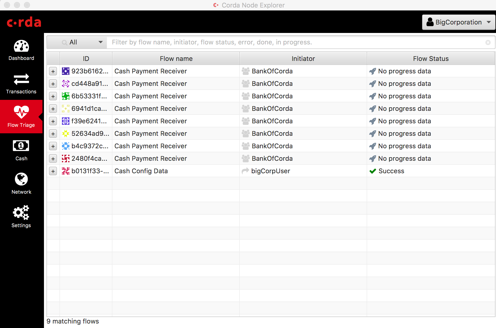

Flow Hospital
=============

Overview
--------

The **flow hospital** refers to a built-in node service that manages flows that have encountered an error.

This service is responsible for recording, tracking, diagnosing, recovering and retrying. It determines whether errored flows should be retried
from their previous checkpoints or have their errors propagate. Flows may be recoverable under certain scenarios (eg. manual intervention
may be required to install a missing contract JAR version). For a given errored flow, the flow hospital service determines the next course of
action towards recovery and retry.

.. note:: The flow hospital will never terminate a flow, but will propagate its error back to the state machine, and ultimately, end user code to handle
   if it ultimately proves impossible to resolve automatically.

This concept is analogous to *exception management handling* associated with enterprise workflow software, or
*retry queues/stores* in enterprise messaging middleware for recovering from failure to deliver a message.

Functionality
-------------

Flow hospital functionality is enabled by default in |release|. No explicit configuration settings are required.

There are two aspects to the flow hospital:

- run-time behaviour in the node upon failure, including retry and recovery transitions and policies.
- visualisation of failed flows in the Explorer UI.

.. _flow-hospital-runtime:

Run-time behaviour
~~~~~~~~~~~~~~~~~~

Specifically, there are two main ways a flow is hospitalized:

1. A counterparty invokes a flow on your node that isn’t installed (i.e. missing CorDapp):
   this will cause the flow session initialisation mechanism to trigger a ``ClassNotFoundException``.
   If this happens, the session initiation attempt is kept in the hospital for observation and will retry if you restart the node.
   Corrective action requires installing the correct CorDapp in the node's "cordapps" directory.

   .. warning:: There is currently no retry API. If you don’t want to install the cordapp, you should be able to call `killFlow` with the UUID
      associated with the failing flow in the node's log messages.

2. Once started, if a flow experiences an error, the following failure scenarios are handled:

   * SQLException mentioning a deadlock*:
     if this happens, the flow will retry. If it retries more than once, a back off delay is applied to try and reduce contention.
     Current policy means these types of failed flows will retry forever (unless explicitly killed).  No intervention required.

   * Database constraint violation:
     this scenario may occur due to natural contention between racing flows as Corda delegates handling using the database's optimistic concurrency control.
     As the likelihood of re-occurrence should be low, the flow will actually error and fail if it experiences this at the same point more than 3 times. No intervention required.

   * Finality Flow handling - Corda 3.x (old style) ``FinalityFlow`` and Corda 4.x ``ReceiveFinalityFlow`` handling:
     if on the receive side of the finality flow, any error will result in the flow being kept in for observation to allow the cause of the
     error to be rectified (so that the transaction isn’t lost if, for example, associated contract JARs are missing).
     Intervention is expected to be “rectify error, perhaps uploading attachment, and restart node” (or alternatively reject and call `killFlow`).

   * `FlowTimeoutException`:
     this is used internally by the notary client flow when talking to an HA notary.  It’s used to cause the client to try and talk to a different
     member of the notary cluster if it doesn't hear back from the original member it sent the request to within a “reasonable” time.
     The time is hard to document as the notary members, if actually alive, will inform the requester of the ETA of a response.
     This can occur an infinite number of times.  i.e. we never give up notarising.  No intervention required.

.. _flow-hospital-visualisation:

Visualisation
~~~~~~~~~~~~~

The Corda Enterprise Node Explorer can be used to visualize all flows within the "Flow Triage" panel, where these can be filtered by flow
status (for example, to only display errored flows):

As of |release|, this UI is informational only (read-only). Future versions of Corda will extend the basic functionality to enable
operational controls such as manual recovery and retry, and cancellation of errored flows.

Futures
-------

The flow hospital will be extended in the following areas:

- Human Computer Interaction (HCI) with MQ integration <ref design/CID>
- Addition of Public APIs (and CRaSH utility functions) to trigger retries
- Improved back-off and retry policies
- Improved Explorer visualization operational controls (eg. ability to select and retry or terminate a failed flow).
- Tighter integration with Corda Enterprise monitoring and management tooling

