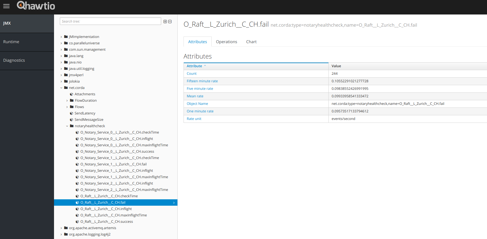

Notary Health Check
===================

This is a simple CordApp to check if notaries on a Corda network are up and responsive.

Installation
------------

To install the app, copy the ``notaryhealthcheck-cordapp`` and the ``notaryhealthcheck-contract`` JARs to the ``cordapps`` directory
of a node that will run the checks. The notaryhealthcheck-contract JAR also needs to be installed on all validating
notaries that are to be checked.

Starting and Stopping the Checks
--------------------------------

The health check works by using a scheduled state per notary. When the flow for the scheduled state is executed,
it will check any previously unfinished checks, install a new scheduled state for the next iteration of the check,
and then run a check on the notary, consuming the current scheduled state.

Start Flows
+++++++++++

To run the actual checks, a check schedule state needs to be installed in the vault. The CordApp provides flows to do
this: ``StartCheckScheduleFlow`` to start monitoring a specific notary node,  and ``StartCheckingAllNotariesFlow`` to start
monitoring all notary nodes and services listed in the network parameters (including all cluster members for
clustered notaries).

The checks will run at regular intervals passed in as a parameter to the constructor of the flows.

There are also flows to stop the scheduled checks: ``StopCheckScheduleFlow`` to stop checking a specific notary node
and ``StopAllChecksFlow`` to stop all checks currently scheduled on the service node. These will consume the currently
scheduled states without spawning any new checks.

Command Line Client
+++++++++++++++++++

To simplify controlling the checks, a command line client is provided that will call the respective flows via RPC.
The ``notaryhealthcheck-client`` is built into a fat JAR and can be executed via Java:

.. code:: bash

        java -jar notaryhealthcheck-client-<version>.jar -c <command> [<options]

The command must be one of:

:startAll: Finds and starts monitoring all notaries in the network map
:start: Starts monitoring a specified notary node. Requires use of the ``--target`` option
:stopAll: Stops all running checks
:stop: Stops monitoring a specified notary node. Requires use of the ``--target`` option

Options are:
:-u, --user: RPC user to use for the node. This can also be stored in a config file. It must be defined
       either in config or on the command line.
:-P, --password: RPC password. This can also be stored in a config file. It must be defined
          either in config or on the command line.
:-h, --host: hostname or IP address of the node.
:-p, --port: RPC port of the node
:-w, --wait-period: Time in seconds to wait between to checks. This can also be stored in a config file.
            Defaults to 120, i.e. 2 minutes
:-o, --wait-for-outstanding-flows: This is the time we wait before rechecking a notary for which we have
            a check flow in-flight, i.e. it is not responding timely or at all. This can also be stored in a config file.
            Defaults to 300, i.e. 5 minutes
:-t, --target: A string representation of the X500 name of the notary node that we want to monitor. Can only be used with
            ``start`` or ``stop``
:-n, --notary: A string representation of the X500 name of the notary service the target is part of for clustered
            notaries. This can only be used with ``start`` or ``stop``. It will default to the value of ``--target``, so does not
        need to be specified for single node notaries.

Monitoring
----------

Logfile
+++++++

Every state change of the check (starting a check, successful check,
failed check, check still in-flight when the next is scheduled) will generate a log line with all the relevant stats.
By redirecting the logs for the name ``net.corda.notaryhealthcheck.cordapp`` to a separate file,
these can be monitored separately from the logging of the rest of the node.

.. code:: xml

    ...
    <Appenders>
        ...
        <RollingFile name="HealthCheckFile-Appender"
                     fileName="${log-path}/healthcheck-${log-name}.log"
                     filePattern="${archive}/healthcheck-${log-name}.%date{yyyy-MM-dd}-%i.log.gz">

            <PatternLayout pattern="[%-5level] %date{ISO8601}{UTC}Z [%t] %c{2}.%method - %msg %X%n"/>
                ...
        </RollingFile>
        ...
    </Appenders>
    <Loggers>
        ...
        <Logger name="net.corda.notaryhealthcheck.cordapp" additivity="false" level="info">
            <AppenderRef ref="HealthCheckFile-Appender" />
        </Logger>
        ...
    </Loggers>

The log events leave lines like below. There are examples for single node notaries (or notary services), and for
cluster members of a clustered notary, which will list a node name in addition to the notary (service) name.

The first two lines show successful checks, listing the notary (and possibly node) that was checked along with the duration
of how long the notarisation took.

The second set of two lines shows a failed check, showing the notary that was checked, how long the failed notarisation
took, and also when the last successful check for this particular notary or cluster member was, and the error message
of the failure.

The third set shows messages generated when a notary is hanging or a check takes a very long time. In this case, the
previous checks were still in flight. The first line shows the number of checks that are still in flight, and how long
it has been waiting for results. In this case, a new check will only be started if the wait time for outstanding flows
has been reached. If no new flow will be started, a line like the second one will be printed that shows since when
the app has been waiting for in-flight flows and at what time the last succesful check happened.

.. code:: text

    [INFO ] 2018-07-20T14:19:12,275Z [flow-worker] cordapp.ScheduledCheckFlow.call - Notary: O=Raft, L=Zurich, C=CH: Check successful in 00:00:00.206 {fiber-id=10000156, flow-id=1d14d397-27f9-4c33-8e3f-948b731f56f1, invocation_id=a9585116-6838-40c0-96fb-ba248a1a3683, invocation_timestamp=2018-07-20T14:19:12.010Z, session_id=a9585116-6838-40c0-96fb-ba248a1a3683, session_timestamp=2018-07-20T14:19:12.010Z, thread-id=222}
    [INFO ] 2018-07-20T14:19:12,380Z [flow-worker] cordapp.ScheduledCheckFlow.call - Notary: O=Raft, L=Zurich, C=CH Node O=Notary Service 0, L=Zurich, C=CH: Check successful in 00:00:00.225 {fiber-id=10000159, flow-id=85afafd9-1e1c-41e5-89ea-1755f2ec8ad8, invocation_id=f6f95981-a93f-437a-a21a-1e97fd8dc0f4, invocation_timestamp=2018-07-20T14:19:12.089Z, session_id=f6f95981-a93f-437a-a21a-1e97fd8dc0f4, session_timestamp=2018-07-20T14:19:12.089Z, thread-id=217}

    [INFO ] 2018-07-20T14:19:12,359Z [flow-worker] cordapp.ScheduledCheckFlow.call - Notary: O=Raft, L=Zurich, C=CH Node O=Notary Service 1, L=Zurich, C=CH: Check failed in 00:00:00.290 Last successful check: 2018-07-18T15:59:28.996Z Failure: net.corda.core.flows.NotaryException: Unable to notarise transaction <Unknown> : net.corda.core.contracts.TransactionVerificationException$ContractCreationError: Contract verification failed: net.corda.notaryhealthcheck.contract.NullContract, could not create contract class: net.corda.notaryhealthcheck.contract.NullContract, transaction: 1CCC10DFC8EFA49782976FB5BBCD1B206D9BDE93BFC049FAAE5841D3892C6199 {fiber-id=10000155, flow-id=b96ed63e-c1bd-4036-9ef2-63041b696579, invocation_id=bd731c7f-e391-47f7-8996-540b40d9be00, invocation_timestamp=2018-07-20T14:19:11.979Z, session_id=bd731c7f-e391-47f7-8996-540b40d9be00, session_timestamp=2018-07-20T14:19:11.979Z, thread-id=222}
    [INFO ] 2018-07-20T14:19:12,387Z [flow-worker] cordapp.ScheduledCheckFlow.call - Notary: O=Raft, L=Zurich, C=CH: Check failed in 00:00:00.311 Last successful check: 2018-07-20T14:19:02.366Z Failure: net.corda.core.flows.NotaryException: Unable to notarise transaction <Unknown> : net.corda.core.contracts.TransactionVerificationException$ContractCreationError: Contract verification failed: net.corda.notaryhealthcheck.contract.NullContract, could not create contract class: net.corda.notaryhealthcheck.contract.NullContract, transaction: 65F2DF9C5459E925B140214A91139F18EB72B8F364444B8EA977A2D9ECCDF069 {fiber-id=10000158, flow-id=bece0fd9-b347-452d-be45-0c2d23484d32, invocation_id=e9f4c93a-f547-4b60-9dd9-cfcabcb29ab7, invocation_timestamp=2018-07-20T14:19:12.060Z, session_id=e9f4c93a-f547-4b60-9dd9-cfcabcb29ab7, session_timestamp=2018-07-20T14:19:12.060Z, thread-id=223}

    [INFO ] 2018-07-20T14:19:12,400Z [flow-worker] cordapp.ScheduledCheckFlow.call - Notary: O=Raft, L=Zurich, C=CH Node O=Notary Service 2, L=Zurich, C=CH: Checks in flight: 23 Running for: 00:21:57.656. {fiber-id=10000161, flow-id=594e3269-b0bd-4ee8-86d4-b676222f1ba9, invocation_id=480736b7-0c06-432a-a8b9-71057f25ba10, invocation_timestamp=2018-07-20T14:19:12.344Z, session_id=480736b7-0c06-432a-a8b9-71057f25ba10, session_timestamp=2018-07-20T14:19:12.344Z, thread-id=221}
    [INFO ] 2018-07-20T14:19:12,408Z [flow-worker] cordapp.ScheduledCheckFlow.call - Notary: O=Raft, L=Zurich, C=CH Node O=Notary Service 2, L=Zurich, C=CH Waiting for previous flows since 2018-07-20T13:57:14.743Z Last successful check: 2018-07-20T13:57:05.075Z {fiber-id=10000161, flow-id=594e3269-b0bd-4ee8-86d4-b676222f1ba9, invocation_id=480736b7-0c06-432a-a8b9-71057f25ba10, invocation_timestamp=2018-07-20T14:19:12.344Z, session_id=480736b7-0c06-432a-a8b9-71057f25ba10, session_timestamp=2018-07-20T14:19:12.344Z, thread-id=221}

JMX/Jolokia
+++++++++++

The flow also populates a set of JMX metrics in the namespace ``net.corda.notaryhealthcheck`` that can be used to
monitor notary health via a dashboard or hook up an alerter. As an example, this is the  `hawtio <https://hawt.io>`_
view on a failing notary check. Note the metrics for `success`, `fail`, `inflight`, and `maxinflightTime` for the
notary service and the cluster members on the left hand side.

