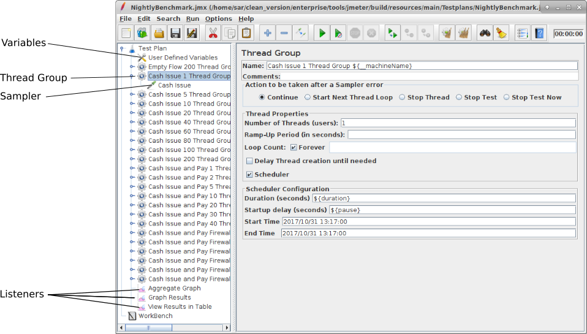

====================================
Understanding and Creating Testplans
====================================

JMeter offers a very flexible and powerful tool kit to build a large variety of testplans. This document can only give
a brief overview over what testplans are typically used for Corda performance testing. To get an overview of what is
available in JMeter, and if you are looking into writing more elaborate testplans, please refer to the `JMeter user
manual <https://jmeter.apache.org/usermanual/index.html>`_.

Structure of a Simple Testplan
==============================

The testplan is a hierarchy of configuration elements. The only elements used in our simple test plans are
*Variables*, *Thread Groups*, *Samplers* and *Listeners*. Rather than creating a new testplan from scratch,
it might a good idea to take a copy of one of the provided example test plans and modify that.

User Defined Variables
    A variables element defines key/value pairs that can be used in all following following elements instead of string
    literals. They can be referenced by using a ``$`` sign and curly braces, e.g. ``${varName}``.

    .. image:: resources/variables.png

Thread Group
    A thread group collects a set of actions that form one step in the test plan. All elements within a thread group
    will be run in order. As the name suggest, a thread group can spin up threads to run serveral instances of its
    content in parallel. Note that everything inside the group will be run in every thread (including any initialisation
    or tear down steps). However, the tear down steps will only be run when all thread groups have finished at the end
    of the test plan - not at the end of the thread group's execution. It cannot be used to release resources that
    the next thread group is supposed to reuse.

    The thread group also allows to repeat the action that has been configured. Repitition can either be count based, or
    scheduler based (e.g. for 5 minutes). Counter based repition will loop the given number of times for each thread,
    so 10 thread with 10 repetitions means 100 runs of group content.

    If a test plan contains a list of thread groups, they will be run sequentially. If the runtime of the thread group
    is controlled via a scheduler, a start-up delay is configurable that the process will wait between finishing the
    previous thread group and starting the next one, e.g. to let the system under test finish any lingering requests,
    flush queues and return to idle state.

Sampler
    Usually, there will be a sampler inside the thread group that creates the load for the Corda network via RPC
    invocations. Note that the thread group will call ``setupTest`` only before the first iteration, and ``teardownTest``
    only after all tests in all thread groups have finished, but will call ``runTest`` for every loop iteration
    configured in the thread group.
    However, all task are run for each thread in parallel.

Listeners
    Listeners collect the output of samplers and handle it by either displaying it, storing it to file or
    aggregating it in some way. Note that starting and stopping does not clear data from the listeners, and some
    statistics are calculated across runs and breaks, so clearing the relevant data before starting a run is vital when
    running from the GUI. The description of all built-in listeners can be found in the `documentation
    <https://jmeter.apache.org/usermanual/component_reference.html#listeners>`_ - here is a short list of listeners
    typically used for Corda runs.

    View Results in Table
        This outpug handler is useful for debugging the test system - every result will be displayed as a line in a table,
        including a status and stats about sent and received bytes. The table can become very long and unwieldy quickly
        when running with many threads and/or loops.

    Graph Results
        This aggregator plots various stats about processing time and throughput over time. It can be handy to view
        trends, but as the time window is fixed and it loops back to the beginning and plots over existing graphs,
        the usefulness for long running tests is limited.

    Aggregate Report
        This aggregator collects processing time stats and throughput on a per thread group basis as a table, and keeps
        a running total for the run.

    Aggregate Graph
        Like the Aggregate Report, but also offers to tools to plot the results.

Included Testplans
==================

Two testplans are included with the performance test suite, to be found in the ``Sample Testplans`` directory in the zip
file. Note that both testplans are examples how they can look and are not runnable out of the box - you need to supply
values for host names, party/notary names, RPC credentials and so on for your Corda installation.

``Example Flow Request.jmx``
    This is a very simple testplan that has one thread group that just runs cash self issue. Everything is configured
    directly on the sampler's page - just enter the details of your installed Corda node here and you should be good
    to go. The structure of this test plan is a good place to start to create your own test plans.

``NightlyBenchmarkSample.jmx``
    This is a copy of the test plan that is used for performance testing Corda Enterprise at R3. This plan has a lot of
    different tests, each in its own thread group. All the thread groups will be run one after another. These different
    tests show use of all the different sampler clients described in :doc:`jmeter-samplers`.
    This testplan uses variables to avoid repetition of values that might require changing. You need to enter the
    appropriate values for your Corda network installation here to get the plan working.

    A useful way to try out bits of the plan is to load it in an interactive JMeter session and disable most of the
    thread groups in order to only run a few tests. (Thread groups can be enabled/disabled in the right-click context
    menu).

Creating Testplans
==================

The JMeter GUI can be used to create and try out new testplans. The easiest way of doing this to take a copy of an
existing testplan and modify this as the structure of all testplans is fairly similar.

- Optionally, there can be user variables and set-up steps defined at the top of the test plan
- Each plan needs one or more thread groups that contain the actual tests to run, i.e. samplers that exercise the system
  under test. Each thread group can just contain a sampler, or furhter logical elements like repetition/decision elements
  that run different samplers in various combinations.
- Thread groups can contains listeners that only process results from this thread group
- The testplan should have at least one global listener that captures results from all thread groups.

Detailed description of the parts of a test plan can be found in the `JMeter documentation
<https://jmeter.apache.org/usermanual/test_plan.html>`_.
