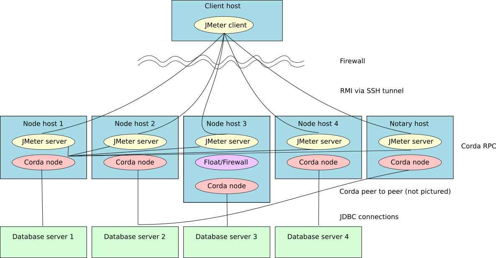

===========================================
Reproducing the R3 performance test numbers
===========================================

The performance test suite contains all the code and configuration to reproduce the performance tests run at R3 and
presented or published occasionally.

Test Network
============

The performance test runs in a self contained test network consisting of

- 4 node machines, each running one Corda node
- 1 simple notary running on a separate machine
- separate database servers for all the nodes
- optionally a doorman/network map server - the test network can be set up using the bootstrapper or the network map
  approach - this does not impact performance however.

The performance network sits behind a firewall that allows incoming connections only via SSH, however the machines
within the network can connect to each other on a range of ports (Corda Remote Procedure Call (RPC), Corda peer to
peer connection (P2P) and JDBC connections to various database servers are all allowed).

A Corda JMeter server instance is running on all 4 nodes and on the notary server. The JMeter client connects to the
JMeter server instances via SSH tunnels. As the JMeter servers run within the firewalled network, they are free to
open RPC connections to any of the Corda nodes - which one they connect to is configured in the JMeter test plan.
They usually connect all to one node to drive the test flows as hard as possible, but might connect to different
nodes for different tests.

The location of the node's working directory is important - as nodes use Artemis for peer to peer communication, it is
crucial that the Artemis spool directory is on a fast storage solution, e.g. a local SSD. It should not be on a network
mount or SAN drive.

There is a separate database for each node - for historical reasons, the notary and node 2 share a database in the,
set-up, therefore node 2 gets the lightest load in order to not cause a slow-down by overloading the database. It
is entirely possible to run the whole network with one database that has different users/schemas for each node and the
notary, however, this set-up might not reach full performance as database throughput becomes a bottleneck.

The default set-up uses Microsoft SQL Server instances as databases, but some testing has been done with Postgres
and Oracle 12 databases.

Machines in the Test Network
----------------------------

Microsoft Azure
+++++++++++++++

The initial performance network was set up on a cluster of Microsoft Azure nodes. The following specs have been chosen
for the network setup

========= ================== =========================================== =========================================================
 Machine   Type               Description                                  Notes
========= ================== =========================================== =========================================================
 node 1    Standard D32s      32 cores, 128GB memory, Ubuntu 16.04        main target node for  flow invocation
 node 2    Standard F8s       8 cores, 16GB memory, Ubuntu 16.04          mostly used for JMeter server, Corda node lightly used
 node 3    Standard D32s      32 cores, 128GB memory, Ubuntu 16.04        target node configured with float/Corda firewall
 node 4    Standard D16s      16 cores, 64GB memory, Ubuntu 16.04         recipient node for payment flows
 notary    Standard F8s       8 cores, 16GB memory, Ubuntu 16.04          notary node
 sql 1     Standard DS12 v2   4 cores, 28GB memory, Windows Server 2016   SQL Server for node 1
 sql 2     Standard DS12 v2   4 cores, 28GB memory, Windows Server 2016   SQL Server for node 2 and notary
 sql 3     Standard DS12 v2   4 cores, 28GB memory, Windows Server 2016   SQL Server for node 3
 sql 4     Standard DS12 v2   4 cores, 28GB memory, Windows Server 2016   SQL Server for node 4
========= ================== =========================================== =========================================================

This set-up has been used to performance tune Corda until Autumn 2018. One of the lessons learned was that performance
testing in the cloud has a few drawbacks:

- The performance of virtual machines in the cloud is not always consistent. How fast they go exactly depends on what
  else is going on, so fluctuations in measured performance could not always be attributed to changes to Corda.
- Cloud databases are optimised for web apps etc. Therefore, they are mostly read-optimised. Corda, however, writes
  a lot of checkpoints and transactions to the database which required us to install custom database instances.
- The virtual hard drives in the cloud have very limited througput, which causes bottlenecks for Artemis queues,
  log file writing and database writing. Getting more performant storage in the cloud is either very expensive or
  plainly not possible.

Dedicated Hardware
++++++++++++++++++

Due to the observed drawbacks with performance testing in the cloud, the performance testing has been moved to
dedicated hardware in a rented data center. To build up the performance test network, the following machine types are
acquired. They are all placed in the same data center, with 10Gb/s network connectivity.

Node Servers
   Intel  2x Xeon E5-2687Wv4, 24 cores hyperthreaded, 256GB DDR4 ECC 2133 MHz, 2x 400GB NVME

Database Servers
   Intel  Xeon E5-2687Wv4 - 12 cores hyperthreaded, 256GB DDR4 ECC 2133 MHz, 2 x 1GB NVME

Notary Server
   Intel  Xeon E5-2687Wv4 - 12 cores hyperthreaded, 256GB DDR4 ECC 2133 MHz, 2 x 1GB NVME

Node Configuration
------------------

For performance runs, the nodes run with pretty standard configuration. However, there are a few tweaks:

- The JVM gets set up with 8 gigabyte heapsize and using the G1 garbage collector.
- The database transaction isolation level is set to ``READ_COMMITTED``.
- In the tuning part of the Enterprise configuration, a generous number of flow and RPC threads are configured.
- Dev mode is turned off for all nodes including the notary.
::

    custom = {
        jvmArgs = [ "-Xmx8g", "-Xms8g", "-XX:+UseG1GC" ]
    }
    database {
        transactionIsolationLevel = "READ_COMMITTED"
    }

    enterpriseConfiguration = {
        tuning = {
            rpcThreadPoolSize = 32
            flowThreadPoolSize = 128
        }
    }
    devMode = false

Depending on the type of machines used, it is recommended that the ``rpcThreadPoolSize`` does not exceed the number of
virtual cores (i.e 2 x number of cores when hyperthreading is enabled), and the ``flowThreadPoolSize`` should be around
4 times the number of virtual cores. Depending on other factors like disk I/O, networking, memory etc. tweaking these
numbers can yield better performance results.

Notary Configuration
--------------------
When using a simple, single node notary, it has the following configuration in addition to the above::

   notary {
      className="net.corda.notary.jpa.JPANotaryService"
      extraConfig {
      }
      validating=false
   }

Database Configuration
----------------------

Each node has its own, dedicated database server running Microsoft SQL Server 2016 Standard.
Note that the disk write latency and throughput on the database machine are critical for the node's performance as the
Corda checkpointing mechanism means that many checkpoints are written to the database, and then deleted again when the
flow finishes. Checkpoints will only be read when a flow is resumed or restarted, which might not happen a lot when
running a large number of short-lived flows. Therefore, a read-optimised database server (as e.g. the hosted database
instances offered by the big cloud providers) is not ideal for a busy Corda node and will limit throughput.
It is recommended to manage the database server manually and optimise for write throughput at least as much as for read.

Test Plan
=========

For the test, JMeter server instances on 4 node machines and the simple notary machine all connect to one node via RPC
to drive the tests. A external JMeter client uses the ``NightlyBenchmark.jmx`` test plan to run the tests.

