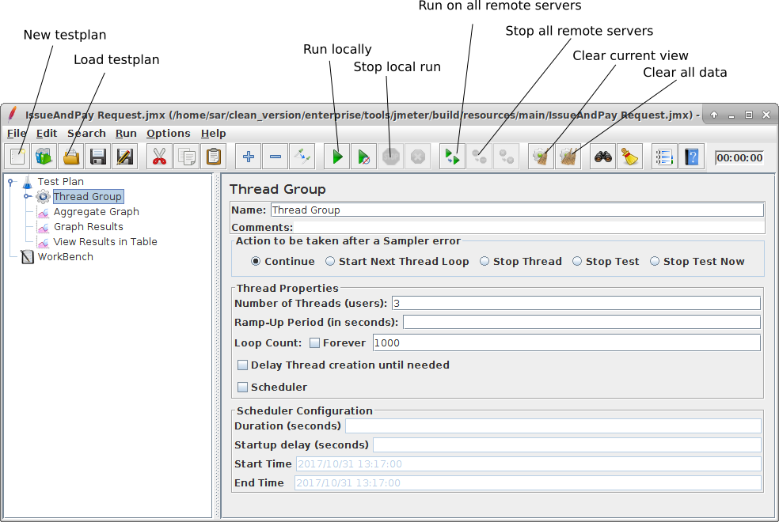

====================
Running JMeter Corda
====================

Jmeter Corda is distributed as a runnable "fat" JAR containing all the dependenices required to run the application.
It comes prepacked with Corda :doc:`jmeter-samplers` and a wrapper that sets up a basic configuration and allows
configuration of SSH tunnels. The arguments for the ``jmeter-corda`` command line fall into two categories: there are
a number of arguments that are consumed by the custom wrapper, followed by a double dash ``--``. Anything after this
will be passed on to the JMeter code as JMeter arguments (though the wrapper can add more arguments to this). The typical
call will be::

    java -jar jmeter-corda-jar <wrapper arguments> -- <jmeter arguments>

JMeter Corda Wrapper Arguments
==============================

The JMeter Corda wrappper understands the following optional arguments:

``-?``, ``-h``, ``--help``
    This will print a help text for the JMeter Corda wrapper arguments and also trigger printing of the JMeter help
    text

``-Xssh``
    This tells the wrapper to set up SSH tunnels. It takes a list of host names as argument. See :ref:`ssh_tunnel` for
    details.

``-XsshUser``
    User name to use for remote servers if creating SSH tunnels. This defaults to the current user name.

``-XadditionalSearchPaths``
    A semicolon separated list of directories containing class files or JAR files that JMeter should consider for finding
    samplers or plug-ins. The wrapper sets up a default search path that contains the samplers included in the JAR and
    the required plug-ins to talk to Corda. Any custom samplers to be used in tests need to be included here.

``-XjmeterProperties``
    Path to a JMeter properties file. JMeter always needs configuration via a properties file - there is a ``jmeter.properties``
    file included in the jmeter-corda.jar that sets sensible defaults. The wrapper will make JMeter use the pre-packed
    properties if this option is not set.

``-XserverRmiMappings``
    Port mappings for the remote method invocation tunnels when setting up SSH tunnels. See :ref:`ssh_tunnel` for details.

These arguments have to come first on the command line. They can be followed by a double dash and JMeter arguments
that will be fed through to JMeter. The wrapper will add some arguments to the list passed on to JMeter and does disallow
some arguments. Some JMeter arguments used/discussed on this page are:

``-p``
    This is the way of telling JMeter what properties file to use. This will **always** be set by the wrapper code and
    must **not** be set on the command line. Use the ``-XjmeterProperties`` argument to the wrapper instead.

``-s``
    This makes JMeter run in server mode, i.e. it will run headless and wait for instructions from a client via remote
    method invocation. See also :ref:`jmeter_server`.

Running the JMeter GUI
======================

By default, JMeter Corda will start up as client in GUI mode. The GUI allows to view/create test plans, and run tests
interactively either locally or remotely, and view results. The UI has a set of handy butons at the top that allow to
quickly create or load a testplan, control local or remote test runs, and clear any test results collected so far.
The latter is particularly important when looking at averages, as old data might skew the results being looked at.

The *clear current view* button only clears the data in the currently viewed output collector - if a test plan has several
output listeners defined (as in the example above, we have *Aggregate Graph*, *Graph Results* and *View Results in Table*),
any collector not currently selected is not affected. *Clear all data* will clear the results from all collectors.

See :doc:`jmeter-testplans` for details on the testplan, and how to create one.

Running JMeter headless
=======================

JMeter can be run in headless mode, i.e. without starting up a GUI, by giving it a test definition on the command line.
This allows to run performance tests excluding any influences from GUI rendering or interaction issues, and allows
to run performance tests in an automated manner, e.g. as part of a nightly build. This is controlled by JMeter arguments
passed through to the JMeter instances. The relevant arguments are:

``-n``
    This will run a JMeter client in headless mode. This requires to also pass a test definition via ``-t`` and an output
    file via ``-l``.

``-t <testplan.jmx>``
    Provide a testplan xml file to load and run.

``-l <results.jtl>``
    Path to an output jtl file to be written - this is a JMeter specific CSV format.

``-r``
    Run via RMI against the remote servers configured in the JMeter properties file. Without this option, JMeter
    will run the testplan locally.

Example::

    java -jar jmeter-corda.jar -Xssh node1.mydomain.com node2.mydomain.com -- -n -t /home/<user>/tesplan.jmx -l /home/<user>/results.jtl -r

See `JMeter documentation <https://jmeter.apache.org/usermanual/get-started.html#non_gui>`_ for details.

Using remote JMeter
===================

JMeter can connect to JMeter server instances using Java Remote Invocation (RMI). The hosts and ports a JMeter client
instance can connect to are listed in the properties file it is using. When running the GUI, the remote hosts will be
used when using the start/stop remotely functions, while the simple start/stop will still work locally. When running
headless, the remote hosts will be used when the ``-r`` option is given.

If no SSH tunneling is required, the ``-R`` option can be used to pass in a different list of remote hosts to the client.
If the SSH tunneling set-up from the wrapper is used, this option is **not** supported and **will fail**.

.. _ssh_tunnel:

SSH Tunnel Set-Up
-----------------

The RMI traffic requires non-standard ports to be open, therefore the standard practice is to
route it via SSH tunnels. Therefore, the remote hosts in the default configuration are all specified as ``127.0.0.1``,
i.e. localhost, with different port numbers, for which SSH tunnels will be opened to the hosts specified on the command
line using the ``-Xssh`` flag.
Due to the Java RMI architecture, three tunnels need to be opened for each remote JMeter instace - one for the connection
to the RMI server, and an outbound and inbound tunnel. For this to work, it is crucial that the JMeter client and the
server instances agree on the ports they use, and the hostnames used on the command line and the server RMI mapping
do match exactly.

The Corda JMeter executable contains code to set up the tunnels and orchestrate the connections on the client and server
side. All the tunnels are set up from the client side. The information required to set up the tunnels comes from three
places:

- The number of hosts to create tunnels for and their client side RMI server ports are read from the ``jmeter.properties``
  file that is used to run this instance of JMeter. For using the SSH tunnel, localhost addresses are listed here as the
  actual remoting is done via SSH. By default, the five remote addresses shown below are listed in the properties file
  included in the JAR. This configuration is only relevant on the client side::

    #---------------------------------------------------------------------------
    # Remote hosts and RMI configuration
    #---------------------------------------------------------------------------

    # Remote Hosts - comma delimited
    remote_hosts=127.0.0.1:20100,127.0.0.1:20101,127.0.0.1:20102,127.0.0.1:20103,127.0.0.1:20104

- The actual host names are passed to the client process on the command line with the ``-Xssh`` command line flag. This
  takes a list of space separated, fully qualified host names. They must be actual hostnames (not just IP addresses), and
  for the look-up to work, must match between the `hostname` entry on the server and the DNS name - i.e. the result of
  calling `hostname` on the server should be the same as the first part of the hostname used on the command line up to
  the first dot::

    java -jar jmeter-corda.jar -Xssh node1.mydomain.com node2.mydomain.com

- The server side RMI server port can be configured in the ``jmeter.properties`` file as property ``server.rmi.port``,
  and defaults to ``1099``. It is crucial that the same value is used on the server and client side.
- The client local RMI port (server to client callback) is also configured in the ``jmeter.properties`` file as property
  ``client.rmi.localport``. Again it is crucial that this value is the same on server and client side.
- The server local RMI port (used to send requests to the server) needs to be different for each host so different
  information can be send to different tunnels for different servers from the client. Therefore, the property
  ``server.rmi.localport`` in the ``jmeter.properties`` file is only used as a fallback - it would only work for a single
  JMeter server instance being used at a time. Instead, the mappings of port to host name come from an additinal config
  file ``server-rmi.config`` that lists a mapping of unqualified hostname to port::

    # lines starting in # are comments and ignored
    node1:10101
    node2:10102

  These values must be the same on client and server side and must match the configured hostname of the target host.
  The configuration file can be passed to the process using the ``-XserverRmiMappings`` command line flag.
- The server RMI mapping must be provided on the command line of the client and the server process when using SSH tunnels,
  and the mappings on client and server side have to match.

Connecting to remote JMeter servers
-----------------------------------

The default JMeter properties file in the Corda JMeter JAR assumes that 5 instances of JMeter server are running on hosts
that can be reached via SSH tunnels. When using the run remotely function in the GUI, JMeter will try to connect to the
hosts listed in its properties file.

If you need to specify a different list of remote hosts, e.g. for a different number of hosts, to specify different port
numbers or to specify explicit namesin case SSH tunnelling is not required, you will have to take a copy of the
``jmeter.properties`` file, modify it accordingly and specify the file to use on the command line using the
``-XjmeterProperties`` argument.

Running with SSH tunnels
++++++++++++++++++++++++

In order to run the client with SSH tunnels, a typical command line would be::

    java -jar jmeter-corda.jar -Xssh <server1 hostname> [<server hostname> ...] [-XsshUser <remote user name>] [-XjmeterProperties <jmeter properties file>] -XserverRmiMappings <RMI mappings file> [-- <jmeter arguments>]

The SSH tunnel code assumes private/public key authentication, interactive authentication is not supported. In order to
establish the SSH tunnels, an SSH agent must be running that has exactly one private key loaded that can be
used to establish connections to all server hosts. When starting from a POSIX system (Unix/linux/Mac OS), the tool expects
a POSIX SSHagent to be started, and the environment variable ``SSH_AUTH_SOCK`` to be set. On a Windows system, the key
is expected to be served up by the Putty SSH agent `Pageant <https://www.ssh.com/ssh/putty/putty-manuals/0.68/Chapter9.html>`_.

Running without SSH tunnels
+++++++++++++++++++++++++++

If SSH tunneling is not required, the list of actual host names needs to be in the JMeter properties file as property
``remote_hosts``, or can be passed in with the JMeter argument ``-R``:

``jmeter.properties``
    ``remote_hosts=node1.mydomain.com,node2.mydomain.com``

Command line
    ``java -jar jmeter-corda.jar -- -Rnode1.mydomain.com,node2.mydomain.com``

None of the Corda provided SSH code options need to be configured, so the server command line should just include the
``-s`` option, and the client command line would be::

    java -jar jmeter-corda.jar -XjmeterProperties <property file including hostnames> [-- <jmeter arguments>]

It is recommended to consult the JMeter manual on `Remote Testing <https://jmeter.apache.org/usermanual/remote-test.html>`_
when setting up remote testing without SSH tunneling.

