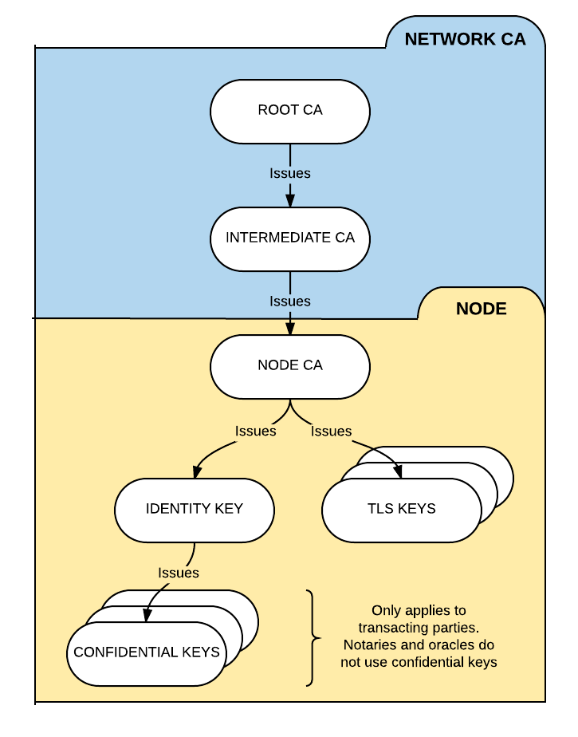

Network permissioning
=====================

.. contents::

Corda networks are *permissioned*. To connect to a network, a node needs three keystores in its
``<workspace>/certificates/`` folder:

* ``truststore.jks``, which stores trusted public keys and certificates (in our case, those of the network root CA)
* ``nodekeystore.jks``, which stores the node’s identity keypairs and certificates
* ``sslkeystore.jks``, which stores the node’s TLS keypairs and certificates

Production deployments require a secure certificate authority.
Most production deployments will use an existing certificate authority or construct one using software that will be
made available in the coming months. Until then, the documentation below can be used to create your own certificate
authority.

.. note:: If you are looking for information on how to connect to the existing compatibility zone go to the section: `Connecting to a compatibility zone`_

Certificate hierarchy
---------------------
A Corda network has four types of certificate authorities (CAs):

* The **root network CA**
* The **doorman CA**

  * The doorman CA is used instead of the root network CA for day-to-day
    key signing to reduce the risk of the root network CA's private key being compromised

* The **node CAs**

  * Each node serves as its own CA in issuing the child certificates that it uses to sign its identity
    keys and TLS certificates

* The **legal identity CAs**

   * Node's well-known legal identity, apart from signing transactions, can also issue certificates for confidential legal identities

The following constraints are also imposed:

* Doorman certificates are issued by a network root which certificate doesn't contain the extension
* Well-known service identity certificates are issued by an entity with a Doorman certificate
* Node CA certificates are issued by an entity with a Doorman certificate
* Well known legal identity/TLS certificates are issued by a certificate marked as node CA
* Confidential legal identity certificates are issued by a certificate marked as well known legal identity
* Party certificates are marked as either a well known identity or a confidential identity
* The structure of certificates above Doorman/Network map is intentionally left untouched, as they are not relevant to
  the identity service and therefore there is no advantage in enforcing a specific structure on those certificates. The
  certificate hierarchy consistency checks are required because nodes can issue their own certificates and can set
  their own role flags on certificates, and it's important to verify that these are set consistently with the
  certificate hierarchy design. As as side-effect this also acts as a secondary depth restriction on issued
  certificates

All the certificates must be issued with the custom role extension (see below).

We can visualise the permissioning structure as follows:

Keypair and certificate formats
-------------------------------
You can use any standard key tools to create the required public/private keypairs and certificates. The keypairs and
certificates must obey the following restrictions:

* The certificates must follow the `X.509 standard <https://tools.ietf.org/html/rfc5280>`_

   * We recommend X.509 v3 for forward compatibility

* The TLS certificates must follow the `TLS v1.2 standard <https://tools.ietf.org/html/rfc5246>`_

* The root network CA, doorman CA and node CA keys, as well as the node TLS
  keys, must follow one of the following schemes:

    * ECDSA using the NIST P-256 curve (secp256r1)

    * ECDSA using the Koblitz k1 curve (secp256k1)

    * RSA with 3072-bit key size

.. note:: Corda's ``X509Utilities`` show how to generate the required public/private keypairs and certificates using
   Bouncy Castle. You can find the ``X509Utilities`` in the `Corda repository <https://github.com/corda/corda>`_, under
   ``/node-api/src/main/kotlin/net/corda/nodeapi/internal/crypto/X509Utilities.kt``.

Certificate role extension
--------------------------
Corda certificates have a custom X.509 v3 extension that specifies the role the certificate relates to. This extension
has the OID ``1.3.6.1.4.1.50530.1.1`` and is non-critical, so implementations outside of Corda nodes can safely ignore it.
The extension contains a single ASN.1 integer identifying the identity type the certificate is for:

1. Doorman
2. Network map
3. Service identity (currently only used as the shared identity in distributed notaries)
4. Node certificate authority (from which the TLS and well-known identity certificates are issued)
5. Transport layer security
6. Well-known legal identity
7. Confidential legal identity

In a typical installation, node administrators needn't be aware of these. However, when node certificates are managed
by external tools (such as an existing PKI solution deployed within an organisation), it is important to understand
these constraints.

Certificate path validation is extended so that a certificate must contain the extension if the extension was present
in the certificate of the issuer.

Creating the root and doorman CAs
---------------------------------

Creating the root network CA's keystore and truststore
^^^^^^^^^^^^^^^^^^^^^^^^^^^^^^^^^^^^^^^^^^^^^^^^^^^^^^

1. Create a new keypair

   * This will be used as the root network CA's keypair

2. Create a self-signed certificate for the keypair. The basic constraints extension must be set to ``true``

   * This will be used as the root network CA's certificate

3. Create a new keystore and store the root network CA's keypair and certificate in it for later use

   * This keystore will be used by the root network CA to sign the doorman CA's certificate

4. Create a new Java keystore named ``truststore.jks`` and store the root network CA's certificate in it using the
   alias ``cordarootca``

   * This keystore must then be provisioned to the individual nodes later so they can store it in their ``certificates`` folder

.. warning:: The root network CA's private key should be protected and kept safe.

Creating the doorman CA's keystore
^^^^^^^^^^^^^^^^^^^^^^^^^^^^^^^^^^

1. Create a new keypair

   * This will be used as the doorman CA's keypair

2. Obtain a certificate for the keypair signed with the root network CA key. The basic constraints extension must be
   set to ``true``

   * This will be used as the doorman CA's certificate

3. Create a new keystore and store the doorman CA's keypair and certificate chain
   (i.e. the doorman CA certificate *and* the root network CA certificate) in it for later use

   * This keystore will be used by the doorman CA to sign the nodes' identity certificates

Creating the node CA keystores and TLS keystores
------------------------------------------------

Creating the node CA keystores
^^^^^^^^^^^^^^^^^^^^^^^^^^^^^^

1. For each node, create a new keypair

2. Obtain a certificate for the keypair signed with the doorman CA key. The basic constraints extension must be
   set to ``true``

3. Create a new Java keystore named ``nodekeystore.jks`` and store the keypair in it using the alias ``cordaclientca``

   * The node will store this keystore locally to sign its identity keys and anonymous keys

Creating the node TLS keystores
^^^^^^^^^^^^^^^^^^^^^^^^^^^^^^^

1. For each node, create a new keypair

2. Create a certificate for the keypair signed with the node CA key. The basic constraints extension must be set to
   ``false``

3. Create a new Java keystore named ``sslkeystore.jks`` and store the key and certificates in it using the alias
   ``cordaclienttls``

   * The node will store this keystore locally to sign its TLS certificates

Installing the certificates on the nodes
----------------------------------------
For each node, copy the following files to the node's certificate directory (``<workspace>/certificates/``):

1. The node's ``nodekeystore.jks`` keystore
2. The node's ``sslkeystore.jks`` keystore
3. The root network CA's ``truststore.jks`` keystore

Connecting to a compatibility zone
----------------------------------
To connect to a compatibility zone you need to register with their certificate signing authority (doorman) by submitting
a certificate signing request (CSR) to obtain a valid identity for the zone.

Before you can register, you must first have received the trust store file containing the root certificate from the zone
operator. Then run the following command:

``java -jar corda.jar --initial-registration --network-root-truststore-password <trust store password>``

By default it will expect the trust store file to be in the location ``certificates/network-root-truststore.jks``.
This can be overridden with the additional ``--network-root-truststore`` flag.

The certificate signing request will be created based on node information obtained from the node configuration.
The following information from the node configuration file is needed to generate the request.

* **myLegalName** Your company's legal name as an X.500 string. X.500 allows differentiation between entities with the same
  name as the legal name needs to be unique on the network. If another node has already been permissioned with this
  name then the permissioning server will automatically reject the request. The request will also be rejected if it
  violates legal name rules, see :ref:`node_naming` for more information.

* **emailAddress** e.g. "admin@company.com"

* **devMode** must be set to false

* **networkServices or compatibilityZoneURL** The Corda compatibility zone services must be configured. This must be either:

  * **compatibilityZoneURL** The Corda compatibility zone network management service root URL.
  * **networkServices** Replaces the ``compatibilityZoneURL`` when the Doorman and Network Map services
    are configured to operate on different URL endpoints. The ``doorman`` entry is used for registration.

A new pair of private and public keys generated by the Corda node will be used to create the request.

The utility will submit the request to the doorman server and poll for a result periodically to retrieve the certificates.
Once the request has been approved and the certificates downloaded from the server, the node will create the keystore and trust store using the certificates and the generated private key.

.. note:: You can exit the utility at any time if the approval process is taking longer than expected. The request process will resume on restart.

This process only is needed when the node connects to the network for the first time, or when the certificate expires.
