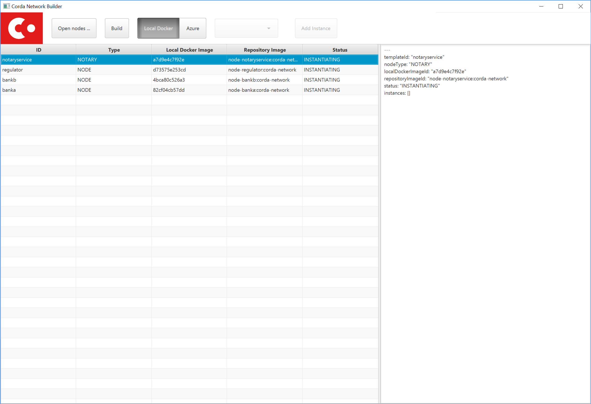

Release notes for Corda 4
=========================

.. _release_notes_v4_0:

Welcome to the Corda 4 release notes. Please read these carefully to understand what's new in this
release and how the changes can help you. Just as prior releases have brought with them commitments
to wire and API stability, Corda 4 comes with those same guarantees. States and apps valid in
Corda 3 are transparently usable in Corda 4.

For app developers, we strongly recommend reading ":doc:`app-upgrade-notes`". This covers the upgrade
procedure, along with how you can adjust your app to opt-in to new features making your app more secure and
easier to upgrade in future.

For node operators, we recommend reading ":doc:`node-upgrade-notes`". The upgrade procedure is simple but
it can't hurt to read the instructions anyway.

Additionally, be aware that the data model improvements are changes to the Corda consensus rules. To use
apps that benefit from them, *all* nodes in a compatibility zone must be upgraded and the zone must be
enforcing that upgrade. This may take time in large zones like the testnet. Please take this into
account for your own schedule planning.

.. warning:: There is a bug in Corda 3.3 that causes problems when receiving a ``FungibleState`` created
   by Corda 4. There will shortly be a followup Corda 3.4 release that corrects this error. Interop between
   Corda 3 and Corda 4 will require that Corda 3 users are on the latest patchlevel release.

.. contents::

Changes for developers in Corda 4
~~~~~~~~~~~~~~~~~~~~~~~~~~~~~~~~~

Reference states
++++++++++++++++

With Corda 4 we are introducing the concept of "reference input states". These allow smart contracts
to reference data from the ledger in a transaction without simultaneously updating it. They're useful
not only for any kind of reference data such as rates, healthcare codes, geographical information etc,
but for anywhere you might have used a SELECT JOIN in a SQL based app.

A reference input state is a ``ContractState`` which can be referred to in a transaction by the contracts
of input and output states but, significantly, whose contract is not executed as part of the transaction
verification process and is not consumed when the transaction is committed to the ledger. Rather, it is checked
for "current-ness". In other words, the contract logic isn't run for the referencing transaction only.
Since they're normal states, if they do occur in the input or output positions, they can evolve on the ledger,
modeling reference data in the real world.

Signature constraints
+++++++++++++++++++++

CorDapps built by the ``corda-gradle-plugins`` are now signed and sealed JAR files by default. This
signing can be configured or disabled with the default certificate being the Corda development certificate.

When an app is signed, that automatically activates the use of signature constraints, which are an
important part of the Corda security and upgrade plan. They allow states to express what contract logic
governs them socially, as in "any contract JAR signed by a threshold of these N keys is suitable",
rather than just by hash or via zone whitelist rules, as in previous releases.

**We strongly recommend all apps be signed and use signature constraints going forward.**

Learn more about this new feature by reading the :doc:`app-upgrade-notes`.

State pointers
++++++++++++++

:ref:`state_pointers` formalize a recommended design pattern, in which states may refer to other states
on the ledger by ``StateRef`` (a pair of transaction hash and output index that is sufficient to locate
any information on the global ledger). State pointers work together with the reference states feature
to make it easy for data to point to the latest version of any other piece of data, with the right
version being automatically incorporated into transactions for you.

New network builder tool
++++++++++++++++++++++++

A new graphical tool for building test Corda networks has been added. It can build Docker images for local
deployment and can also remotely control Microsoft Azure, to create a test network in the cloud.

Learn more on the :doc:`network-builder` page.

JPA access in flows and services
++++++++++++++++++++++++++++++++

Corda 3 provides the ``jdbcConnection`` API on ``FlowLogic`` to give access to an active connection to your
underlying database. It is fully intended that apps can store their own data in their own tables in the
node database, so app-specific tables can be updated atomically with the ledger data itself. But JDBC is
not always convenient, so in Corda 4 we are additionally exposing the *Java Persistence Architecture*, for
object-relational mapping. The new ``ServiceHub.withEntityManager`` API lets you load and persist entity
beans inside your flows and services.

Please do write apps that read and write directly to tables running alongside the node's own tables. Using
SQL is a convenient and robust design pattern for accessing data on or off the ledger.

.. important:: Please do not attempt to write to tables starting with ``node_`` or ``contract_`` as those
   are maintained by the node. Additionally, the ``node_`` tables are private to Corda and should not be
   directly accessed at all. Tables starting with ``contract_`` are generated by apps and are designed to
   be queried by end users, GUIs, tools etc.

Security upgrades
+++++++++++++++++

**Sealing.** Sealed JARs are a security upgrade that ensures JARs cannot define classes in each other's packages,
thus ensuring Java's package-private visibility feature works. The Gradle plugins now seal your JARs
by default.

**BelongsToContract annotation.** CorDapps are currently expected to verify that the right contract
is named in each state object. This manual step is easy to miss, which would make the app less secure
in a network where you trade with potentially malicious counterparties. The platform now handles this
for you by allowing you to annotate states with which contract governs them. If states are inner
classes of a contract class, this association is automatic. See :doc:`api-contract-constraints` for more information.

**Two-sided FinalityFlow and SwapIdentitiesFlow.** The previous ``FinalityFlow`` API was insecure because
nodes would accept any finalised transaction, outside of the context of a containing flow. This would
allow transactions to be sent to a node bypassing things like business network membership checks. The
same applies for the ``SwapIdentitiesFlow`` in the confidential-identities module. A new API has been
introduced to allow secure use of this flow.

**Package namespace ownership.** Corda 4 allows app developers to register their keys and Java package namespaces
with the zone operator. Any JAR that defines classes in these namespaces will have to be signed by those keys.
This is an opt-in feature designed to eliminate potential confusion that could arise if a malicious
developer created classes in other people's package namespaces (e.g. an attacker creating a state class
called ``com.megacorp.exampleapp.ExampleState``). Whilst Corda's attachments feature would stop the
core ledger getting confused by this, tools and formats that connect to the node may not be designed to consider
attachment hashes or signing keys, and rely more heavily on type names instead. Package namespace ownership
allows tool developers to assume that if a class name appears to be owned by an organisation, then the
semantics of that class actually *were* defined by that organisation, thus eliminating edge cases that
might otherwise cause confusion.

Network parameters in transactions
++++++++++++++++++++++++++++++++++

Transactions created under a Corda 4+ node will have the currently valid signed ``NetworkParameters``
file attached to each transaction. This will allow future introspection of states to ascertain what was
the accepted global state of the network at the time they were notarised. Additionally, new signatures must
be working with the current globally accepted parameters. The notary signing a transaction will check that
it does indeed reference the current in-force network parameters, meaning that old (and superseded) network
parameters can not be used to create new transactions.

RPC upgrades
++++++++++++

**AMQP/1.0** is now default serialization framework across all of Corda (checkpointing aside), swapping the RPC
framework from using the older Kryo implementation. This means Corda open source and Enterprise editions are
now RPC wire compatible and either client library can be used. We previously started using AMQP/1.0 for the
peer to peer protocol in Corda 3.

**Class synthesis.** The RPC framework supports the "class carpenter" feature. Clients can now freely
download and deserialise objects, such as contract states, for which the defining class files are absent
from their classpath. Definitions for these classes will be synthesised on the fly from the binary schemas
embedded in the messages. The resulting dynamically created objects can then be fed into any framework that
uses reflection, such as XML formatters, JSON libraries, GUI construction toolkits, scripting engines and so on.
This approach is how the :doc:`blob-inspector` tool works - it simply deserialises a message and then feeds
the resulting synthetic class graph into a JSON or YAML serialisation framework.

Class synthesis will use interfaces that are implemented by the original objects if they are found on the
classpath. This is designed to enable generic programming. For example, if your industry has standardised
a thin Java API with interfaces that expose JavaBean style properties (get/is methods), then you can have
that JAR on the classpath of your tool and cast the deserialised objects to those interfaces. In this way
you can work with objects from apps you aren't aware of.

**SSL**. The Corda RPC infrastructure can now be configured to utilise SSL for additional security. The
operator of a node wishing to enable this must of course generate and distribute a certificate in
order for client applications to successfully connect. This is documented here :doc:`tutorial-clientrpc-api`

Preview of the deterministic DJVM
+++++++++++++++++++++++++++++++++

It is important that all nodes that process a transaction always agree on whether it is valid or not.
Because transaction types are defined using JVM byte code, this means that the execution of that byte
code must be fully deterministic. Out of the box a standard JVM is not fully deterministic, thus we must
make some modifications in order to satisfy our requirements.

This version of Corda introduces a standalone :doc:`key-concepts-djvm`. It isn't yet integrated with
the rest of the platform. It will eventually become a part of the node and enforce deterministic and
secure execution of smart contract code, which is mobile and may propagate around the network without
human intervention.

Currently, it is released as an evaluation version. We want to give developers the ability to start
trying it out and get used to developing deterministic code under the set of constraints that we
envision will be placed on contract code in the future. There are some instructions on
how to get started with the DJVM command-line tool, which allows you to run code in a deterministic
sandbox and inspect the byte code transformations that the DJVM applies to your code. Read more in
":doc:`key-concepts-djvm`".

Configurable flow responders
++++++++++++++++++++++++++++

In Corda 4 it is possible for flows in one app to subclass and take over flows from another. This allows you to create generic, shared
flow logic that individual users can customise at pre-agreed points (protected methods). For example, a site-specific app could be developed
that causes transaction details to be converted to a PDF and sent to a particular printer. This would be an inappropriate feature to put
into shared business logic, but it makes perfect sense to put into a user-specific app they developed themselves.

If your flows could benefit from being extended in this way, read ":doc:`flow-overriding`" to learn more.

Target/minimum versions
+++++++++++++++++++++++

Applications can now specify a **target version** in their JAR manifest. The target version declares
which version of the platform the app was tested against. By incrementing the target version, app developers
can opt in to desirable changes that might otherwise not be entirely backwards compatible. For example
in a future release when the deterministic JVM is integrated and enabled, apps will need to opt in to
determinism by setting the target version to a high enough value.

Target versioning has a proven track record in both iOS and Android of enabling platforms to preserve
strong backwards compatibility, whilst also moving forward with new features and bug fixes. We recommend
that maintained applications always try and target the latest version of the platform. Setting a target
version does not imply your app *requires* a node of that version, merely that it's been tested against
that version and can handle any opt-in changes.

Applications may also specify a **minimum platform version**. If you try to install an app in a node that
is too old to satisfy this requirement, the app won't be loaded. App developers can set their min platform
version requirement if they start using new features and APIs.

Dependency upgrades
+++++++++++++++++++

We've raised the minimum JDK to |java_version|, needed to get fixes for certain ZIP compression bugs.

We've upgraded to Kotlin |kotlin_version| so your apps can now benefit from the new features in this language release.

We've upgraded to Gradle 4.10.1.

Changes for administrators in Corda 4
~~~~~~~~~~~~~~~~~~~~~~~~~~~~~~~~~~~~~

Official Docker images
++++++++++++++++++++++

Corda 4 adds an :doc:`docker-image` for starting the node. It's based on Ubuntu and uses the Azul Zulu
spin of Java 8. Other tools will have Docker images in future as well.

Auto-acceptance for network parameters updates
++++++++++++++++++++++++++++++++++++++++++++++

Changes to the parameters of a compatibility zone require all nodes to opt in before a flag day.

Some changes are trivial and very unlikely to trigger any disagreement. We have added auto-acceptance
for a subset of network parameters, negating the need for a node operator to manually run an accept
command on every parameter update. This behaviour can be turned off via the node configuration.
See :doc:`network-map`.

Automatic error codes
+++++++++++++++++++++

Errors generated in Corda are now hashed to produce a unique error code that can be
used to perform a lookup into a knowledge base. The lookup URL will be printed to the logs when an error
occur. Here's an example:

.. code-block:: none

    [ERROR] 2018-12-19T17:18:39,199Z [main] internal.NodeStartupLogging.invoke - Exception during node startup: The name 'O=Wawrzek Test C4, L=London, C=GB' for identity doesn't match what's in the key store: O=Wawrzek Test C4, L=Ely, C=GB [errorCode=wuxa6f, moreInformationAt=https://errors.corda.net/OS/4.0/wuxa6f]

The hope is that common error conditions can quickly be resolved and opaque errors explained in a more
user friendly format to facilitate faster debugging and trouble shooting.

At the moment, Stack Overflow is that knowledge base, with the error codes being converted
to a URL that redirects either directly to the answer or to an appropriate search on Stack Overflow.

Standardisation of command line argument handling
+++++++++++++++++++++++++++++++++++++++++++++++++

In Corda 4 we have ported the node and all our tools to use a new command line handling framework. Advantages for you:

* Improved, coloured help output.
* Common options have been standardised to use the same name and behaviour everywhere.
* All programs can now generate bash/zsh auto completion files.

You can learn more by reading our :doc:`CLI user experience guidelines <cli-ux-guidelines>` document.

Liquibase for database schema upgrades
++++++++++++++++++++++++++++++++++++++

We have open sourced the Liquibase schema upgrade feature from Corda Enterprise. The node now uses Liquibase to
bootstrap and update itself automatically. This is a transparent change with pre Corda 4 nodes seamlessly
upgrading to operate as if they'd been bootstrapped in this way. This also applies to the finance CorDapp module.

.. important:: If you're upgrading a node from Corda 3 to Corda 4 and there is old data in the vault, this upgrade may take some time, depending on the number of unconsumed states in the vault.

Ability to pre-validate configuration files
+++++++++++++++++++++++++++++++++++++++++++

A new command has been added that lets you verify a config file is valid without starting up the rest of the node::

    java -jar corda-4.0.jar validate-configuration

Flow control for notaries
+++++++++++++++++++++++++

Notary clusters can now exert backpressure on clients, to stop them from being overloaded. Nodes will be ordered
to back off if a notary is getting too busy, and app flows will pause to give time for the load spike to pass.
This change is transparent to both developers and administrators.

Retirement of non-elliptic Diffie-Hellman for TLS
+++++++++++++++++++++++++++++++++++++++++++++++++

The TLS_DHE_RSA_WITH_AES_128_GCM_SHA256 family of ciphers is retired from the list of allowed ciphers for TLS
as it is a legacy cipher family not supported by all native SSL/TLS implementations. We anticipate that this
will have no impact on any deployed configurations.

Miscellaneous changes
~~~~~~~~~~~~~~~~~~~~~

To learn more about smaller changes, please read the :doc:`changelog`.

Finally, we have added some new jokes. Thank you and good night!
