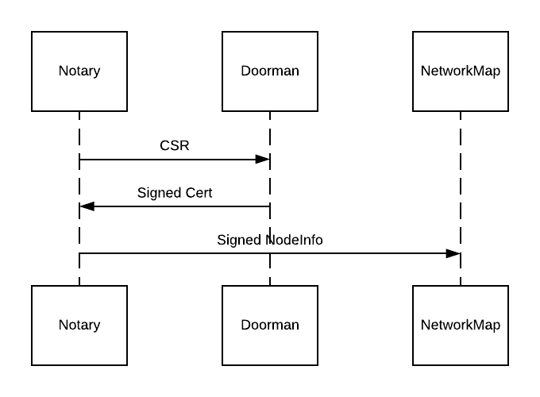

In a network with Doorman and Network map
+++++++++++++++++++++++++++++++++++++++++

You can skip this section if you're not setting up or joining a network with
doorman and network map service.

Expected Outcome
~~~~~~~~~~~~~~~~

You will go from a set of configuration files to a fully functional Corda network.
The network map will be advertising the service identity of the notary. Every
notary worker has obtained its own identity and the shared service identity
from the doorman. 

Using the registration tool, you will obtain the service identity of your notary
cluster and distribute it to the keystores of all worker nodes.

The individual node identity is used by the messaging layer to route requests to
specific workers. The workers sign transactions using the service identity private key.

========  ========================== ===========================
Host      Individual identity        Service identity
========  ========================== ===========================
notary-1  O=Worker 1, L=London, C=GB O=HA Notary, L=London, C=GB
notary-2  O=Worker 2, L=London, C=GB O=HA Notary, L=London, C=GB
notary-3  O=Worker 3, L=London, C=GB O=HA Notary, L=London, C=GB
========  ========================== ===========================

The notary workers will be visible and available on the network. To list available notary
identities using the Corda node shell

.. code:: sh

  run notaryIdentities

The output of the above command should include ``O=HA Notary, L=London, C=GB``.

CorDapp developers should select the notary service identity from the network map cache.

.. code:: kotlin

  serviceHub.networkMapCache.getNotary(CordaX500Name("HA Notary", "London", "GB"))

Every notary worker's keystore contains the private key of the replica and the
private key of the notary service (with aliases ``identity-private-key`` and
``distributed-notary-private key`` in the keystore). We're going to create and
populate the node's keystores later in this tutorial.

The Notary, the Doorman and the Network Map
~~~~~~~~~~~~~~~~~~~~~~~~~~~~~~~~~~~~~~~~~~~

The notary is an essential component of every Corda network, therefore the
notary identity needs to be created first, before other nodes can join the
network, since the Notary identity is part of the network parameters.
Adding a Corda notary to an existing network is covered in
the network services documentation (TBD where this is hosted). Removing a notary from a network
is currently not supported.

The notary sends a certificate signing request (CSR) to the doorman for
approval. Once approved, the notary obtains a signed certificate from the
doorman. The notary can then produce a signed node info file that contains the
P2P addresses, the legal identity, certificate and public key. The node infos
of all notaries that are part of the network are included in the network
parameters. Therefore, the notary node info files have to be present when the
network parameters are created.

Registering with the Doorman
~~~~~~~~~~~~~~~~~~~~~~~~~~~~

Obtaining the individual Node Identities
^^^^^^^^^^^^^^^^^^^^^^^^^^^^^^^^^^^^^^^^

Write the configuration files for your notary nodes as described in :doc:`installing-the-notary-service`.

Register all the nodes with the doorman using the ``--initial-registration``  flag.

.. code:: sh

  java -jar corda.jar --initial-registration \
      --network-root-truststore-password '{{ root-truststore-password }}' \
      --network-root-truststore network-root-truststore.jks

Obtaining the distributed Service Identity
^^^^^^^^^^^^^^^^^^^^^^^^^^^^^^^^^^^^^^^^^^

Once you completed the initial registration for all notary nodes, you can use
the registration tool to submit the certificate signing request (CSR) for the
service identity of your notary cluster. Read the documentation about the
`registration tool <https://github.com/corda/network-services/tree/master/registration-tool>`__
for detailed instructions.

Use the configuration file template below to configure the registration tool.

::

  legalName = "{{ X500 name of the notary service }}"
  email = "test@email.com"
  compatibilityZoneURL = "https://{{ host }}:{{ port }}"
  networkRootTrustStorePath = "network-root-truststore.jks"
  
  networkRootTrustStorePassword = ""
  keyStorePassword = ""
  trustStorePassword = ""
  
  crlCheckSoftFail = true

Run the command below to obtain the service identity of the notary cluster.

.. code:: sh

  java -jar registration-tool.jar --config-file '{{ registation-config-file }}'

The service identity will be stored in a file
``certificates/notaryidentitykeystore.jks``. Distribute the
``distributed-notary-private-key`` into the keystores of all notary nodes that
are part of the cluster as follows:

* Copy the notary service identity to all notary nodes, placing it in the same directory as the ``nodekeystore.jks`` file and run the following command to import the service identity into the node's keystore:

.. code:: sh

  registration-tool.jar --importkeystore \
    --srcalias distributed-notary-private-key \
    --srckeystore certificates/notaryidentitykeystore.jks \
    --destkeystore certificates/nodekeystore.jks

* Check that the private keys are available in the keystore using the following command

.. code:: sh

  keytool -list -v -keystore certificates/nodekeystore.jks | grep Alias

  # Output:
  # Alias name: cordaclientca
  # Alias name: identity-private-key
  # Alias name: distributed-notary-private-key

Network Map: Setting the Network Parameters
~~~~~~~~~~~~~~~~~~~~~~~~~~~~~~~~~~~~~~~~~~~

This step is only applicable if you're the operator of the network map service.
In case the network map is operated by somebody else, you might need to send
them the node-info file of one of your notary nodes for inclusion in the
network parameters.

Copy the node info file of one of the notary replicas to the network map to
include the service identity in the network parameters. Follow the
instructions in the manual of the network services to generate the network
parameters (TBD where the documentation is hosted). 
