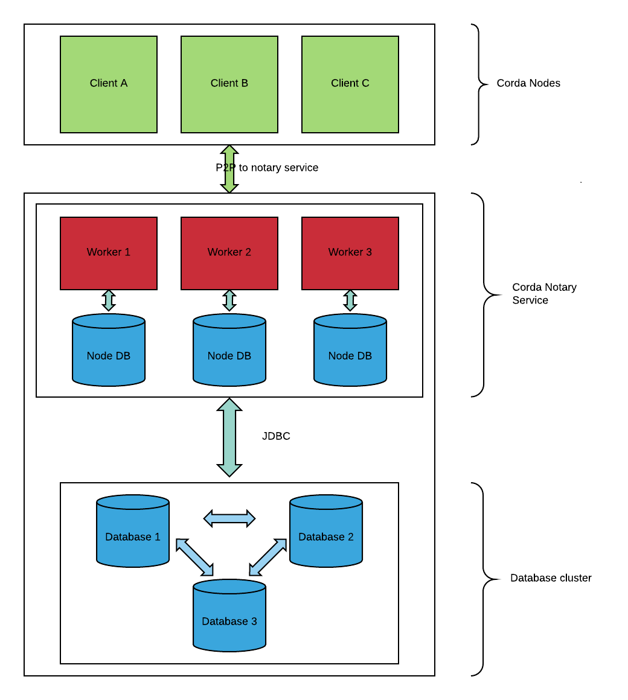
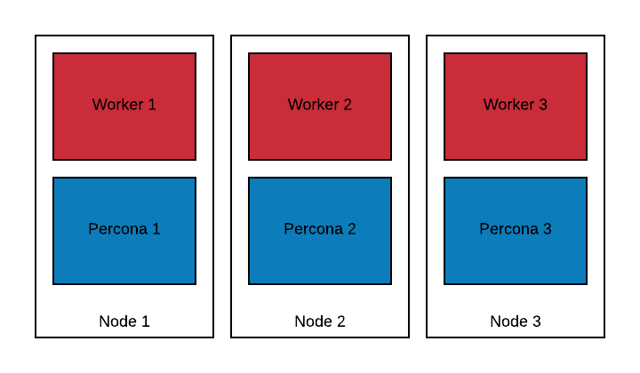

=====================================
Highly Available Notary Service Setup
=====================================

About the HA Notary Installation
================================

In this chapter you'll learn how to set up, configure and start a highly
available (HA) Corda Enterprise notary service from scratch. If you're targeting an
environment with doorman and network map, you require the registration tool. If
you don't require the doorman and network map, and you don't want to join an
existing network, the bootstrapper allows you to set up a cluster of nodes from
a set of configuration files.

The HA notary relies on a Percona/XtraDB (Percona) cluster. How to set up Percona
is described below.

This guide assumes you're running a Debian-based Linux OS.

Double curly braces ``{{ }}`` are used to represent placeholder values
throughout this guide.

Overview
========

The figure above displays Corda client nodes in green on the top, then the Corda
notary worker nodes in red in the middle and on the bottom are the Percona nodes in blue.

Client nodes that request a notarisation by the service name of the notary,
will connect to the available worker nodes in a round-robin fashion.

The task of a worker node is to verify the notarisation request, the transaction timestamp (if present),
and resolve and verify the transaction chain (if the notary service is validating). It then commits the
transaction's input states to the Percona database.

Since our notary cluster consists of several Percona nodes and several
worker nodes, we achieve high availability (HA). Individual nodes of the
Percona and notary clusters can fail, while clients are still able to
notarise transactions. The notary cluster remains available. A three-node
Percona cluster as shown in the figure above can tolerate one crash fault.

.. note::

  In production you should consider running five nodes or more, to be able to
  tolerate more than one simultaneous crash fault. One single Corda notary
  worker is enough to serve traffic in principle, although its capacity might
  not be sufficient, depending on your throughput and latency requirements.

Colocating Percona and the Notary Service
+++++++++++++++++++++++++++++++++++++++++

You can run a Percona Server and a Corda notary worker on the same machine.

Summary
+++++++

* Client nodes communicate with the notary cluster via P2P messaging, the messaging layer handles selecting an appropriate notary worker node by the service legal name.
* Client nodes connect to the notary cluster members round-robin.
* The notary worker nodes communicate with the underlying Percona cluster via JDBC.
* The Percona nodes communicate with each other via group communication (GComm).
* The Percona replicas should only be reachable from each other and from the worker nodes.
* The worker P2P ports should be reachable from the internet (or at least from the rest of the Corda network you're building or joining).
* We recommend running the worker nodes and the Percona service in a joined private subnet, opening up the P2P ports of the workers for external traffic.

Legal Names and Identities
++++++++++++++++++++++++++

Every notary worker node has two legal names. Its own legal name, specified by
``myLegalName``, e.g ``O=Worker 1, C=GB, L=London`` and the service legal name
specified in configuration by ``notary.serviceLegalName``, e.g. ``O=HA Notary,
C=GB, L=London``. Only the service legal name is included in the network
parameters. CorDapp developers should select the notary service identity from the network map cache.

.. code:: kotlin

  serviceHub.networkMapCache.getNotary(CordaX500Name("HA Notary", "London", "GB"))

Every notary worker's keystore contains the private key of the worker and the
private key of the notary service (with aliases ``identity-private-key`` and
``distributed-notary-private key`` in the keystore). We're going to create and
populate the node's keystores later in this tutorial.

Choosing Installation Path
==========================

.. note:: 

  If you want to connect to a Corda network with a doorman and network map service,
  use the registration tool to create your service identity. In case you want
  to set up a test network for development or a private network without doorman and
  network map, using the bootstrapper is recommended.

Expected Data Volume
====================

For non-validating notaries the notary stores roughly one kilobyte per transaction.

Prerequisites
=============

* Java runtime
* Corda Enterprise JAR
* Notary Health-Check JAR
* Bootstrapper JAR (only required when setting up network without doorman and network map)
* Network Registration tool (only required when setting up a network with doorman and network map)
* Root access to a Linux machine or VM to install Percona
* The private IP addresses of your DB hosts (where we're going to install Percona)
* The public IP addresses of your notary hosts (in order to advertise these IPs for P2P traffic)

Your Corda distribution should contain all the JARs listed above.

Security
========

Credentials
+++++++++++

Make sure you have the following credentials available, create them if necessary and always
keep them safe.

================================ ============================================================================================================
Password or Keystore             Description
================================ ============================================================================================================
database root password           used to create the Corda user, setting up the DB and tables (only required for some installation methods)
Corda DB user password           used by the notary service to access the DB
SST DB user password             used by the Percona cluster for data replication (SST stands for state snapshot transfer)
Network root truststore password (not required when using the bootstrapper)
Node keystore password           (not required when using the bootstrapper)
The network root truststore      (not required when using the bootstrapper)
================================ ============================================================================================================

Networking
++++++++++

Percona Cluster
~~~~~~~~~~~~~~~
=====  =======================
Port   Purpose
=====  =======================
3306   MySQL client connections (from the Corda notary nodes)
4444   SST via rsync and Percona XtraBackup
4567   Write-set replication traffic (over TCP) and multicast replication (over TCP and UDP)
4568   IST (Incremental State Transfer)
=====  =======================

Follow the `Percona documentation <https://www.percona.com/doc/percona-xtradb-cluster/5.7/security/encrypt-traffic.html>`__
if you need to encrypt the traffic between your Corda nodes and Percona and between Percona nodes.

Corda Node
~~~~~~~~~~

=========  ======= ==============================
Port       Example Purpose
=========  ======= ==============================
P2P Port   10002   P2P traffic (external)
RPC Port   10003   RPC traffic (internal only)
=========  ======= ==============================

Later in the tutorial we're covering the notary service configuration in details, in :doc:`installing-the-notary-service`.

Keys and Certificates
+++++++++++++++++++++

Keys are stored the same way as for regular Corda nodes in the ``certificates``
directory. If you're interested in the details you can find out
more in the :doc:`../permissioning` document.

Next Steps
==========

.. toctree::
   :maxdepth: 1

   installing-percona
   installing-the-notary-service
   operating-percona
