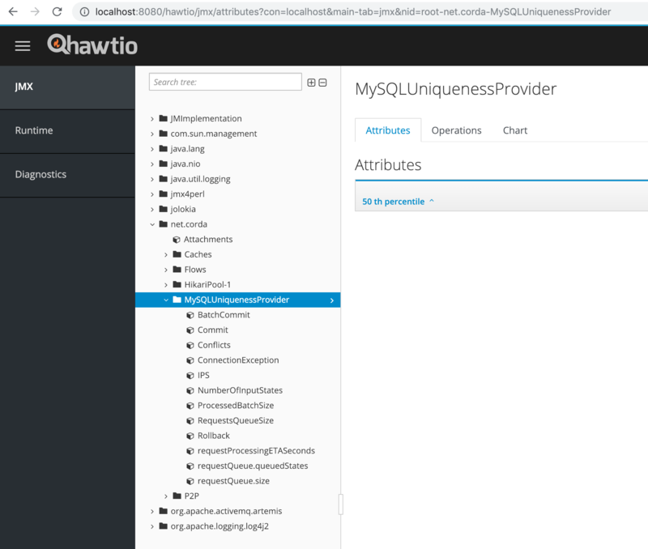

Highly-available notary metrics
===============================

Corda nodes export various performance and health metrics for monitoring, as
described in :doc:`../node-administration`. The HA notary provides additional
notary-related metrics as listed below.

net.corda.MySQLUniquenessProvider
+++++++++++++++++++++++++++++++++

The MySQLUniquenessProvider collects and exposes the following metrics.

+-----------------------------+------------------------------------------------------------------------------+
| Metric Name                 | Description                                                                  |
+=============================+==============================================================================+
| Commit                      | Transaction commit duration and transactions per seconds                     |
+-----------------------------+------------------------------------------------------------------------------+
| IPS                         | Input states per second                                                      |
+-----------------------------+------------------------------------------------------------------------------+
| BatchCommit                 | Transaction batch commit duration and rate meter                             |
+-----------------------------+------------------------------------------------------------------------------+
| Rollback                    | When writing to multiple masters with Galera, transaction rollbacks may      |
|                             | happen due to high write contention                                          |
+-----------------------------+------------------------------------------------------------------------------+
| ConnectionException         | Incremented when we can not obtain a DB connection                           |
+-----------------------------+------------------------------------------------------------------------------+
| Conflicts                   | Double spend attempts, including notarisation retries                        |
+-----------------------------+------------------------------------------------------------------------------+
| NumberOfInputStates         | Distribution of number of input states per transaction                       |
+-----------------------------+------------------------------------------------------------------------------+
| requestQueue.queuedStates   | Number of requests in the queue at insert                                    |
+-----------------------------+------------------------------------------------------------------------------+

Below is a screenshot of the metrics displayed in the Hawtio console.

