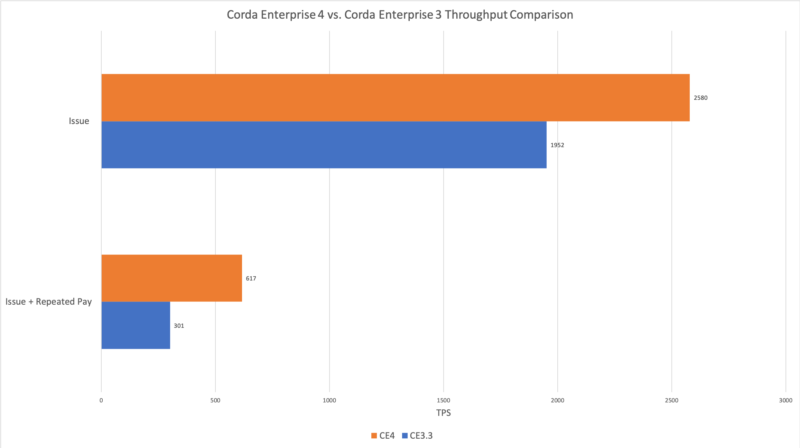
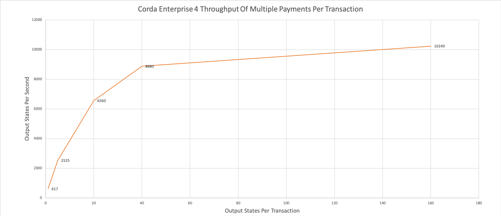
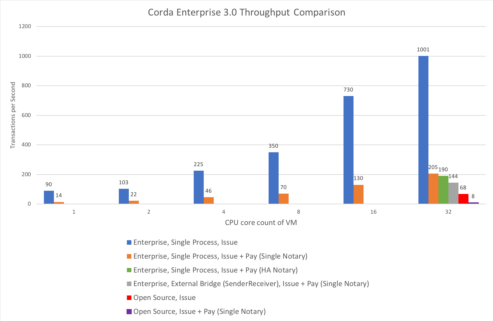

Sizing and performance
======================

Overview
--------

This section describes how Corda Enterprise 4 nodes perform relative to Corda Enterprise 3 in certain circumstances.  It also shows how the
throughput changes with the number of output states per transaction and how that allows the node to achieve a greater number of Corda states
to be transacted per second.

In addition it describes how Corda Enterprise performs, and can take advantage of, different host configurations whether Virtual Machines or dedicated
hardware, and how you might adjust the configuration and hosting of the node to influence the performance based on the benchmarking experience of R3
on Corda Enterprise 3.

.. note:: It is expected that users should test their own configurations with the networks, hosts, CorDapps, business flows
          and loads associated with their deployments.  The numbers here are for a limited set of scenarios and represent what
          was achieved with the test setup and the sample flows we use in our benchmarking.  These numbers should be treated
          as an approximate guide only and actual performance of your CorDapp will depend on many factors.  Those flows
          and other elements of our performance testing tool set are now available as part of this release to help calibrate
          infrastructure configurations and to help stress CorDapps through generated load. See the :doc:`performance-testing/introduction` here.

Figure 1 below compares the number of Transactions Per Second (TPS) carried out by a single node, either locally with no other nodes and no notary
(Issue) or with one other node and a notary (Issue + Repeated Pay), between Corda Enterprise 4 and Corda Enterprise 3.3 (most recent release at
the time of Corda Enterprise 4 release).  This is with each node running on it's own dedicated server against a dedicated database server
running **Microsoft SQL Server**.  Similar results were obtained against the other supported databases.

   Figure 1

The x-axis represents the number of flows completing per second which equates to Transactions Per Second (TPS).
As you can see, Corda Enterprise 4 offers a substantial increase in Transactions Per Second (TPS) over the prior release on the same hardware.

Figure 2 shows how the relative performance of making multiple payments from one node to another via the notary in a single transaction
varies with the number of those payments combined together.  This can be useful to understand how scalability varies with transaction size and how batching might
be a technique for even greater throughput.

   Figure 2

The y-axis represents the number of output contract states being recorded in the vault per second.  The x-axis represents the number of output
contract states in each transaction.

For comparing Corda Enterprise performance with differing node memory and CPU configurations, the numbers in the high level comparison chart
of Figure 3 were achieved using Corda Enterprise 3.0 on **Microsoft Azure** virtual machines (VM), running against a
**Microsoft SQL Server** database.  Each node had their own instance of the database running on a separate VM from the node,
with minimal latency between the node VM and the database server VM.

   Figure 3

The y-axis represents the number of flows completing per second, which we call Transactions Per Second (TPS) for simplicity although the actual number of
Corda transactions per flow completing varies depending on the type of flow.   The x-axis represents the performance with varying numbers
of CPU cores configured for the VMs.  Each bar indicates the performance of a particular type of flow and with a particular high-level node (or nodes)
configuration as depicted by the bar colour.

See the sections below for a discussion of the configurations used in these tests.

Observations
~~~~~~~~~~~~

* Corda Enterprise 4 has greater throughput than Corda Enterprise 3 (up to 2x in our tests).
* Even a single core deployment of Corda Enterprise offers greater throughput than Open Source Corda.
* There can be throughput benefits to combining multiple states or business transactions into a single Corda transaction.
* Corda Enterprise can utilise servers in excess of 16 cores.
* Corda Enterprise can scale approximately 10x by adding more cores for the flows used in the benchmarks.
* A lightly used node can operate in 1GB of heap space and a small number of cores for the flows used.
* A 32GB heap is sufficient for large core counts and numbers of parallel flows, for the flows used, but even larger can be beneficial.
* Corda Enterprise throughput is dependent on the throughput of the underlying RDBMS.
* The latency between the node and the database should be kept to a reasonable minimum.
* The use of OpenSSL may be required to achieve some of the higher throughput numbers between two nodes.

Sizing
~~~~~~

With all of the preceding caveats and those that follow in the more detailed sections regarding how much all this depends on the
CorDapps and workload, here are some simplistic node sizes.  Refer to detail elsewhere in this section on what processing can be achieved with
these sizings.

============ ========= ======= ================
Size         JVM Heap  # Cores Minimum Host RAM
============ ========= ======= ================
Small        1GB         1     2GB to 3GB

Medium       4GB         8     8GB

Large        32GB        32    64GB

X-Large      > 32GB      > 32  > 64GB
============ ========= ======= ================

It's likely you'll have (much) more RAM in larger VMs and physical servers, so feel free to give the node more heap.  Disk requirements
should be sufficient to store the binaries, log files (which could be large) and the Artemis MQ journal files, the latter dependent on queued messages.  Several GB should be sufficient.

.. note:: Performance in shared infrastructure environments varies over time dependent on what other workloads are present in said
          shared infrastructure.

The flows used in the measurements
----------------------------------

The results currently cover two main types of flow:

1. **Issue**. This is a flow that issues a ``FungibleAsset`` based on the ``Cash`` state and contract in the ``finance`` module.  The state is issued on
   a single node, in a single Corda transaction, is not notarised and appears in the vault of that node only thus there is no peer-to-peer communication
   taking place.
2. **Issue + Pay**. This is a more complex flow interaction made up of two high level steps of issuing a state to the local node (node A)
   in one Corda transaction (identical to **Issue** described above) and then transfering ownership of that state to a second node (node B).
   Additionally the contract requires that this second transfer transaction be timestamped and notarised, so the transaction is sent to the Notary by node A
   before all signatures are returned to node A who forwards to node B.   It is important to note that this flow is much more complex in terms of the peer-to-peer
   communications than that description makes clear.  Node B will never have seen the issuance transaction that contains the input state for the payment
   transaction and so node B enters transaction dependency resolution to request the first transaction from node A, resulting in additional sub-flows and
   peer-to-peer communication.
3. **Issue + Repeated Pay** This flow issues some states on Node A and then repeatedly transfers a fraction of those states to Node B via the Notary.  It is possible
   to configure the number of output states generated and transfered to Node B in each transaction in order to demonstate the effects of doing so on
   throughtput.

In summary, the **Issue** flow is pretty much the lightest weight flow imaginable that generates a Corda transaction.  **Issue + Pay** and
**Issue + Repeated Pay** are somewhat middling in
complexity and the load it generates for a node.  In future releases we will expand the range of scenarios to cover some in between, and some much more complex
involving more steps, greater variety of transaction sizes and/or more nodes with the hope that one of these could act as a proxy for your own flows if they don't yet exist
and cannot therefore be benchmarked.  No two flows are the same and therefore any debate around sizing naturally leads to conversations around what type
of flows, what size transactions involving what kinds of states and contracts.  We thus can only give you a flavour of what might actually be required and/or possible.

We launch these flows using the RPC client.  A limited number of flows are launched in parallel (up to 800 outstanding flows in the case of **Issue**) in order
for the node to have enough load to reflect the performance expected and exploit the multi-threaded capabilities without overwhelming it with long queues of pending work
(that will form a separate scenario as we develop the performance test suite further). Also see `Limiting outstanding flows`_.

We measure the time taken from the time just before we request the execution of a flow from the RPC client to the time after we see the ``Future`` returned
from ``startFlow`` RPC call complete on the client.  At this point the transaction is recorded in all nodes that participate in the transactions and all sub-flows are
complete.

The node configurations used in the measurements
------------------------------------------------

We have established results for a number of different software configurations:

1. **Single Notary**.  In Corda Enterprise 3 this uses the simple single node notary in non-validating mode.  It persists to a **Microsoft SQL Server** database running
   on a distinct VM or server, both for notary specific data and other regular node data persistence.  In Figure 3, these notaries always ran on an 8 core VM and on
   dedicated hardware the same as the nodes in Figure 1, although it was overkill and something lesser would be suitable as the load is not as significant as it is
   for other nodes.  For Corda Enterprise 4, the notary is actually using a slightly enhanced implementation that is less of a bottleneck and will be released in a
   later point release of Corda Enterprise.
2. **Highly Available Notary**.  In Figure 3, this uses a notary cluster made up of 3 nodes in non-validating mode.  Normal node persistence uses a **Microsoft SQL Server** database
   but the notary state is maintained in a version of MySQL utilising a clustering technology as described in :doc:`running-a-notary-cluster/introduction`.
   For full disclosure (and convenience for us) all 3 nodes are running in one data centre, which would not be a typical deployment.  Whilst the latency
   between cluster members influences the performance of the notary itself, it is not operating at its limit even in that scenario here.  These notaries always ran on an 8 core VM.
3. **Open Source**.  In Figure 3, this uses the latest available open source Corda at the time of the test, persisting to an in-process **H2** database.
4. **External Bridge (SenderReceiver)**.  This is the Corda Firewall.  In Figure 3, this hosts the inbound and outbound peer-to-peer traffic endpoint in a separate JVM process,
   rather than embedded in the main node JVM process.

In all cases the Artemis MQ broker is running within the node JVM.  For the Corda Enterprise 4 tests in Figures 1 & 2 we used OpenSSL as
discussed later with respect to network bandwidth.

For the tests run against Corda Enteprise 4 (and the equivalent comparisons of 3.3) in Figures 1 & 2 we used dedicated hardware for the nodes.  All nodes were
24 core (48 hyper-thread) based on 2x Intel Xeon E5-2687Wv4 with 256GB RAM and local SSDs.

We used the following Azure VM types for the nodes in the original Corda Enterprise 3.0 testing shown in Figure 3:

============== ========
Azure VM type  # Cores
============== ========
DS1_v2           1
D2s_v3           2
D4s_v3           4
D8s_v3           8
D16s_v3         16
D32s_v3         32
============== ========

Database server configuration
-----------------------------

In the Corda Enterprise 4.0 testing for Figures 1 & 2 we have used dedicated database servers with single Intel Xeon E5-2687Wv4 giving 12 cores (24 hyper-threads),
256GB RAM and local SSDs.  They ran **SQL Server 2017 Standard Edition**.

The servers used in the original Azure hosted tests shown in Figure 3 were 4 cores, 28GB RAM (**Azure DS12 v2 VM**).  Each had only one data
disk (limited to 5000 IOPS).  They ran **SQL Server 2017 Standard Edition**.

It's important to note that like many applications, the node is very sensitive to latency between the node and database servers.  We kept the latency
here to a minimum, without resorting to any extreme measures, by keeping them in the same location and on the same subnet.  We have tested with
databases separated from the node with increased latency (high single digit, low double digit millisecond - effectively cross region) and it
significantly impacts performance, with flows taking much longer to complete and overall throughput reduced accordingly.

Database storage
~~~~~~~~~~~~~~~~

In our performance tests, on **Microsoft SQL Server 2017**, we see database table space usage of around 10KB per state with an additional 10KB per transaction.  So a transaction with
3 output states would use 10KB + (3 x 10KB) = 40KB of storage.  This will obviously vary dependent on the complexity of the states and the extent to which they
implement vault schema mappings, and is something that is likely to be changed in future releases as we finesse transaction storage in the light of
performance and privacy requirements.

Scaling with CPU core count
---------------------------

Corda Enterprise is able to make use of multiple cores by running flows simultaneously.  When a flow is running (and not waiting for peer-to-peer messages)
it splits its time between computation (running contract verification, signing transactions, etc.) and database writes and reads.  When giving a node more and more
CPU cores in order to scale up, at some point the balance of processing will shift to the database and the node will no longer be able to take advantage of
additional CPU cores, reflected in an inability to drive CPU utilisation towards 100%.

Whilst the Figure 3 testing shows scaling with different core counts, the Corda Enterprise 4.0 throughput tests in Figure 1 are achieved on
dedicated servers with 48 hyper-threads (24 cores).  At the peak, these are fully utilising 36 hyper-threads/cores (or 75%) in the node.
As you can see in Figure 3 the node scales relatively well and clearly demonstrates the ability of the node to utilise larger numbers of cores.

Also see the section on heap size regarding Netty memory allocation as this is linked to core count.

Sizing the flow thread pool
---------------------------

Key to unlocking this scaling is the thread pool that the node utilises for running flows in parallel.  This thread pool has a finite size.  The default settings
are for the number of threads to be 2x the number of cores, but capped at 30.  We require a database connection per flow and so that cap helps reduce unexpected
incidents of running out of database connections.  If your database server is configured to allow many more connections, and you have plenty of cores, then the flow thread
pool should be configured to be much larger.  A good starting point is to go with 4x core count.  e.g. on a 32 core host, set the ``flowThreadPoolSize`` to 128.
See :doc:`corda-configuration-file` for more details on how to configure this setting.

We followed this ratio of 4x cores for ``flowThreadPoolSize`` when running our performance tests shown in the chart above.  Increasing the number of threads for flows
and the number of RPC clients currently just lead to an offsetting increase in database query times (and decrease in database throughput).

Sizing the heap
---------------

We typically run our performance tests with 32GB heaps, because this seems to give plenty of breathing room to the node JVM process.  Settings below
1GB certainly start to apply memory pressure and can result in an ``OutOfMemoryError`` and are not recommended.  This is due to many internal data structures within the
Artemis MQ message broker and several caches in the Corda Enterprise node that have fixed upper bounds.  Typically you want to be generous with the heap size.

As with other JVM processes, do not set the maximum heap size of the node to use all available memory on the host.  The operating system, file buffers,
threads etc all consume non-heap memory.

It is also worth knowing that by default Netty, part of the embedded Artemis MQ broker (when it is indeed embedded in the node JVM process), will allocate
chunks of memory for internal buffers from a pool size based on CPU core count.  So if you wish to run on hosts with very large core counts, be sure to allocate a larger heap.  Assume 16MB per core.

There are several fixed sized caches in Corda that means there is a minimum memory footprint.  Other caches do resize as heap size varies, including the
transaction cache which is referred to during vault queries and transaction verification and resolution to reduce database accesses.  It will take a minimum of 8MB of heap and up to 5% of the maximum heap size.  So
for a 1GB heap, this would be approximately 50MB.  You will find that the amount of various data elements in the node that can be cached will grow linearly
with the configured maximum heap size because of these resizing caches and so a large heap *may* result in greater node throughput if certain round trips to the
database are hampering performance.

It's also important to take into account the memory footprint of live (i.e. incomplete) flows.  The more live flows a node has, the more memory they will consume.

Limiting outstanding flows
--------------------------

It is currently possible to start flows in the node at a faster rate than they complete.  This will lead to increased memory footprint and heap usage
in the local node and potentially remote nodes.  Techniques for helping in this scenario will be the subject of future releases.  In the meantime, it
may be necessary to limit the number of outstanding flows in the RPC client, by only allowing a certain number of incomplete ``Future``-s as returned
from ``startFlow``.  Corda Enteprise 4 does including better scheduling than earlier releases so the latency impacts of outstanding flows have mostly been eliminated.

Network bandwidth
-----------------

In the highest throughput scenarios in Figure 1, node A experiences between 500 and 600Mbit/s outbound network traffic.  Inbound is much less,
since under normal circumstances flow checkpoint traffic is write-only.  In order to maximise the bandwidth available between two nodes it
is necessary to use the ``useOpenSsl`` option described in :doc:`corda-configuration-file`.  The JVM implementation of SSL is restricted in the
bandwidth it can sustain over a single connection.