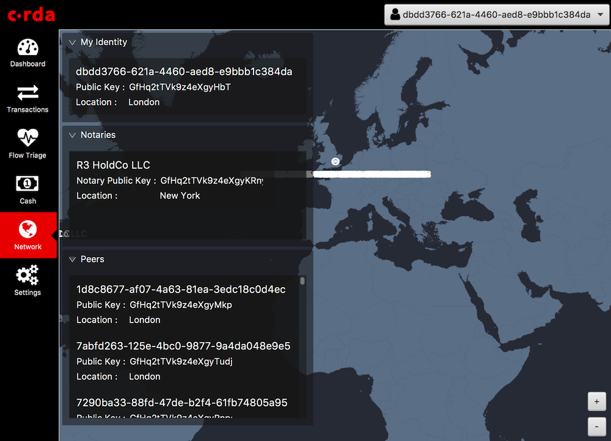
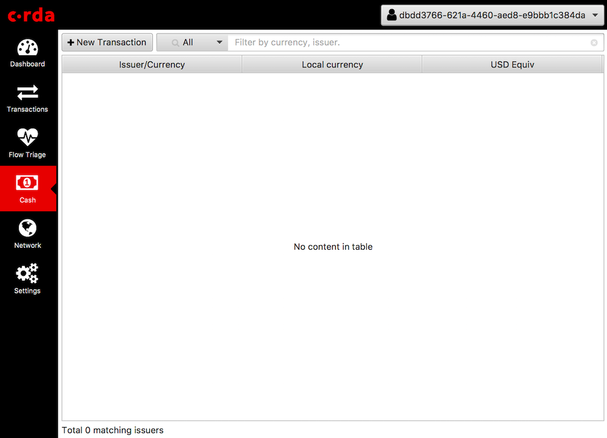
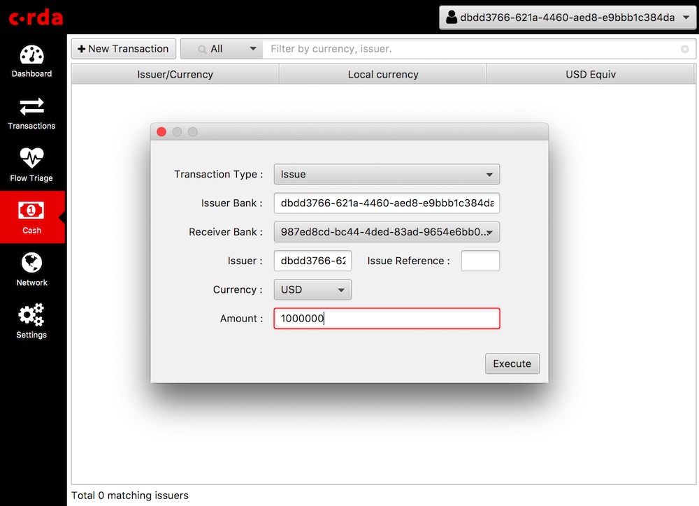
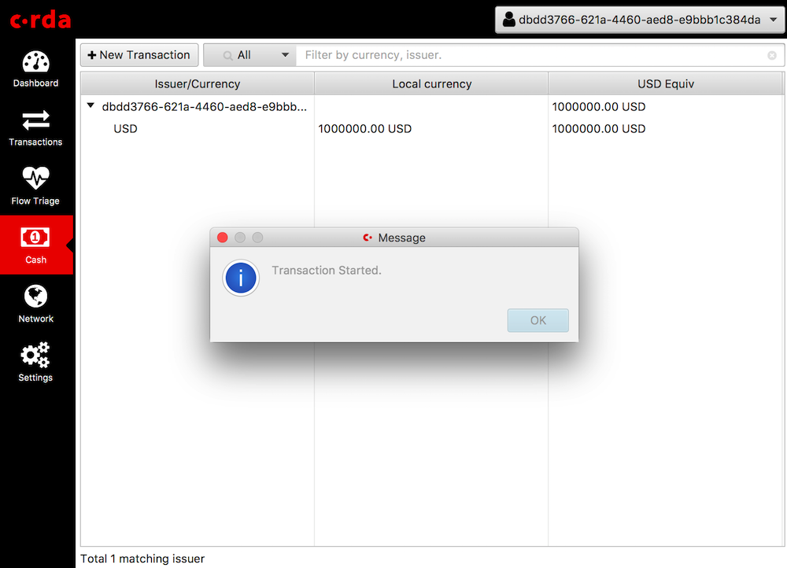
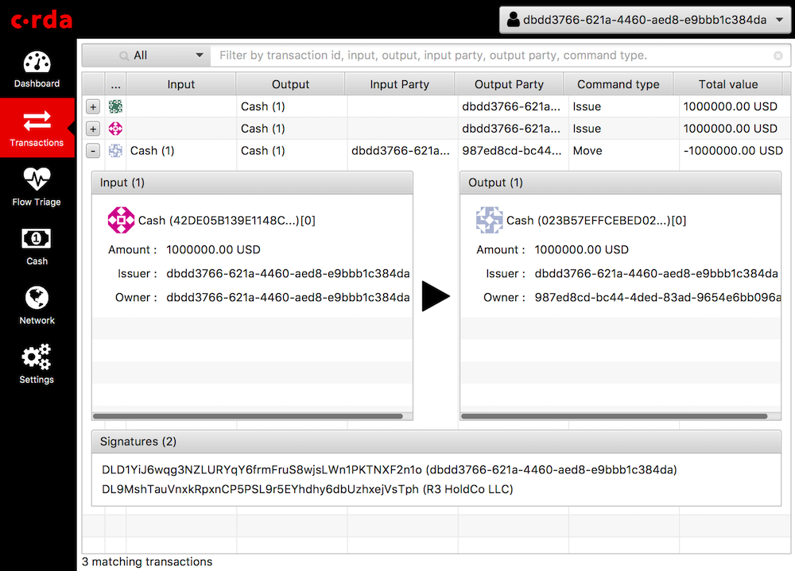

Using the Node Explorer to test a Corda node on Corda Testnet
=============================================================

This document will explain how to test the installation of a Corda node on Testnet.

Prerequisites
-------------

This guide assumes you have deployed a Corda node to the Corda Testnet.

.. note::

   If you need to set up a node on Testnet first please follow the instructions: :doc:`corda-testnet-intro`.

Get the testing tools
---------------------

To run the tests and make sure your node is connecting correctly to the network you will need to download and install a
couple of resources.

1. Log into your Cloud VM via SSH.

2. Stop the Corda node(s) running on your cloud instance.

   .. code:: bash

       ps aux | grep corda.jar | awk '{ print $2 }' | xargs sudo kill

3. Download the finance CorDapp

   In the terminal on your cloud instance run:

   .. code:: bash

       wget https://ci-artifactory.corda.r3cev.com/artifactory/corda-releases/net/corda/corda-finance/<VERSION>-corda/corda-finance-<VERSION>-corda.jar

   This is required to run some flows to check your connections, and to issue/transfer cash to counterparties. Copy it to the Corda installation location:

   .. code:: bash

       sudo cp /home/<USER>/corda-finance-<VERSION>-corda.jar /opt/corda/cordapps/

4. Add the following line to the bottom of your ``node.conf``:

   .. code:: bash

       custom : { issuableCurrencies : [ USD ] }

   .. note:: Make sure that the config file is in the correct format, e.g., by ensuring that there's a comma at the end of the line prior to the added config.

4. Restart the Corda node:

   .. code:: bash

       cd /opt/corda
       sudo ./run-corda.sh

   Your node is now running the Finance Cordapp.

   .. note:: You can double-check that the CorDapp is loaded in the log file ``/opt/corda/logs/node-<VM-NAME>.log``. This file will list installed apps at startup. Search for ``Loaded CorDapps`` in the logs.

6. Now download the Node Explorer to your **LOCAL** machine:

   .. note:: Node Explorer is a JavaFX GUI which connects to the node over the RPC interface and allows you to send transactions.

   Download the Node Explorer from here:

   .. code:: bash

       http://ci-artifactory.corda.r3cev.com/artifactory/corda-releases/net/corda/corda-tools-explorer/<VERSION>-corda/corda-tools-explorer-<VERSION>-corda.jar

   .. warning:: This Node Explorer is incompatible with the Corda Enterprise distribution and vice versa as they currently use different serialisation schemes (Kryo vs AMQP).

7. Run the Node Explorer tool on your **LOCAL** machine.

   .. code:: bash

       java -jar corda-tools-explorer-<VERSION>-corda.jar

   .. image:: resources/explorer-login.png

Connect to the node
-------------------

To connect to the node you will need:

* The IP address of your node (the public IP of your cloud instance). You can find this in the instance page of your cloud console.
* The port number of the RPC interface to the node, specified in ``/opt/corda/node.conf`` in the ``rpcSettings`` section, (by default this is 10003 on Testnet).
* The username and password of the RPC interface of the node, also in the ``node.conf`` in the ``rpcUsers`` section, (by default the username is ``cordazoneservice`` on Testnet).

Click on ``Connect`` to log into the node.

Check your network identity and counterparties
----------------------------------------------

Once Explorer has logged in to your node over RPC click on the ``Network`` tab in the side navigation of the Explorer UI:

If your Corda node is correctly configured and connected to the Testnet then you should be able to see the identities of your node, the Testnet notary and the network map listing all the counterparties currently on the network.

Test issuance transaction
-------------------------

Now we are going to try and issue some cash to a 'bank'. Click on the ``Cash`` tab.

Now click on ``New Transaction`` and create an issuance to a known counterparty on the network by filling in the form:

Click ``Execute`` and the transaction will start.

Click on the red X to close the notification window and click on ``Transactions`` tab to see the transaction in progress, or wait for a success message to be displayed:

Congratulations! You have now successfully installed a CorDapp and executed a transaction on the Corda Testnet.