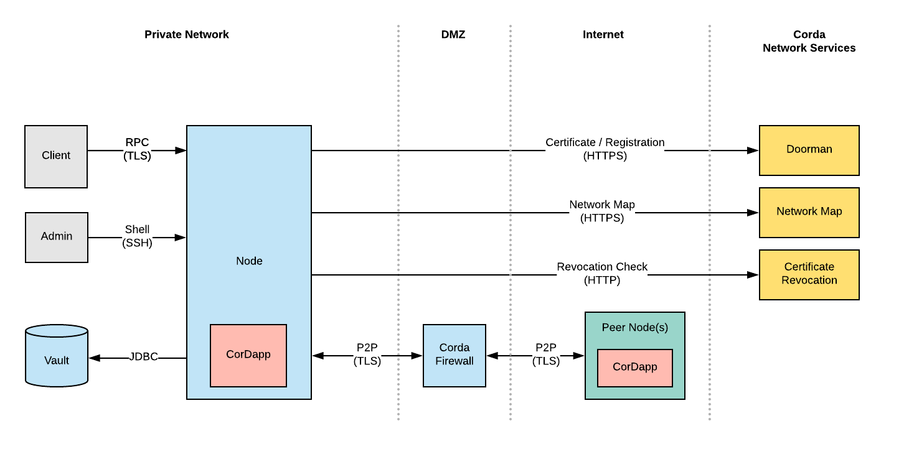

## Introduction

This document describes the security threat model of the Corda Platform. The
Corda Threat Model is the result of architectural and threat modelling
sessions, and is designed to provide a high level overview of the security
objectives for the Corda Network, and the controls and mitigations used to
deliver on those objectives. It is intended to support subsequent analysis and
architecture of systems connecting with the network and the applications which
interact with data across it.

It is incumbent on all ledger network participants to review and assess the
security measures described in this document against their specific
organisational requirements and policies, and to implement any additional
measures needed.

## Scope

Built on the [Corda](http://www.corda.net/) distributed ledger platform
designed by R3, the ledger network enables the origination and management of
(primarily financial) agreements between business partners. Participants to
the network create and maintain Corda _nodes,_ each hosting one or more
pluggable applications ( _CorDapps_ ) which define the data to be exchanged
and its workflow. See the [Corda Technical White
Paper](https://docs.corda.net/_static/corda-technical-whitepaper.pdf) for a
detailed description of Corda's design and functionality.

R3 provide and maintain a number of essential services underpinning the ledger
network. In the future these services are intended to be operated by a
separate Corda Foundation. The network services currently include:

  * Network map service: Service for distributing and providing updates for a network map document enabling nodes to identify other nodes on the network, their network address and advertised services. 
  * Network permissioning service ('Doorman'): Issues signed digital certificates credentialising the identity of parties on the network to conduct peer-to-peer communication.

Participants to the ledger network include major financial institutions,
regulated by national and supra-national authorities in various global
jurisdictions. In a majority of cases, there are stringent requirements in
place for participants to demonstrate that their handling of all data is
performed in an appropriately secure manner, including the exchange of data
over the ledger network. This document identifies measures within the Corda
platform and supporting infrastructure to mitigate key security risks in
support of these requirements.

## The Corda Network

The diagram below illustrates the network architecture, protocols and high
level data flows that comprise the Corda Network. The threat model has been
developed based upon this architecture.

# The Threat Model

Threat Modelling is an iterative process that works to identity, describe and
mitigate threats to a system. One of the most common models for identify
threats is the [STRIDE](https://en.wikipedia.org/wiki/STRIDE_\(security\))
framework. It provides a set of security threats in six categories:

  * Spoofing
  * Tampering
  * Information Disclosure
  * Repudiation
  * Denial of Service
  * Elevation of Privilege

The Corda threat model uses the STRIDE framework to present the threats to the
Corda Network in a structured way. It should be stressed that threat modelling
is an iterative process that is never complete. The model described below is
part of an on-going process intended to continually refine the security
architecture of the Corda platform.

## Spoofing

Spoofing is pretending to be something or someone other than yourself. It is
the actions taken by an attacker to impersonate another party, typically for
the purposes of gaining unauthorised access to privileged data, or
perpetrating fraudulent transactions. Spoofing can occur on multiple levels.
Machines can be impersonated at the network level by a variety of methods such
as ARP & IP spoofing or DNS compromise.

Spoofing can also occur at an application or user-level. Attacks at this level
typically target authentication logic, using compromised passwords and
cryptographic keys, or by subverting cryptography systems.

Corda employs a Public Key Infrastructure (PKI) to validate the identity of
nodes, both at the point of registration with the network map service and
subsequently through the cryptographic signing of transactions. An imposter
would need to acquire an organisation's private keys in order to meaningfully
impersonate that organisation. R3 provides guidance to all ledger network
participants to ensure adequate security is maintained around cryptographic
keys.  
  
<table>  
<tr>  
<th>

Element

</th>  
<th>

Attacks

</th>  
<th>

Mitigations

</th></tr>  
<tr>  
<td>

RPC Client

</td>  
<td>

An external attacker impersonates an RPC client and is able to initiate flows
on their behalf.

A malicious RPC client connects to the node and impersonates another, higher-
privileged client on the same system, and initiates flows on their behalf.

 **Impacts**

If successful, the attacker would be able to perform actions that they are not
authorised to perform, such initiating flows. The impact of these actions
could have financial consequences depending on what flows were available to
the attacker.

</td>  
<td>

The RPC Client is authenticated by the node and must supply valid credentials
(username & password).

RPC Client permissions are configured by the node administrator and can be
used to restrict the actions and flows available to the client.

RPC credentials and permissions can be managed by an Apache Shiro service. The
RPC service restricts which actions are available to a client based on what
permissions they have been assigned.

</td></tr>  
<tr>  
<td>

Node

</td>  
<td>

An attacker attempts to impersonate a node and issue a transaction using their
identity.

An attacker attempts to impersonate another node on the network by submitting
NodeInfo updates with - falsified address and/or identity information.

 **Impacts**

If successful, a node able to assume the identity of another party could
conduct fraudulent transactions (e.g. pay cash to its own identity), giving a
direct financial impact to the compromised identity. Demonstrating that the
actions were undertaken fraudulently could prove technically challenging to
any subsequent dispute resolution process.

In addition, an impersonating node may be able to obtain privileged
information from other nodes, including receipt of messages intended for the
original party containing information on new and historic transactions.

</td>  
<td>

Nodes must connect to each other using using mutually-authenticated TLS
connections. Node identity is authenticated using the certificates exchanged
as part of the TLS protocol. Only the node that owns the corresponding private
key can assert their true identity.

NodeInfo updates contain the Node's public identity certificate and must be
signed by the corresponding private key. Only the node in possession of this
private key can sign the NodeInfo.

Corda employs a Public Key Infrastructure (PKI) to validate the identity of
nodes. An imposter would need to acquire an organisation's private keys in
order to meaningfully impersonate that organisation. Corda will soon support a
range of HSMs (Hardware Security Modules) for storing a node's private keys,
which mitigates this risk.

</td></tr>  
<tr>  
<td>

Network Map

</td>  
<td>

An attacker with appropriate network access performs a DNS compromise,
resulting in network traffic to the Doorman & Network Map being routed to
their attack server, which attempts to impersonate these machines.

 **Impact**

Impersonation of the Network Map would enable an attacker to issue
unauthorised updates to the map.

</td>  
<td>

Connections to the Network Map service are secured using the HTTPS protocol.
The connecting node authenticates the NetworkMap servers using their public
certificates, to ensure the identity of these servers is correct.

All data received from the NetworkMap is digitally signed (in addition to
being protected by TLS) - an attacker attempting to spoof the Network Map
would need to acquire both private TLS keys, and the private NetworkMap
signing keys.

The Doorman and NetworkMap signing keys are stored inside a (Hardware Security
Module (HSM) with strict security controls (network separation and physical
access controls).

</td></tr>  
<tr>  
<td>

Doorman

</td>  
<td>

An attacker attempts to join the Corda Network by impersonating an existing
organisation and issues a fraudulent registration request

 **Impact**

The attacker would be able to join and impersonate an organisation.

Impersonation of the Doorman would trick nodes into joining the wrong network.

</td>  
<td>

R3 operate strict validation procedures to ensure that requests to join the
Corda Network have legitimately originated from the organisation in question.

</td></tr></table>

  

## Tampering

Tampering refers to the modification of data with malicious intent. This
typically involves modification of data at rest (such as a file on disk, or
fields in a database), or modification of data in transit.

To be successful, an attacker would require privileged access to some part of
the network infrastructure (either public or internal private networks). They
might also have access to a Node's file-system, database or even direct memory
access.  
  
<table>  
<tr>  
<th>

Element

</th>  
<th>

Attacks

</th>  
<th>

Mitigations

</th></tr>  
<tr>  
<td>

Node (CorDapp)

</td>  
<td>

Unintended, adverse behaviour of a CorDapp running on one or more nodes -
either its core code or any supporting third party libraries. A coding bug is
assumed to be the default cause, although malicious modification of a CorDapp
could result in similar effects.

</td>  
<td>

By design, Corda's notary-based consensus model and contract validation
mechanisms provide protection against attempts to alter shared data or perform
invariant operations. The primary risk is therefore to local systems.

Future versions of Corda will require CorDapps to be executed inside a
sandboxed JVM environment, modified to restrict unauthorised access to the
local file system and network. This is intended to minimise the potential of a
compromised CorDapp to affect systems local to the node.

</td></tr>  
<tr>  
<td>

P2P & RPC connections

</td>  
<td>

An attacker performs Man-in-the-Middle (MITM) attack against a node's peer-to-
peer (P2P) connection

 **Impact**

An attacker would be able to modify transactions between participating nodes.

</td>  
<td>

Mutually authenticated TLS connections between nodes ensures that Man-In-The-
Middle (MITM) attacks cannot take place. Corda Nodes restrict their
connections TLS v1.2 and also restrict which cipher suites are accepted.

</td></tr>  
<tr>  
<td>

Node Vault

</td>  
<td>

An attacker gains access to the Node's vault and modifies tables in the
database.

 **Impact**

Transaction history would become compromised. The impact could range from
deletion of data to malicious tampering of financial detail.

</td>  
<td>

There are not currently any direct controls to mitigate this kind of attack. A
node's vault is assumed to be within the same trust boundary of the node JVM.
Access to the vault must be restricted such that only the node can access it.
Both network-level controls (fire-walling) and database permissions must be
employed.

Note that the tampering of a node's vault only affects that specific node's
transaction history. No other node in the network is affected and any
tampering attempts are easily detected.

  

</td></tr>  
<tr>  
<td>

Network Map

</td>  
<td>

An attacker compromises the Network Map service and publishes an illegitimate
update.

 **Impact**

NodeInfo entries (name & address information) could potentially become altered
if this attack was possible

The NetworkMap could be deleted and/or unauthorized nodes could be added to,
or removed from the map.

</td>  
<td>

Individual Node entries in the NetworkMap must be signed by the associated
Node. The signatures are validated by the NetworkMap service, and all other
Nodes in the network, to ensure they have not been tampered with. An attacker
would need to acquire a node's private identity signing key to be able to make
modifications to a NodeInfo. It is not possible for the NetworkMap service (or
R3) to modify the NodeInfo entries, therefore an attacker would also be
limited in this regard.

The only impact the attacker could have would be to remove individual entries
in the map, or insert their own NodeInfo.

</td></tr></table>

## Repudiation

Repudiation refers to the ability to claim a malicious action did not take
place. Repudiation becomes relevant when it is not possible to verify the
identity of an attacker, or there is a lack of evidence to link their
malicious actions with events in a system.

Preventing repudiation does not prevent other forms of attack. Rather, the
goal is to ensure that the attacker is identifiable, their actions can be
traced, and there is no way for the attacker to deny having committed those
actions.  
  
<table>  
<tr>  
<th>

Element

</th>  
<th>

Attacks

</th>  
<th>

Mitigations

</th></tr>  
<tr>  
<td>

RPC Client

</td>  
<td>

Attacker attempts to initiate a transaction they are not entitled to perform

</td>  
<td>

All interactions with an RPC user are logged by the node.

</td></tr>  
<tr>  
<td>

Node

</td>  
<td>

A malicious CorDapp attempts to spend a state that does not belong to them

</td>  
<td>

All P2P transactions are logged by the node.

</td></tr></table>

  

## Information Disclosure

Information disclosure is about the unauthorised access of data. Attacks of
this kind have an impact when confidential data is accessed. Typical examples
of attack include extracting secrets from a running process, and accessing
confidential files on a file-system which have not been appropriately secured.
Interception of network communications between trusted parties can also lead
to information disclosure.

An attacker capable of intercepting network traffic from a Corda node would,
at a minimum, be able to identify which other parties that node was
interacting with, along with relative frequency and volume of data being
shared; this could be used to infer additional privileged information without
the parties' consent. All network communication of a Corda is encrypted using
the TLS protocol (v1.2), using modern cryptography algorithms.  
  
<table>  
<tr>  
<th>

Element

</th>  
<th>

Attack

</th>  
<th>

Mitigations

</th></tr>  
<tr>  
<td>

Node

</td>  
<td>

An attacker attempts to retrieve transaction history from a peer node in the
network, for which they have no legitimate right of access.

Corda nodes will, upon receipt of a request referencing a valid transaction
hash, respond with the dependency graph of that transaction. One theoretical
scenario is therefore that a participant is able to guess (or otherwise
acquire by illicit means) the hash of a valid transaction, thereby being able
to acquire its content from another node.

 **Impact**

If successful, an exploit of the form above could result in information
private to specific participants being shared with one or more non-privileged
parties. This may include market-sensitive information used to derive
competitive advantage.

</td>  
<td>

Corda will not divulge transaction history to a peer node unless that node is
an explicit party to the transaction.

By design, Corda nodes do not globally broadcast transaction information to
all participants in the network. Hash functions used by Corda (primarily
SHA256) are effectively immune to brute-force attacks, and integration of
blinding nonces into the transaction data will be used to prevent an attacker
from successfully obtaining a transaction hash even if the transaction content
is known/guessed. Risk from a guessing-based approach as described above is
therefore believed to be negligible.

The SGX integration feature currently envisaged for Corda will implement CPU
peer-to-peer encryption under which transaction graphs are transmitted in an
encrypted state and only decrypted within a secure enclave. Knowledge of a
transaction hash will then be further rendered insufficient for a non-
privileged party to view the content of a transaction.

</td></tr>  
<tr>  
<td>

Node Vault (database)

</td>  
<td>

An unauthorised user attempts to access the node's vault

 **Impact**

Access to the vault would reveal the full transaction history that the node
has taken part in. This may include financial information.

</td>  
<td>

Access to the Vault uses standard JDBC authentication mechanism. Any user
connecting to the vault must have permission to do so.

</td></tr>  
<tr>  
<td>

Node Process (JVM)

</td>  
<td>

An attacker who gains access to the machine running the Node attempts to read
memory from the JVM process.

An attacker with access the file-system attempts to read the Node's
cryptographic key-store, containing the private identity keys.

 **Impact**

An attacker would be able to read sensitive such as private identity keys. The
worst impact would be the ability to extract private keys from the JVM
process.

  

</td>  
<td>

Corda Nodes are designed to be executed using a designated 'corda' system
process, which other users and processes on the system do not have permission
to access.

The node's Java Key Store is encrypted using PKCS#12 encryption. In the future
Corda will eventually store its keys in a HSM (Hardware Security Module).

</td></tr>  
<tr>  
<td>

RPC Client

</td>  
<td>

Interception of RPC traffic between a client system and the node.

A malicious RPC client authenticates to a Node and attempts to query the
transaction vault.

 **Impact**

An attacker would be able to see details of transactions shared between the
connected business systems and any transacting party.

</td>  
<td>

RPC communications are protected by the TLS protocol.

Permission to query a node's vault must be explicitly granted on a per-user
basis. It is recommended that RPC credentials and permissions are managed in
an Apache Shiro database.

</td></tr></table>

  

## Denial of Service

Denial-of-service (DoS) attacks target the availability of a resource from its
intended users. There are two anticipated targets of a DoS attack - network
participants (Corda Nodes) and network services (Doorman and the Network Map).
DoS attacks occur by targeting the node or network services with a high
volume/frequency of requests, or by sending malformed requests. Typical DoS
attacks leverage a botnet or other distributed group of systems (Distributed
Denial of Service, DDoS). A successful DoS attack may result in non-
availability of targeted ledger network node(s)/service(s), both during the
attack and thereafter until normal service can be resumed.

Communication over the ledger network is primarily peer-to-peer. Therefore the
network as a whole is relatively resilient to DoS attacks. The primary threat
is anticipated as being to the Corda network services which are depended on by
network participants. These services will be protected by automated
enterprise-grade DDoS detection and mitigation services, which will conduct
intelligent traffic profiling in order to detect and block malicious traffic.  
  
<table>  
<tr>  
<th>

Element

</th>  
<th>

Attack

</th>  
<th>

Mitigations

</th></tr>  
<tr>  
<td>

Node

</td>  
<td>

An attacker control sends high volume of malformed transactions to a node.

 **Impact**

Nodes targeted by this attack could exhaust their processing & memory
resources, or potentially cease responding to transactions.

</td>  
<td>

P2P communcation is authenticated as part of the TLS protocol, meaning that
attackers must be part of the Corda network to launch an attack.

Communication over the ledger network is primarily peer-to-peer, the network
as a whole is relatively resilient to DoS attacks, the primary threat being to
specific nodes or services.

Note that there is no specific mitigation against DoS attacks at the per-node
level. DoS attacks by participants on other participants will be expressly
forbidden under the terms of the ledger network's network agreement. Measures
will be taken against any ledger network participant found to have perpetrated
a DoS attack, including exclusion from the ledger network network and
potential litigation. As a result, the perceived risk of a member-on-member
attack is low and technical measures are not considered under this threat
model, although they may be included in future iterations.

</td></tr>  
<tr>  
<td>

CorDapp

</td>  
<td>

Unintended termination or other logical sequence (e.g. due to a coding bug in
either Corda or a CorDapp) by which a party is rendered unable to resolve a
[Flow](https://docs.corda.net/key-concepts-flow-framework.html). The most
likely results from another party failing to respond when required to do so
under the terms of the agreed transaction protocol.

 **Impact**

Depending on the nature of the flow, a party could be financially impacted by
failure to resolve a flow on an indefinite basis. For example, a party may be
left in possession of a digital asset without the means to transfer it to
another party.

</td>  
<td>

The network agreement will stipulate a default maximum allowable period time -
the 'event horizon' - within which a party is required to provide a valid
response to any message sent to it in the course of a Flow. If that period is
exceeded, the Flow will be considered to be cancelled and may be discontinued
without prejudice by all parties. The event horizon may be superseded by
agreements between parties specifying other timeout periods, which may be
encoded into Flows under the Corda Flow Framework.

Additional measures may be taken under the agreement against parties who
repeatedly fail to meet their response obligations under the network
agreement.

</td></tr>  
<tr>  
<td>

Doormap

</td>  
<td>

Attacker submits excessive registration requests to the Doorman service

</td>  
<td>

Doorman is deployed behind a rate-limiting firewall.

Doorman requests are validated and filtered to ensure malformed requests are
rejected.

</td></tr>  
<tr>  
<td>

Network Map

</td>  
<td>

Attacker causes the network map service to become unavailable

</td>  
<td>

Updates to the network map must be signed by participant nodes and are
authenticated before being processed.

The network map is designed to be distributed by a CDN (Content Delivery
Network).

Network map is also cached locally by nodes on the network.

There is no requirement for the network map services to be highly available in
order for the ledger network to be operational. Temporary non-availability of
the network map service may delay certification of new entrants to the
network, but will have no impact on existing participants. Similarly, the
network map will be cached by individual nodes once downloaded from the
network map service; unplanned downtime would prevent broadcast of updates
relating to new nodes connecting to / disconnecting from the network, but not
affect communication between nodes whose connection state remains unchanged
throughout the incident.

</td></tr></table>

  

## Elevation of Privilege

Elevation of Privilege is enabling somebody to perform actions they are not
permitted to do. Attacks range from a normal user executing actions as a more
privileged administrator, to a remote (external) attacker with no privileges
executing arbitrary code.  
  
<table>  
<tr>  
<th>

Element

</th>  
<th>

Attack

</th>  
<th>

Mitigations

</th></tr>  
<tr>  
<td>

Node

</td>  
<td>

Malicious contract attempts to instantiate classes in the JVM that it is not
authorised to access.

Malicious CorDapp sends malformed serialised data to a peer.

 **Impact**

Unauthorised remote code execution would lead to complete system compromise.

</td>  
<td>

The AMQP serialiser uses a combination of white and black-lists to mitigate
against de-serialisation vulnerabilities.

Corda does not currently provide specific security controls to mitigate all
classes of privilege escalation vulnerabilities. The design of Corda requires
that CorDapps are inherently trusted by the node administrator. Likewise,
node-on-node attacks are not part of the formal threat model, and P2P traffic
is assumed to originate from trusted network participants.

Future security research will introduce stronger controls that can mitigate
this class of threat. The Deterministic JVM will provide a sandbox that
prevents execution of code & classes outside of the security boundary that
contract code is restricted to.

In addition, the SGX integration will provide an additional layer of security
around Corda contracts.

  

</td></tr>  
<tr>  
<td>

RPC Client

</td>  
<td>

A malicious RPC client connects to the node and impersonates another, higher-
privileged client on the same system, and initiates flows on their behalf.

</td>  
<td>

Nodes implement an access-control model that restricts what actions RPC users
can perform.

Session replay is mitigated by virtue of the TLS protocol used to protect RPC
communications.

</td></tr></table>

  

# Conclusion

The threat model presented here describes the main threats to the Corda
Network, and the controls that are included to mitigate these threats. It was
necessary to restrict this model to a high-level perspective of the Corda
Network. It is hoped that enough information is provided to allow network
participants to understand the security model of Corda.

Threat modelling is an on-going process. There is active research at R3 to
continue evolving the Corda Threat Model. In particular, models are being
developed that focus more closely on individual components - such as the Node,
Network Map and Doorman.

  

  

