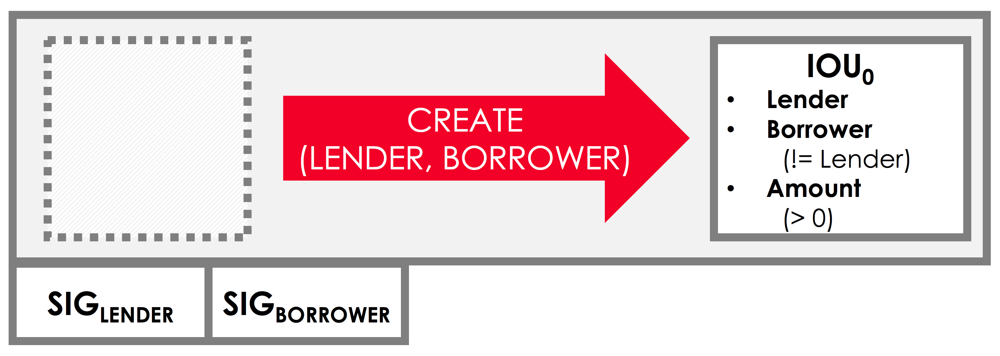

.. highlight:: kotlin
.. raw:: html

   
   

Writing the contract
====================

It's easy to imagine that most CorDapps will want to impose some constraints on how their states evolve over time:

* A cash CorDapp will not want to allow users to create transactions that generate money out of thin air (at least
  without the involvement of a central bank or commercial bank)
* A loan CorDapp might not want to allow the creation of negative-valued loans
* An asset-trading CorDapp will not want to allow users to finalise a trade without the agreement of their counterparty

In Corda, we impose constraints on how states can evolve using contracts.

.. note::

    Contracts in Corda are very different to the smart contracts of other distributed ledger platforms. They are not
    stateful objects representing the current state of the world. Instead, like a real-world contract, they simply
    impose rules on what kinds of transactions are allowed.

Every state has an associated contract. A transaction is invalid if it does not satisfy the contract of every input and
output state in the transaction.

The Contract interface
----------------------
Just as every Corda state must implement the ``ContractState`` interface, every contract must implement the
``Contract`` interface:

.. container:: codeset

    .. code-block:: kotlin

        interface Contract {
            // Implements the contract constraints in code.
            @Throws(IllegalArgumentException::class)
            fun verify(tx: LedgerTransaction)
        }

We can see that ``Contract`` expresses its constraints through a ``verify`` function that takes a transaction as input,
and:

  * Throws an ``IllegalArgumentException`` if it rejects the transaction proposal
  * Returns silently if it accepts the transaction proposal

Controlling IOU evolution
-------------------------
What would a good contract for an ``IOUState`` look like? There is no right or wrong answer - it depends on how you
want your CorDapp to behave.

For our CorDapp, let's impose the constraint that we only want to allow the creation of IOUs. We don't want nodes to
transfer them or redeem them for cash. One way to enforce this behaviour would be by imposing the following constraints:

* A transaction involving IOUs must consume zero inputs, and create one output of type ``IOUState``
* The transaction should also include a ``Create`` command, indicating the transaction's intent (more on commands
  shortly)

We might also want to impose some constraints on the properties of the issued ``IOUState``:

  * Its value must be non-negative
  * The lender and the borrower cannot be the same entity

And finally, we'll want to impose constraints on who is required to sign the transaction:

  * The IOU's lender must sign
  * The IOU's borrower must sign

We can picture this transaction as follows:

Defining IOUContract
--------------------
Let's write a contract that enforces these constraints. We'll do this by modifying either ``TemplateContract.java`` or
``App.kt`` and updating ``TemplateContract`` to define an ``IOUContract``:

.. container:: codeset

    .. literalinclude:: example-code/src/main/kotlin/net/corda/docs/tutorial/twoparty/contract.kt
        :language: kotlin
        :start-after: DOCSTART 01
        :end-before: DOCEND 01

    .. literalinclude:: example-code/src/main/java/net/corda/docs/java/tutorial/twoparty/IOUContract.java
        :language: java
        :start-after: DOCSTART 01
        :end-before: DOCEND 01

If you're following along in Java, you'll also need to rename ``TemplateContract.java`` to ``IOUContract.java``.

Let's walk through this code step by step.

The Create command
^^^^^^^^^^^^^^^^^^
The first thing we add to our contract is a *command*. Commands serve two functions:

* They indicate the transaction's intent, allowing us to perform different verification for different types of
  transaction. For example, a transaction proposing the creation of an IOU could have to meet different constraints
  to one redeeming an IOU
* They allow us to define the required signers for the transaction. For example, IOU creation might require signatures
  from the lender only, whereas the transfer of an IOU might require signatures from both the IOU's borrower and lender

Our contract has one command, a ``Create`` command. All commands must implement the ``CommandData`` interface.

The ``CommandData`` interface is a simple marker interface for commands. In fact, its declaration is only two words
long (Kotlin interfaces do not require a body):

.. container:: codeset

    .. code-block:: kotlin

        interface CommandData

The verify logic
^^^^^^^^^^^^^^^^
Our contract also needs to define the actual contract constraints by implementing ``verify``. Our goal in writing the
``verify`` function is to write a function that, given a transaction:

* Throws an ``IllegalArgumentException`` if the transaction is considered invalid
* Does **not** throw an exception if the transaction is considered valid

In deciding whether the transaction is valid, the ``verify`` function only has access to the contents of the
transaction:

* ``tx.inputs``, which lists the inputs
* ``tx.outputs``, which lists the outputs
* ``tx.commands``, which lists the commands and their associated signers

As well as to the transaction's attachments and time-window, which we won't use here.

Based on the constraints enumerated above, we need to write a ``verify`` function that rejects a transaction if any of
the following are true:

* The transaction doesn't include a ``Create`` command
* The transaction has inputs
* The transaction doesn't have exactly one output
* The IOU itself is invalid
* The transaction doesn't require the lender's signature

Command constraints
~~~~~~~~~~~~~~~~~~~
Our first constraint is around the transaction's commands. We use Corda's ``requireSingleCommand`` function to test for
the presence of a single ``Create`` command.

If the ``Create`` command isn't present, or if the transaction has multiple ``Create`` commands, an exception will be
thrown and contract verification will fail.

Transaction constraints
~~~~~~~~~~~~~~~~~~~~~~~
We also want our transaction to have no inputs and only a single output - an issuance transaction.

To impose this and the subsequent constraints, we are using Corda's built-in ``requireThat`` block. ``requireThat``
provides a terse way to write the following:

* If the condition on the right-hand side doesn't evaluate to true...
* ...throw an ``IllegalArgumentException`` with the message on the left-hand side

As before, the act of throwing this exception causes the transaction to be considered invalid.

IOU constraints
~~~~~~~~~~~~~~~
We want to impose two constraints on the ``IOUState`` itself:

* Its value must be non-negative
* The lender and the borrower cannot be the same entity

We impose these constraints in the same ``requireThat`` block as before.

You can see that we're not restricted to only writing constraints in the ``requireThat`` block. We can also write
other statements - in this case, extracting the transaction's single ``IOUState`` and assigning it to a variable.

Signer constraints
~~~~~~~~~~~~~~~~~~
Finally, we require both the lender and the borrower to be required signers on the transaction. A transaction's
required signers is equal to the union of all the signers listed on the commands. We therefore extract the signers from
the ``Create`` command we retrieved earlier.

This is an absolutely essential constraint - it ensures that no ``IOUState`` can ever be created on the ledger without
the express agreement of both the lender and borrower nodes.

Progress so far
---------------
We've now written an ``IOUContract`` constraining the evolution of each ``IOUState`` over time:

* An ``IOUState`` can only be created, not transferred or redeemed
* Creating an ``IOUState`` requires an issuance transaction with no inputs, a single ``IOUState`` output, and a
  ``Create`` command
* The ``IOUState`` created by the issuance transaction must have a non-negative value, and the lender and borrower
  must be different entities

Next, we'll update the ``IOUFlow`` so that it obeys these contract constraints when issuing an ``IOUState`` onto the
ledger.