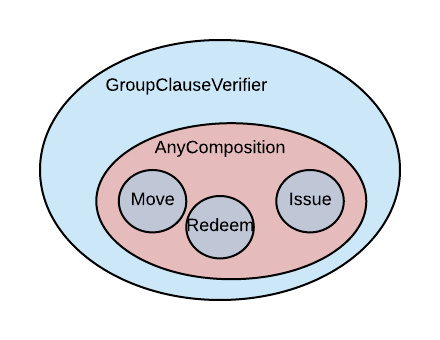
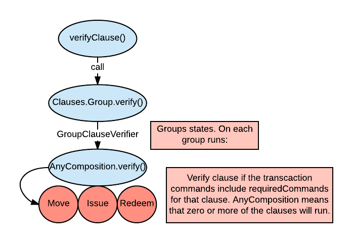

.. highlight:: kotlin
.. raw:: html

   
   

Writing a contract using clauses
================================

In this tutorial, we will restructure the commercial paper contract to use clauses. You should have
already completed ":doc:`tutorial-contract`".

As before, this example is focused on a basic implementation of commercial paper (CP), which is essentially a simpler version of a corporate
bond. A company issues commercial paper with a particular face value, say $100, but sells it for less, say $90. The paper can be redeemed
for cash at a given future date. In our example, the commercial paper has a 10% interest rate, with a single repayment.
The full Kotlin code can be found in ``CommercialPaper.kt``.

What are clauses and why use them?
----------------------------------

Clauses are essentially micro-contracts which contain independent verification logic, and can be logically composed
to form a complete contract. Clauses are designed to enable re-use of common verification parts. For example, issuing state objects
is generally the same for all fungible contracts, so a common issuance clause can be used for each contract's
issue clause. This cuts down on scope for error, and improves consistency of behaviour. By splitting verification logic
into smaller chunks, these can also be readily tested in isolation.

How do clauses work?
--------------------

There are different types of clauses. The most basic are those that define the verification logic for a single command 
(e.g. ``Move``, ``Issue`` and ``Redeem``, in the case of commercial paper), or even run without any commands at all (e.g. ``Timestamp``). 

These basic clauses can then be combined using a ``CompositeClause``. The goal of composite clauses is to determine 
which individual clauses need to be matched and verified for a given transaction 
to be considered valid. We refer to a clause as being "matched" when the transaction has the required commands present for the clause 
in question to trigger. Meanwhile, we talk about a clause "verifying" when its ``verify()`` function returns ``True``.

As an example, let's say we want a transaction to be valid only when every single one of its clauses matches and verifies. We implement this 
by wrapping the individual clauses into an ``AllOf`` composite clause, which ensures that a transaction is 
only considered valid if all of its clauses are both matched and verify.

There are two other basic composite clauses that you should be aware of:

   * ``AnyOf``, whereby 1 or more clauses may match, and every matched clause must verify
   * ``FirstOf``, whereby at least one clause must match, and the first such clause must verify

In turn, composite clauses are themselves ``Clause`` s, and can, for example, be wrapped in the special ``GroupClauseVerifier`` grouping clause. 
For ``CommercialPaper``, this would look as follows:

For this tutorial, we will be using ``GroupClauseVerifier`` and ``AnyOf``. Since it's important to understand how these work,
charts showing their execution and other details can be found in :doc:`clauses`.

.. _verify_ref:

Commercial paper class
----------------------

We start by defining the ``CommercialPaper`` class. As in the previous tutorial, we need some elementary parts: a ``Commands`` interface,
``generateMove``, ``generateIssue``, ``generateRedeem``. So far, so good - these stay the same. The new part is verification and the
``Clauses`` interface (which we will see later in code). Let's start from the basic structure:

.. container:: codeset

   .. sourcecode:: kotlin

        class CommercialPaper : Contract {
            override fun verify(tx: LedgerTransaction) = verifyClause(tx, Clauses.Group(), tx.commands.select<Commands>())

            interface Commands : CommandData {
                data class Move(override val contractHash: SecureHash? = null) : FungibleAsset.Commands.Move, Commands
                class Redeem : TypeOnlyCommandData(), Commands
                data class Issue(override val nonce: Long = random63BitValue()) : IssueCommand, Commands
            }

   .. sourcecode:: java

      public class CommercialPaper implements Contract {
          @Override
          public void verify(@NotNull LedgerTransaction tx) throws IllegalArgumentException {
              ClauseVerifier.verifyClause(tx, new Clauses.Group(), extractCommands(tx));
          }

        public interface Commands extends CommandData {
            class Move implements Commands {
                @Override
                public boolean equals(Object obj) { return obj instanceof Move; }
            }

            class Redeem implements Commands {
                @Override
                public boolean equals(Object obj) { return obj instanceof Redeem; }
            }

            class Issue implements Commands {
                @Override
                public boolean equals(Object obj) { return obj instanceof Issue; }
            }
        }

As you can see, we used ``verifyClause`` function with ``Clauses.Group()`` in place of our previous verification logic.
It's an entry point to running clause logic. ``verifyClause`` takes the transaction, a clause (usually a composite one)
to verify, and all of the commands the clause is expected to handle. This list of commands is important because
``verifyClause`` checks that none of the commands are left unprocessed at the end, raising an error if they are.

Simple Clauses
--------------

Let's move to constructing contract logic in terms of clauses. The commercial paper contract has three commands and
three corresponding behaviours: ``Issue``, ``Move`` and ``Redeem``. Each of them has a specific set of requirements that must be satisfied -
perfect material for defining clauses. For brevity, we will only show the ``Move`` clause. The rest is constructed in similar manner,
and is included in the ``CommercialPaper.kt`` code.

.. container:: codeset

   .. sourcecode:: kotlin

        interface Clauses {
            class Move: Clause<State, Commands, Issued<Terms>>() {
                override val requiredCommands: Set<Class<out CommandData>>
                    get() = setOf(Commands.Move::class.java)

                override fun verify(tx: LedgerTransaction,
                                inputs: List<State>,
                                outputs: List<State>,
                                commands: List<AuthenticatedObject<Commands>>,
                                groupingKey: Issued<Terms>?): Set<Commands> {
                    val command = commands.requireSingleCommand<Commands.Move>()
                    val input = inputs.single()
                    requireThat {
                        "the transaction is signed by the owner of the CP" using (input.owner.owningKey in command.signers)
                        "the state is propagated" using (outputs.size == 1)
                        // Don't need to check anything else, as if outputs.size == 1 then the output is equal to
                        // the input ignoring the owner field due to the grouping.
                    }
                    return setOf(command.value)
                }
            }
            ...

   .. sourcecode:: java

        public interface Clauses {
            class Move extends Clause<State, Commands, State> {
                @NotNull
                @Override
                public Set<Class<? extends CommandData>> getRequiredCommands() {
                    return Collections.singleton(Commands.Move.class);
                }

                @NotNull
                @Override
                public Set<Commands> verify(@NotNull LedgerTransaction tx,
                                               @NotNull List<? extends State> inputs,
                                               @NotNull List<? extends State> outputs,
                                               @NotNull List<? extends AuthenticatedObject<? extends Commands>> commands,
                                               @NotNull State groupingKey) {
                    AuthenticatedObject<Commands.Move> cmd = requireSingleCommand(tx.getCommands(), Commands.Move.class);
                    // There should be only a single input due to aggregation above
                    State input = single(inputs);

                    if (!cmd.getSigners().contains(input.getOwner().getOwningKey()))
                        throw new IllegalStateException("Failed requirement: the transaction is signed by the owner of the CP");

                    // Check the output CP state is the same as the input state, ignoring the owner field.
                    if (outputs.size() != 1) {
                        throw new IllegalStateException("the state is propagated");
                    }
                    // Don't need to check anything else, as if outputs.size == 1 then the output is equal to
                    // the input ignoring the owner field due to the grouping.
                    return Collections.singleton(cmd.getValue());
                }
            }
            ...

We took part of the code for ``Command.Move`` verification from the previous tutorial and put it into the verify function
of ``Move`` class. Notice that this class must extend the ``Clause`` abstract class, which defines
the ``verify`` function and the ``requiredCommands`` property used to determine the conditions under which a clause
is triggered. In the above example, this means that the clause will run its verification logic when ``Commands.Move`` is present in a transaction.

.. note:: Notice that commands refer to all input and output states in a transaction. For a clause to be executed, the transaction has
    to include all commands from the ``requiredCommands`` set.

A few important changes:

-   The ``verify`` function returns the set of commands which it has processed. Normally this set is identical to the
    ``requiredCommands`` used to trigger the clause. However, in some cases, the clause may process further optional commands
    which it needs to report that it has handled.

-   Verification takes new parameters. Usually inputs and outputs are some subset of the original transaction entries
    passed to the clause by outer composite or grouping clause. ``groupingKey`` is a key used to group original states.

As a simple example, imagine the following input states:

1. 1000 GBP issued by Bank of England
2. 500 GBP issued by Bank of England
3. 1000 GBP issued by Bank of Scotland

We will group states by Issuer, meaning that we have inputs 1 and 2 in one group, and input 3 in another group. The grouping keys are
'GBP issued by Bank of England' and 'GBP issued by Bank of Scotland'.

How are the states grouped and passed in this form to the ``Move`` clause? Answering that question leads us to the concept of 
``GroupClauseVerifier``.

Group clause
------------

We may have a transaction with similar but unrelated state evolutions which need to be validated independently. It
makes sense to check the ``Move`` command on groups of related inputs and outputs (see example above). Thus, we need to collect
relevant states together.
For this, we extend the standard ``GroupClauseVerifier`` and specify how to group input/output states, as well as the top-level
clause to run on each group. In our example, the top level is a composite clause - ``AnyCompostion`` - that delegates verification to
its subclauses (wrapped move, issue, redeem). "Any" in this case means that it will take 0 or more clauses that match the transaction commands.

.. container:: codeset

   .. sourcecode:: kotlin

        class Group : GroupClauseVerifier<State, Commands, Issued<Terms>>(
            AnyOf(
                Redeem(),
                Move(),
                Issue())) {
            override fun groupStates(tx: LedgerTransaction): List<LedgerTransaction.InOutGroup<State, Issued<Terms>>>
                    = tx.groupStates<State, Issued<Terms>> { it.token }
        }

   .. sourcecode:: java

        class Group extends GroupClauseVerifier<State, Commands, State> {
            public Group() {
                super(new AnyOf<>(
                    new Clauses.Redeem(),
                    new Clauses.Move(),
                    new Clauses.Issue()
                ));
            }

            @NotNull
            @Override
            public List<InOutGroup<State, State>> groupStates(@NotNull LedgerTransaction tx) {
                return tx.groupStates(State.class, State::withoutOwner);
            }
        }

For the ``CommercialPaper`` contract, ``Group`` is the main clause for the contract, and is passed directly into
``verifyClause`` (see the example code at the top of this tutorial). We also used ``groupStates`` function here - it 
may be worth reminding yourself how it works here: :ref:`state_ref`.

Summary
-------

In summary, the top-level contract ``CommercialPaper`` specifies a single grouping clause of type
``CommercialPaper.Clauses.Group``, which in turn specifies ``GroupClause`` implementations for each type of command
(``Redeem``, ``Move`` and ``Issue``). This reflects the verification flow: in order to verify ``CommercialPaper``, 
we first group states, then we check which commands are specified, and finally we run command-specific verification logic accordingly.

Debugging
---------

Debugging clauses which have been composed together can be complicated due to the difficulty in knowing which clauses
have been matched, whether specific clauses failed to match or passed verification, etc. There is "trace" level
logging code in the clause verifier which evaluates which clauses will be matched and logs them, before actually
performing the validation. To enable this, ensure trace level logging is enabled on the ``Clause`` interface.
