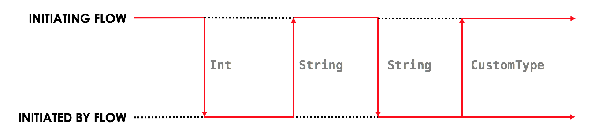

.. highlight:: kotlin
.. raw:: html

   
   

Upgrading a CorDapp (outside of platform version upgrades)
==========================================================

.. note:: This document only concerns the upgrading of CorDapps and not the Corda platform itself (wire format, node
   database schemas, etc.).

.. contents::

CorDapp versioning
------------------
The Corda platform does not mandate a version number on a per-CorDapp basis. Different elements of a CorDapp are
allowed to evolve separately. Sometimes, however, a change to one element will require changes to other elements. For
example, changing a shared data structure may require flow changes that are not backwards-compatible.

Flow versioning
---------------
Any flow that initiates other flows must be annotated with the ``@InitiatingFlow`` annotation, which is defined as:

.. sourcecode:: kotlin

   annotation class InitiatingFlow(val version: Int = 1)

The ``version`` property, which defaults to 1, specifies the flow's version. This integer value should be incremented
whenever there is a release of a flow which has changes that are not backwards-compatible. A non-backwards compatible
change is one that changes the interface of the flow.

Defining a flow's interface
~~~~~~~~~~~~~~~~~~~~~~~~~~~
The flow interface is defined by the sequence of ``send`` and ``receive`` calls between an ``InitiatingFlow`` and an
``InitiatedBy`` flow, including the types of the data sent and received. We can picture a flow's interface as follows:

In the diagram above, the ``InitiatingFlow``:

* Sends an ``Int``
* Receives a ``String``
* Sends a ``String``
* Receives a ``CustomType``

The ``InitiatedBy`` flow does the opposite:

* Receives an ``Int``
* Sends a ``String``
* Receives a ``String``
* Sends a ``CustomType``

As long as both the ``InitiatingFlow`` and the ``InitiatedBy`` flows conform to the sequence of actions, the flows can
be implemented in any way you see fit (including adding proprietary business logic that is not shared with other
parties).

Non-backwards compatible flow changes
~~~~~~~~~~~~~~~~~~~~~~~~~~~~~~~~~~~~~
A flow can become backwards-incompatible in two main ways:

* The sequence of ``send`` and ``receive`` calls changes:

  * A ``send`` or ``receive`` is added or removed from either the ``InitiatingFlow`` or ``InitiatedBy`` flow
  * The sequence of ``send`` and ``receive`` calls changes

* The types of the ``send`` and ``receive`` calls changes

Consequences of running flows with incompatible versions
~~~~~~~~~~~~~~~~~~~~~~~~~~~~~~~~~~~~~~~~~~~~~~~~~~~~~~~~
Pairs of ``InitiatingFlow`` flows and ``InitiatedBy`` flows that have incompatible interfaces are likely to exhibit the
following behaviour:

* The flows hang indefinitely and never terminate, usually because a flow expects a response which is never sent from
  the other side
* One of the flow ends with an exception: "Expected Type X but Received Type Y", because the ``send`` or ``receive``
  types are incorrect
* One of the flows ends with an exception: "Counterparty flow terminated early on the other side", because one flow
  sends some data to another flow, but the latter flow has already ended

Ensuring flow backwards-compatibility
~~~~~~~~~~~~~~~~~~~~~~~~~~~~~~~~~~~~~
The ``InitiatingFlow`` version number is included in the flow session handshake and exposed to both parties via the
``FlowLogic.getFlowContext`` method. This method takes a ``Party`` and returns a ``FlowContext`` object which describes
the flow running on the other side. In particular, it has a ``flowVersion`` property which can be used to
programmatically evolve flows across versions. For example:

.. container:: codeset

    .. sourcecode:: kotlin

        @Suspendable
        override fun call() {
            val otherFlowVersion = otherSession.getCounterpartyFlowInfo().flowVersion
            val receivedString = if (otherFlowVersion == 1) {
                otherSession.receive<Int>().unwrap { it.toString() }
            } else {
                otherSession.receive<String>().unwrap { it }
            }
        }

    .. sourcecode:: java

        @Suspendable
        @Override public Void call() throws FlowException {
            int otherFlowVersion = otherSession.getCounterpartyFlowInfo().getFlowVersion();
            String receivedString;

            if (otherFlowVersion == 1) {
                receivedString = otherSession.receive(Integer.class).unwrap(integer -> {
                    return integer.toString();
                });
            } else {
                receivedString = otherSession.receive(String.class).unwrap(string -> {
                    return string;
                });
            }

            return null;
        }

This code shows a flow that in its first version expected to receive an Int, but in subsequent versions was modified to
expect a String. This flow is still able to communicate with parties that are running the older CorDapp containing
the older flow.

Handling interface changes to inlined subflows
~~~~~~~~~~~~~~~~~~~~~~~~~~~~~~~~~~~~~~~~~~~~~~
Here is an example of an in-lined subflow:

.. container:: codeset

    .. sourcecode:: kotlin

        @StartableByRPC
        @InitiatingFlow
        class FlowA(val recipient: Party) : FlowLogic<Unit>() {
            @Suspendable
            override fun call() {
                subFlow(FlowB(recipient))
            }
        }

        @InitiatedBy(FlowA::class)
        class FlowC(val otherSession: FlowSession) : FlowLogic() {
            // Omitted.
        }

        // Note: No annotations. This is used as an inlined subflow.
        class FlowB(val recipient: Party) : FlowLogic<Unit>() {
            @Suspendable
            override fun call() {
                val message = "I'm an inlined subflow, so I inherit the @InitiatingFlow's session ID and type."
                initiateFlow(recipient).send(message)
            }
        }

    .. sourcecode:: java

        @StartableByRPC
        @InitiatingFlow
        class FlowA extends FlowLogic<Void> {
            private final Party recipient;

            public FlowA(Party recipient) {
                this.recipient = recipient;
            }

            @Suspendable
            @Override public Void call() throws FlowException {
                subFlow(new FlowB(recipient));

                return null;
            }
        }

        @InitiatedBy(FlowA.class)
        class FlowC extends FlowLogic<Void> {
            // Omitted.
        }

        // Note: No annotations. This is used as an inlined subflow.
        class FlowB extends FlowLogic<Void> {
            private final Party recipient;

            public FlowB(Party recipient) {
                this.recipient = recipient;
            }

            @Suspendable
            @Override public Void call() {
                String message = "I'm an inlined subflow, so I inherit the @InitiatingFlow's session ID and type.";
                initiateFlow(recipient).send(message);

                return null;
            }
        }

Inlined subflows are treated as being the flow that invoked them when initiating a new flow session with a counterparty.
Suppose flow ``A`` calls inlined subflow B, which, in turn, initiates a session with a counterparty. The ``FlowLogic``
type used by the counterparty to determine which counter-flow to invoke is determined by ``A``, and not by ``B``. This
means that the response logic for the inlined flow must be implemented explicitly in the ``InitiatedBy`` flow. This can
be done either by calling a matching inlined counter-flow, or by implementing the other side explicitly in the
initiated parent flow. Inlined subflows also inherit the session IDs of their parent flow.

As such, an interface change to an inlined subflow must be considered a change to the parent flow interfaces.

An example of an inlined subflow is ``CollectSignaturesFlow``. It has a response flow called ``SignTransactionFlow``
that isn’t annotated with ``InitiatedBy``. This is because both of these flows are inlined. How these flows speak to
one another is defined by the parent flows that call ``CollectSignaturesFlow`` and ``SignTransactionFlow``.

In code, inlined subflows appear as regular ``FlowLogic`` instances without either an ``InitiatingFlow`` or an
``InitiatedBy`` annotation.

Inlined flows are not versioned, as they inherit the version of their parent ``InitiatingFlow`` or ``InitiatedBy``
flow.

Flows which are not an ``InitiatingFlow`` or ``InitiatedBy`` flow, or inlined subflows that are not called from an
``InitiatingFlow`` or ``InitiatedBy`` flow, can be updated without consideration of backwards-compatibility. Flows of
this type include utility flows for querying the vault and flows for reaching out to external systems.

Performing flow upgrades
~~~~~~~~~~~~~~~~~~~~~~~~

1. Update the flow and test the changes. Increment the flow version number in the ``InitiatingFlow`` annotation
2. Ensure that all versions of the existing flow have finished running and there are no pending ``SchedulableFlows`` on
   any of the nodes on the business network. This can be done by :ref:`draining_the_node`
3. Shut down the node
4. Replace the existing CorDapp JAR with the CorDapp JAR containing the new flow
5. Start the node

If you shut down all nodes and upgrade them all at the same time, any incompatible change can be made.

In situations where some nodes may still be using previous versions of a flow and thus new versions of your flow may
talk to old versions, the updated flows need to be backwards-compatible. This will be the case for almost any real
deployment in which you cannot easily coordinate the roll-out of new code across the network.

.. _draining_the_node:

Draining the node
~~~~~~~~~~~~~~~~~

A flow *checkpoint* is a serialised snapshot of the flow's stack frames and any objects reachable from the stack.
Checkpoints are saved to the database automatically when a flow suspends or resumes, which typically happens when
sending or receiving messages. A flow may be replayed from the last checkpoint if the node restarts. Automatic
checkpointing is an unusual feature of Corda and significantly helps developers write reliable code that can survive
node restarts and crashes. It also assists with scaling up, as flows that are waiting for a response can be flushed
from memory.

However, this means that restoring an old checkpoint to a new version of a flow may cause resume failures. For example
if you remove a local variable from a method that previously had one, then the flow engine won't be able to figure out
where to put the stored value of the variable.

For this reason, in currently released versions of Corda you must *drain the node* before doing an app upgrade that
changes ``@Suspendable`` code. A drain blocks new flows from starting but allows existing flows to finish. Thus once
a drain is complete there should be no outstanding checkpoints or running flows. Upgrading the app will then succeed.

A node can be drained or undrained via RPC using the ``setFlowsDrainingModeEnabled`` method, and via the shell using
the standard ``run`` command to invoke the RPC. See :doc:`shell` to learn more.

Contract and state versioning
-----------------------------

There are two types of contract/state upgrade:

1. *Implicit:* By allowing multiple implementations of the contract ahead of time, using constraints. See
   :doc:`api-contract-constraints` to learn more
2. *Explicit:* By creating a special *contract upgrade transaction* and getting all participants of a state to sign it
   using the contract upgrade flows

This section of the documentation focuses only on *explicit* upgrades.

In an explicit upgrade, contracts and states can be changed in arbitrary ways, if and only if all of the state's
participants agree to the proposed upgrade. The following combinations of upgrades are possible:

* A contract is upgraded while the state definition remains the same
* A state is upgraded while the contract stays the same
* The state and the contract are updated simultaneously

Performing explicit contract and state upgrades
~~~~~~~~~~~~~~~~~~~~~~~~~~~~~~~~~~~~~~~~~~~~~~~

1. Preserve the existing state and contract definitions
^^^^^^^^^^^^^^^^^^^^^^^^^^^^^^^^^^^^^^^^^^^^^^^^^^^^^^^
Currently, all nodes must **permanently** keep **all** old state and contract definitions on their node's classpath

.. note:: Once the contract-code-as-an-attachment feature has been implemented, nodes will only be required to keep the
   old state and contract definitions on their node's classpath for the duration of the upgrade

Changing a state or contract's package constitutes a definition change. If you want to move a state or contract
definition to a new package, you must also preserve the definition in the old package

2. Write the new state and contract definitions
^^^^^^^^^^^^^^^^^^^^^^^^^^^^^^^^^^^^^^^^^^^^^^^
Update the contract and/or state definitions. There are no restrictions on how states are updated. However,
upgraded contracts must implement the ``UpgradedContract`` interface. This interface is defined as:

.. sourcecode:: kotlin

    interface UpgradedContract<in OldState : ContractState, out NewState : ContractState> : Contract {
        val legacyContract: ContractClassName
        fun upgrade(state: OldState): NewState
    }

The ``upgrade`` method describes how the old state type is upgraded to the new state type. When the state isn't being
upgraded, the same state type can be used for both the old and new state type parameters.

By default this new contract will only be able to upgrade legacy states which are constrained by the zone whitelist (see :doc:`api-contract-constraints`).
If hash or other constraint types are used, the new contract should implement ``UpgradedContractWithLegacyConstraint``
instead, and specify the constraint explicitly:

.. sourcecode:: kotlin

    interface UpgradedContractWithLegacyConstraint<in OldState : ContractState, out NewState : ContractState> : UpgradedContract<OldState, NewState> {
        val legacyContractConstraint: AttachmentConstraint
    }

For example, in case of hash constraints the hash of the legacy JAR file should be provided:

.. sourcecode:: kotlin

    override val legacyContractConstraint: AttachmentConstraint
        get() = HashAttachmentConstraint(SecureHash.parse("E02BD2B9B010BBCE49C0D7C35BECEF2C79BEB2EE80D902B54CC9231418A4FA0C"))

3. Create the new CorDapp JAR
^^^^^^^^^^^^^^^^^^^^^^^^^^^^^
Produce a new CorDapp JAR file. This JAR file should only contain the new contract and state definitions.

4. Distribute the new CorDapp JAR
^^^^^^^^^^^^^^^^^^^^^^^^^^^^^^^^^
Place the new CorDapp JAR file in the ``cordapps`` folder of all the relevant nodes. You can do this while the nodes are still 
running.

5. Stop the nodes
^^^^^^^^^^^^^^^^^
Have each node operator stop their node. If you are also changing flow definitions, you should perform a 
:ref:`node drain <draining_the_node>` first to avoid the definition of states or contracts changing whilst a flow is 
in progress.

6. Re-run the network bootstrapper
^^^^^^^^^^^^^^^^^^^^^^^^^^^^^^^^^^
If you're using the network bootstrapper instead of a network map server and have defined any new contracts, you need to 
re-run the network bootstrapper to whitelist the new contracts. See :doc:`network-bootstrapper`.

7. Restart the nodes
^^^^^^^^^^^^^^^^^^^^
Have each node operator restart their node.

8. Authorise the upgrade
^^^^^^^^^^^^^^^^^^^^^^^^
Now that new states and contracts are on the classpath for all the relevant nodes, the nodes must all run the
``ContractUpgradeFlow.Authorise`` flow. This flow takes a ``StateAndRef`` of the state to update as well as a reference
to the new contract, which must implement the ``UpgradedContract`` interface.

At any point, a node administrator may de-authorise a contract upgrade by running the
``ContractUpgradeFlow.Deauthorise`` flow.

9. Perform the upgrade
^^^^^^^^^^^^^^^^^^^^^^
Once all nodes have performed the authorisation process, a **single** node must initiate the upgrade via the
``ContractUpgradeFlow.Initiate`` flow for each state object. This flow has the following signature:

.. sourcecode:: kotlin

    class Initiate<OldState : ContractState, out NewState : ContractState>(
        originalState: StateAndRef<OldState>,
        newContractClass: Class<out UpgradedContract<OldState, NewState>>
    ) : AbstractStateReplacementFlow.Instigator<OldState, NewState, Class<out UpgradedContract<OldState, NewState>>>(originalState, newContractClass)

This flow sub-classes ``AbstractStateReplacementFlow``, which can be used to upgrade state objects that do not need a
contract upgrade.

One the flow ends successfully, all the participants of the old state object should have the upgraded state object
which references the new contract code.

Points to note
~~~~~~~~~~~~~~

Capabilities of the contract upgrade flows
^^^^^^^^^^^^^^^^^^^^^^^^^^^^^^^^^^^^^^^^^^
* Despite its name, the ``ContractUpgradeFlow`` also handles the update of state object definitions
* The state can completely change as part of an upgrade! For example, it is possible to transmute a ``Cat`` state into
  a ``Dog`` state, provided that all participants in the ``Cat`` state agree to the change
* Equally, the state doesn't have to change at all
* If a node has not yet run the contract upgrade authorisation flow, they will not be able to upgrade the contract
  and/or state objects
* State schema changes are handled separately

Writing new states and contracts
^^^^^^^^^^^^^^^^^^^^^^^^^^^^^^^^
* If a property is removed from a state, any references to it must be removed from the contract code. Otherwise, you
  will not be able to compile your contract code. It is generally not advisable to remove properties from states. Mark
  them as deprecated instead
* When adding properties to a state, consider how the new properties will affect transaction validation involving this
  state. If the contract is not updated to add constraints over the new properties, they will be able to take on any
  value
* Updated state objects can use the old contract code as long as there is no requirement to update it

Logistics
^^^^^^^^^
* All nodes need to run the contract upgrade authorisation flow to upgrade the contract and/or state objects
* Only node administrators are able to run the contract upgrade authorisation and deauthorisation flows
* Upgrade authorisations can subsequently be deauthorised
* Only one node should run the contract upgrade initiation flow. If multiple nodes run it for the same ``StateRef``, a
  double-spend will occur for all but the first completed upgrade
* Upgrades do not have to happen immediately. For a period, the two parties can use the old states and contracts
  side-by-side
* The supplied upgrade flows upgrade one state object at a time

State schema versioning
-----------------------
By default, all state objects are serialised to the database as a string of bytes and referenced by their ``StateRef``.
However, it is also possible to define custom schemas for serialising particular properties or combinations of
properties, so that they can be queried from a source other than the Corda Vault. This is done by implementing the
``QueryableState`` interface and creating a custom object relational mapper for the state. See :doc:`api-persistence`
for details.

For backwards compatible changes such as adding columns, the procedure for upgrading a state schema is to extend the
existing object relational mapper. For example, we can update:

.. container:: codeset

    .. sourcecode:: kotlin

        object ObligationSchemaV1 : MappedSchema(Obligation::class.java, 1, listOf(ObligationEntity::class.java)) {
            @Entity @Table(name = "obligations")
            class ObligationEntity(obligation: Obligation) : PersistentState() {
                @Column var currency: String = obligation.amount.token.toString()
                @Column var amount: Long = obligation.amount.quantity
                @Column @Lob var lender: ByteArray = obligation.lender.owningKey.encoded
                @Column @Lob var borrower: ByteArray = obligation.borrower.owningKey.encoded
                @Column var linear_id: String = obligation.linearId.id.toString()
            }
        }

    .. sourcecode:: java

        public class ObligationSchemaV1 extends MappedSchema {
            public ObligationSchemaV1() {
                super(Obligation.class, 1, ImmutableList.of(ObligationEntity.class));
            }
        }

        @Entity
        @Table(name = "obligations")
        public class ObligationEntity extends PersistentState {
            @Column(name = "currency") private String currency;
            @Column(name = "amount") private Long amount;
            @Column(name = "lender") @Lob private byte[] lender;
            @Column(name = "borrower") @Lob private byte[] borrower;
            @Column(name = "linear_id") private UUID linearId;

            protected ObligationEntity(){}

            public ObligationEntity(String currency, Long amount, byte[] lender, byte[] borrower, UUID linearId) {
                this.currency = currency;
                this.amount = amount;
                this.lender = lender;
                this.borrower = borrower;
                this.linearId = linearId;
            }

            public String getCurrency() {
                return currency;
            }

            public Long getAmount() {
                return amount;
            }

            public byte[] getLender() {
                return lender;
            }

            public byte[] getBorrower() {
                return borrower;
            }

            public UUID getLinearId() {
                return linearId;
            }
        }

To:

.. container:: codeset

    .. sourcecode:: kotlin

        object ObligationSchemaV1 : MappedSchema(Obligation::class.java, 1, listOf(ObligationEntity::class.java)) {
            @Entity @Table(name = "obligations")
            class ObligationEntity(obligation: Obligation) : PersistentState() {
                @Column var currency: String = obligation.amount.token.toString()
                @Column var amount: Long = obligation.amount.quantity
                @Column @Lob var lender: ByteArray = obligation.lender.owningKey.encoded
                @Column @Lob var borrower: ByteArray = obligation.borrower.owningKey.encoded
                @Column var linear_id: String = obligation.linearId.id.toString()
                @Column var defaulted: Bool = obligation.amount.inDefault               // NEW COLUMN!
            }
        }

    .. sourcecode:: java

        public class ObligationSchemaV1 extends MappedSchema {
            public ObligationSchemaV1() {
                super(Obligation.class, 1, ImmutableList.of(ObligationEntity.class));
            }
        }

        @Entity
        @Table(name = "obligations")
        public class ObligationEntity extends PersistentState {
            @Column(name = "currency") private String currency;
            @Column(name = "amount") private Long amount;
            @Column(name = "lender") @Lob private byte[] lender;
            @Column(name = "borrower") @Lob private byte[] borrower;
            @Column(name = "linear_id") private UUID linearId;
            @Column(name = "defaulted") private Boolean defaulted;            // NEW COLUMN!

            protected ObligationEntity(){}

            public ObligationEntity(String currency, Long amount, byte[] lender, byte[] borrower, UUID linearId, Boolean defaulted) {
                this.currency = currency;
                this.amount = amount;
                this.lender = lender;
                this.borrower = borrower;
                this.linearId = linearId;
                this.defaulted = defaulted;
            }

            public String getCurrency() {
                return currency;
            }

            public Long getAmount() {
                return amount;
            }

            public byte[] getLender() {
                return lender;
            }

            public byte[] getBorrower() {
                return borrower;
            }

            public UUID getLinearId() {
                return linearId;
            }

            public Boolean isDefaulted() {
                return defaulted;
            }
        }

Thus adding a new column with a default value.

To make a non-backwards compatible change, the ``ContractUpgradeFlow`` or ``AbstractStateReplacementFlow`` must be
used, as changes to the state are required. To make a backwards-incompatible change such as deleting a column (e.g.
because a property was removed from a state object), the procedure is to define another object relational mapper, then
add it to the ``supportedSchemas`` property of your ``QueryableState``, like so:

.. container:: codeset

    .. sourcecode:: kotlin

        override fun supportedSchemas(): Iterable<MappedSchema> = listOf(ExampleSchemaV1, ExampleSchemaV2)

    .. sourcecode:: java

        @Override public Iterable<MappedSchema> supportedSchemas() {
            return ImmutableList.of(new ExampleSchemaV1(), new ExampleSchemaV2());
        }

Then, in ``generateMappedObject``, add support for the new schema:

.. container:: codeset

    .. sourcecode:: kotlin

        override fun generateMappedObject(schema: MappedSchema): PersistentState {
            return when (schema) {
                is DummyLinearStateSchemaV1 -> // Omitted.
                is DummyLinearStateSchemaV2 -> // Omitted.
                else -> throw IllegalArgumentException("Unrecognised schema $schema")
            }
        }

    .. sourcecode:: java

        @Override public PersistentState generateMappedObject(MappedSchema schema) {
            if (schema instanceof DummyLinearStateSchemaV1) {
                // Omitted.
            } else if (schema instanceof DummyLinearStateSchemaV2) {
                // Omitted.
            } else {
                throw new IllegalArgumentException("Unrecognised schema $schema");
            }
        }

With this approach, whenever the state object is stored in the vault, a representation of it will be stored in two
separate database tables where possible - one for each supported schema.

Serialisation
-------------

The Corda serialisation format
~~~~~~~~~~~~~~~~~~~~~~~~~~~~~~
Currently, the serialisation format for everything except flow checkpoints (which uses a Kryo-based format) is based
on AMQP 1.0, a self-describing and controllable serialisation format. AMQP is desirable because it allows us to have
a schema describing what has been serialized alongside the data itself. This assists with versioning and deserialising
long-ago archived data, among other things.

Writing classes that meet the serialisation format requirements
~~~~~~~~~~~~~~~~~~~~~~~~~~~~~~~~~~~~~~~~~~~~~~~~~~~~~~~~~~~~~~~
Although not strictly related to versioning, AMQP serialisation dictates that we must write our classes in a particular way:

* Your class must have a constructor that takes all the properties that you wish to record in the serialized form. This
  is required in order for the serialization framework to reconstruct an instance of your class
* If more than one constructor is provided, the serialization framework needs to know which one to use. The
  ``@ConstructorForDeserialization`` annotation can be used to indicate the chosen constructor. For a Kotlin class
  without the ``@ConstructorForDeserialization`` annotation, the primary constructor is selected
* The class must be compiled with parameter names in the .class file. This is the default in Kotlin but must be turned
  on in Java (using the ``-parameters`` command line option to ``javac``)
* Your class must provide a Java Bean getter for each of the properties in the constructor, with a matching name. For
  example, if a class has the constructor parameter ``foo``, there must be a getter called ``getFoo()``. If ``foo`` is
  a boolean, the getter may optionally be called ``isFoo()``. This is why the class must be compiled with parameter
  names turned on
* The class must be annotated with ``@CordaSerializable``
* The declared types of constructor arguments/getters must be supported, and where generics are used the generic
  parameter must be a supported type, an open wildcard (*), or a bounded wildcard which is currently widened to an open
  wildcard
* Any superclass must adhere to the same rules, but can be abstract
* Object graph cycles are not supported, so an object cannot refer to itself, directly or indirectly

Writing enums
~~~~~~~~~~~~~
Elements cannot be added to enums in a new version of the code. Hence, enums are only a good fit for genuinely static
data that will never change (e.g. days of the week). A ``Buy`` or ``Sell`` flag is another. However, something like
``Trade Type`` or ``Currency Code`` will likely change. For those, it is preferable to choose another representation,
such as a string.
