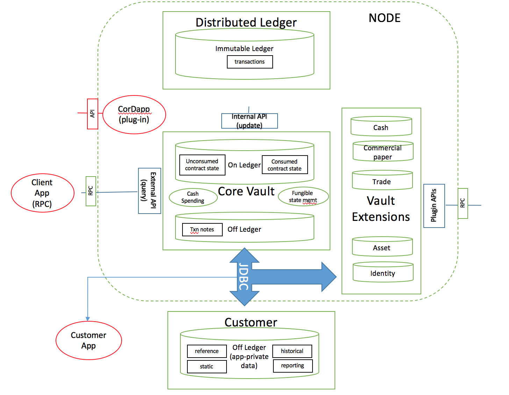

Vault
=====

The vault contains data extracted from the ledger that is considered relevant to the node’s owner, stored in a relational model
that can be easily queried and worked with.

The vault keeps track of both unconsumed and consumed states:

 * **Unconsumed** (or unspent) states represent fungible states available for spending (including spend-to-self transactions)
   and linear states available for evolution (eg. in response to a lifecycle event on a deal) or transfer to another party.
 * **Consumed** (or spent) states represent ledger immutable state for the purpose of transaction reporting, audit and archival, including the ability to perform joins with app-private data (like customer notes).

By fungible we refer to assets of measurable quantity (eg. a cash currency, units of stock) which can be combined
together to represent a single ledger state.

Like with a cryptocurrency wallet, the Corda vault can create transactions that send value (eg. transfer of state) to
someone else by combining fungible states and possibly adding a change output that makes the values balance (this
process is usually referred to as ‘coin selection’). Vault spending ensures that transactions respect the fungibility
rules in order to ensure that the issuer and reference data is preserved as the assets pass from hand to hand. 

A feature called **soft locking** provides the ability to automatically or explicitly reserve states to prevent
multiple transactions within the same node from trying to use the same output simultaneously. Whilst this scenario would
ultimately be detected by a notary, *soft locking* provides a mechanism of early detection for such unwarranted and
invalid scenarios. :doc:`soft-locking` describes this feature in detail.

.. note:: Basic 'coin selection' is currently implemented. Future work includes fungible state optimisation (splitting and
          merging of states in the background), and 'state re-issuance' (sending of states back to the
          issuer for re-issuance, thus pruning long transaction chains and improving privacy).

There is also a facility for attaching descriptive textual notes against any transaction stored in the vault.

The vault supports the management of data in both authoritative ("on-ledger") form and, where appropriate, shadow ("off-ledger") form:

* "On-ledger" data refers to distributed ledger state (cash, deals, trades) to which a firm is participant.
* "Off-ledger" data refers to a firm's internal reference, static and systems data.

The following diagram illustrates the breakdown of the vault into sub-system components:

Note the following:

* The vault "On Ledger" store tracks unconsumed state and is updated internally by the node upon recording of a transaction on the ledger
  (following successful smart contract verification and signature by all participants).
* The vault "Off Ledger" store refers to additional data added by the node owner subsequent to transaction recording.
* The vault performs fungible state spending (and in future, fungible state optimisation management including merging, splitting and re-issuance).
* Vault extensions represent additional custom plugin code a developer may write to query specific custom contract state attributes.
* Customer "Off Ledger" (private store) represents internal organisational data that may be joined with the vault data to perform additional reporting or processing.
* A :doc:`Vault Query API </api-vault-query>` is exposed to developers using standard Corda RPC and CorDapp plugin mechanisms.
* A vault update API is internally used by transaction recording flows.
* The vault database schemas are directly accessible via JDBC for customer joins and queries.

Section 8 of the `Technical white paper`_ describes features of the vault yet to be implemented including private key management, state splitting and merging, asset re-issuance and node event scheduling.

.. _`Technical white paper`: _static/corda-technical-whitepaper.pdf

