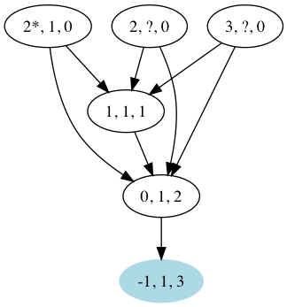

# Avalanche Simulation

Experimental simulation of the Avalanche protocol by Team Rocket. This
implementation is incomplete.

The paper: [Snowflake to Avalanche: A Novel Metastable Consensus Protocol Family for
           Cryptocurrencies](https://ipfs.io/ipfs/QmUy4jh5mGNZvLkjies1RWM4YuvJh5o2FYopNPVYwrRVGV).

## Running the Simulation
```
./gradlew shadowJar
java -jar build/libs/avalanche-all.jar --dump-dags
```

### Visualising the DAGs
```
for f in node-0-*.dot; do dot -Tpng -O $f; done
```
The above command generates a number of PNG files `node-0-*.png`, showing the
evolution of the DAG. The nodes are labeled with the ID of the spent state,
the chit and confidence values. The prefered transaction of a conflict set is
labelled with a star. Accepted transactions are blue.


