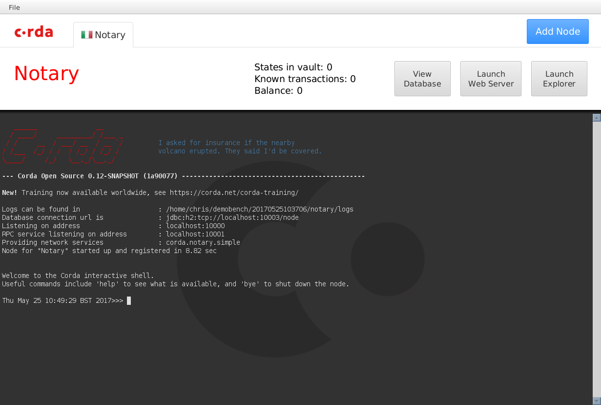
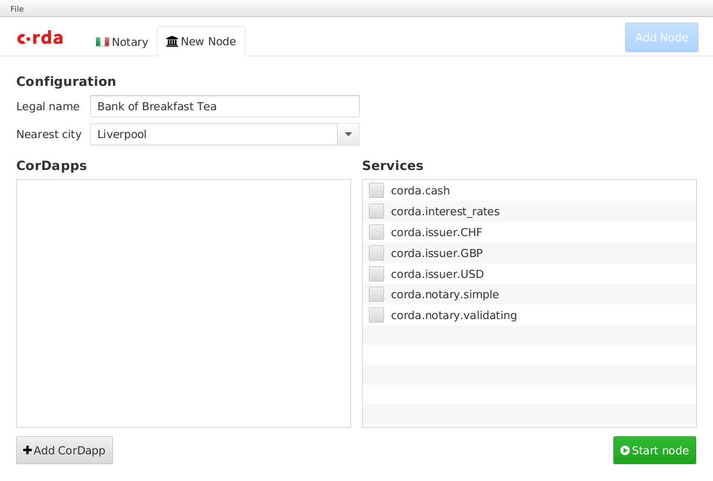
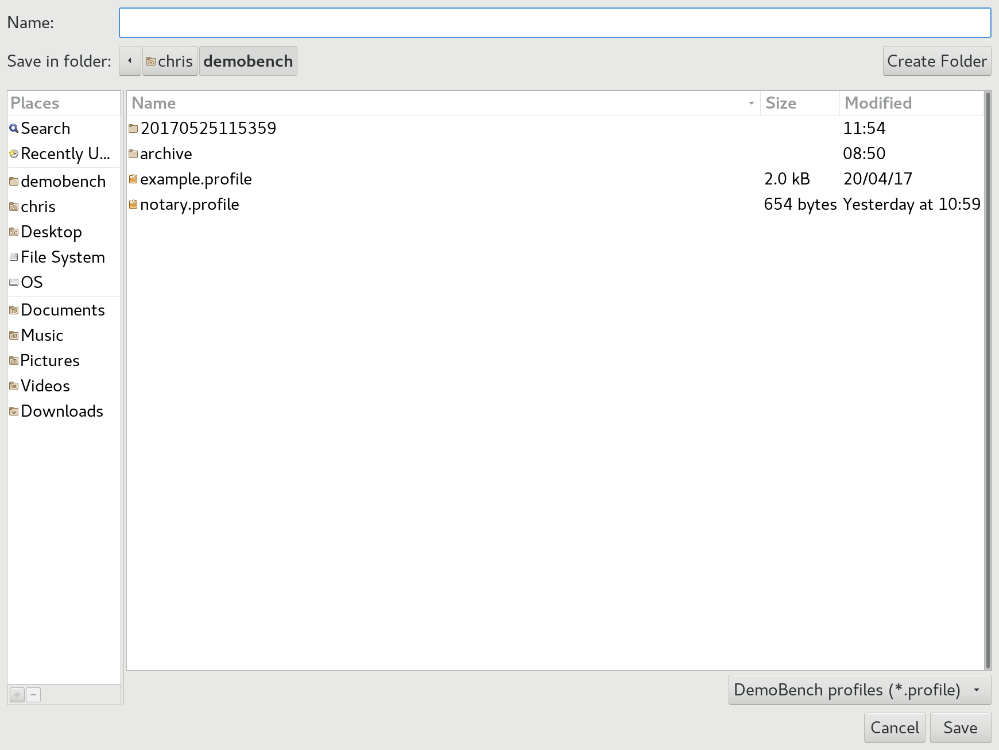

# DemoBench

DemoBench is a standalone desktop application that makes it easy to configure
and launch local Corda nodes. Its general usage is documented
[here](https://docs.corda.net/demobench.html).

## Running locally

**MacOSX/Linux:**

    ./gradlew tools:demobench:installDist
    cd tools/demobench/build/install/demobench
    bin/demobench

**Windows:**

    gradlew tools:demobench:installDist
    cd tools\demobench\build\install\demobench

and then

    bin\demobench

or, if Windows complains that the command line is too long:

    java -Djava.util.logging.config.class=net.corda.demobench.config.LoggingConfig -jar lib\demobench-$version.jar

## Testing
### The Notary Node

When launched, DemoBench will look something like this:


Clicking the `Start node` button should launch a new Notary node.



The tab should display the correct national flag for the node's geographical
location. The `View Database`, `Launch Web Server` and `Launch Explorer` buttons
will be disabled until the node has finished booting, at which point the node
statistics (`States in vault`, `Known transactions` and `Balance`) will become
populated too.

The Corda node should boot into a shell with a command prompt. Type `help` at
this command prompt to list the commands available, followed by `dashboard`.


Press `q` to exit the dashboard, and then check the tab's buttons:

- Press `View Database` to launch the H2 database's Web console in your browser.
Pressing this button again should launch a second console session.
- Press the `Launch Web Server` button to launch the Corda Webserver for this
node. Once booted, it should open your browser to a page saying:
> ### Installed CorDaps
> No installed custom CorDapps

- The button's text should now have changed to `Reopen web site`. Pressing the
button again should open a new session in your browser.

- Press the `Launch Explorer` button to launch the [Node Explorer](https://docs.corda.net/node-explorer.html) for this notary. You should be logged into the
Explorer automatically. The `Launch Explorer` button should now remain disabled
until you close this node's Explorer again.

### The Bank Node

Click the `Add Node` button, and DemoBench will ask you to configure another
node in a new tab.



When you press the `Launch Web Server` this time, your browser should open to a
page saying:
> ### Installed CorDapps
> **net.corda.bank.plugin.BankOfCordaPlugin**<br/>
> net.corda.bank.api.BankOfCordaWebApi:
> - POST issue-asset-request
> - GET date

Clicking on the `GET date` link should return today's date within a JSON document.

Launch the bank's Node Explorer, and check the network view. The Notary node
should be displayed in Rome, whereas the Bank of Breakfast Tea should be in
Liverpool.

## Saving / Loading profiles

Choose `File/Save As` from DemoBench's main menu.



Save the profile and then examine its contents (ZIP format). It should look
something like:

```
  Length      Date    Time    Name
---------  ---------- -----   ----
        0  05-25-2017 11:57   notary/
      490  05-25-2017 11:57   notary/node.conf
        0  05-25-2017 11:57   notary/plugins/
        0  05-25-2017 11:57   bankofbreakfasttea/
      673  05-25-2017 11:57   bankofbreakfasttea/node.conf
        0  05-25-2017 11:57   bankofbreakfasttea/plugins/
---------                     -------
     1163                     6 files
```

Now choose `File/Open` from the main menu, and select the profile that you have
just saved. DemoBench should close the two existing tabs and then relaunch the
Notary and Bank nodes.

If you want to edit the content, please make sure that when zipping content back, 
the notary node is the first directory (ZIP files content is ordered) 

## Exiting DemoBench

Close DemoBench as a normal application on your platform; it should close any
open Node Explorers before exiting.
