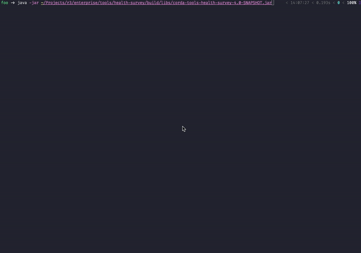

# Corda Health Survey Tool


## Overview

This is a simple tool that collects and packages up material that R3 Support will need to be able to help a customer
with a support request, including things like:

 - an obfuscated version of the config (i.e., without passwords, etc.),
 - logs from the last 3 days (if the user is happy to share),
 - the version of Corda, Java virtual machine and operating system,
 - networking information with DNS lookups to various endpoints (database, network map, doorman, external addresses),
 - a copy of the network parameters file,
 - a list of installed CorDapps (including file sizes and checksums),
 - a list of the files in the drivers directory,
 - a copy of the node information file for the node and a list of the ones in the additional-node-infos directory,
 - etc.

The tool also allows the user to upload the resulting report to a support ticket. JIRA credentials can either be
provided through the environment variables `JIRA_USER` and `JIRA_PASSWORD`, or through the prompt.

The tool can be run with the node installation as its current working directory, e.g.:

```bash
$ cd /opt/corda/
$ java -jar corda-tools-health-survey.jar
```

Alternatively, the base directory and node configuration paths can be specified as program arguments:

- `--base-directory` or `-d`, specifying the path to the node installation.
- `--node-configuration` or `-c`, specifying the path to the node configuration file.

These options can be specified together, allowing for setups with node configuration files under separate directories.



## Build

To build and run the tool, run the following Gradle command from the project root directory:

```bash
$ ./gradlew :tools:health-survey:build
```

Or from this directory:

```bash
$ ../../gradlew build
```

You can find the resulting JAR in `tools/health-survey/build/libs`.