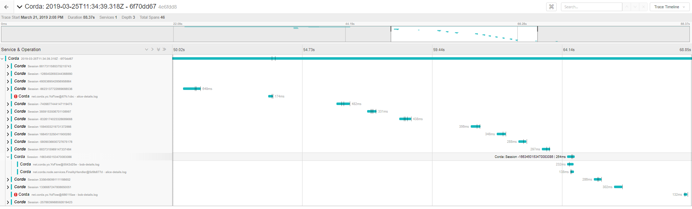
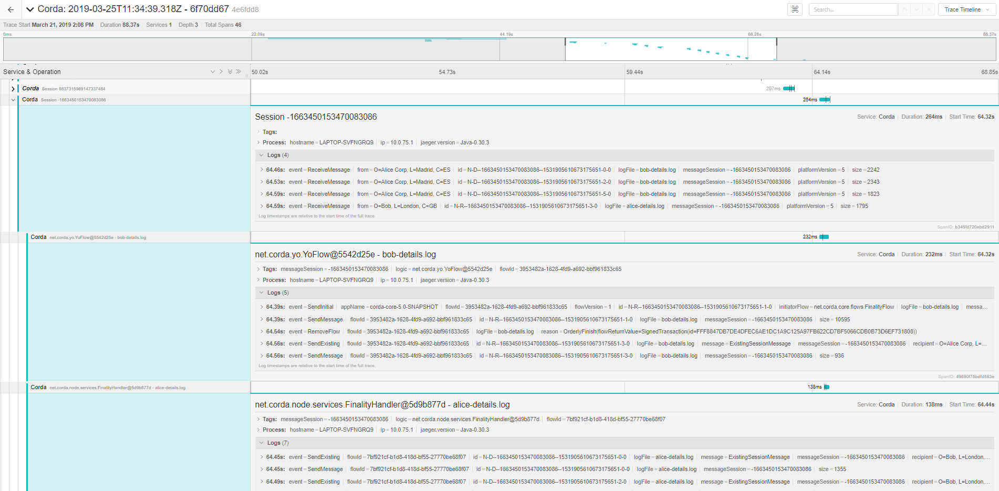

# Trace Log

## Introduction

This utility lets you create visually represented traces from one or more
Corda log files, using the [OpenTracing.io](https://opentracing.io/) API.
More specifically, it leverages the enhanced logging in Corda Enterprise 4,
and lets you generate complete timelines for flows that have been running in
a given time window, with details about what actions have been taken and what
errors have occurred for each one. The tool also plots peer-to-peer messages
that have been sent to and received by each node. If logs from multiple nodes
are imported, the tool will group the flows by their session identifiers since
these can be correlated across participant nodes. This makes it easier to
form a more holistic picture of the journey a sequence of inter-dependent
flows go through.

## Getting Started

First, you will need to start the Jaeger trace collector and the client UI.
Jaeger provides an all-in-one executable designed for quick local
testing. This executable launches the Jaeger UI, collector, query engine, and
agent, with an in-memory storage component. There exists a pre-packaged
Docker image that can be launched with one of the following commands
(depending on what operating system you are running):

 * **Run Collector and UI**

    ```bash
    $ ./start-jaeger.sh  # for Linux and macOS
    $ start-jaeger.bat   # for Windows
    ```

    For this to work, you will obviously need to have Docker installed.

 * **Navigate to the UI**

    You can then open up the client UI in your web browser of choice:
    [http://localhost:16686/](http://localhost:16686/search)

    This will bring up a web page where you can search for distributed traces
    that have been collected by the system. Clicking into one of these traces
    will present you with a UI looking something like the below:

    

    You can interact with the UI to bring up more captured information, for instance:

    

    You can find more information about the exploration tool and its related
    components on the [Jeager Tracing website](https://www.jaegertracing.io/docs/1.11/).

* **Import Log Files**

    To generate traces from your existing log files and to populate the UI with said
    traces, first, make sure that you have built the command-line tool:

    ```bash
    $ ./gradlew jar      # for Linux and macOS
    $ gradlew.bat jar    # for Windows
    ```

    Then, run the tool itself, passing in the log files that you want to ingest:

    ```
    $ java -jar build/libs/trace-log.jar "<log-1>" "<log-2>" ... "<log-n>"
    ```

    This will parse the provided log files and send a trace representation to the
    Jaeger collector, which in turn will make it available to the exploration tool
    depicted above.